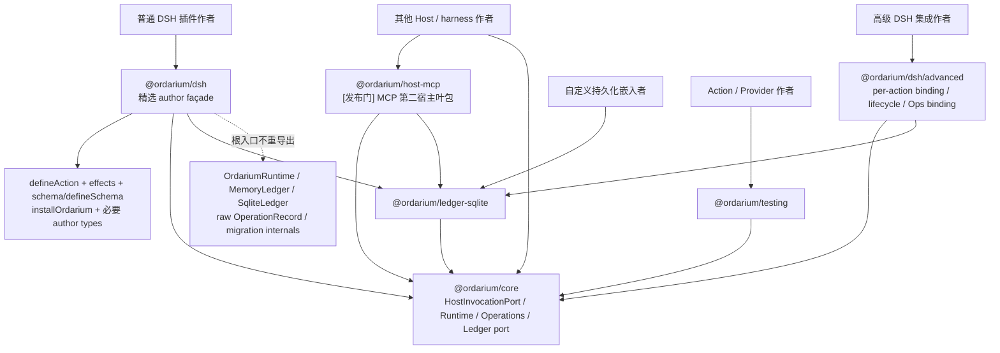

# Ordarium 产品基线

> Product revision：`ORDARIUM-PRODUCT-3`  
> 状态：首个公开版本的产品与开发者表面冻结。`PRODUCT-3` 把定位从“DSH-first SDK”提升为“多 agent harness 公共基石”：结构链 kernel-first 四层重排、HostInvocationPort 冻结、显式共账拓扑与发布前真实第二宿主；变更依据见 `ordarium/evidence/delta-ARCH-001-host-neutral-cornerstone.md`。运行语义由 `13` 定义，当前实现差距由 `14` 记录，组件结构由 `15` 定义，全部 Mermaid 投影由 `16` 维护，实施顺序与验收以 `17` 为准。

## 1. 产品定义

Ordarium 是多 agent harness 共用的基石层：一个可嵌入任意 Node Tool Harness 的 **Safe Action SDK 与 Effect Authority**。它不是 Harness、Agent Runtime、workflow engine、sandbox，也不是多 agent 调度器。DSH 是首个宿主；宿主中立性不是方向性口号，而是发布前必须由冻结的 HostInvocationPort、宿主 conformance harness 与真实第二宿主（`@ordarium/host-mcp`）机器证明的合同。

面向用户，Ordarium 的承诺是：同一项可能产生外部副作用的工作，不会因为 tool call 重投、进程崩溃、session replay、跨 agent/跨宿主重投或并发执行而被系统悄悄当成一项全新的工作；当外部系统不足以证明结果时，Ordarium 返回明确的 `uncertain`，而不是盲重试。

面向开发者，Ordarium 必须表现为一个小表面：声明 Action、选择与 Provider 事实相符的 effect profile、把稳定幂等键和取消信号传给 Provider，然后由一个宿主入口完成注册。

```ts
const createTicket = defineAction({
  name: "ticket.create",
  version: "1",
  description: "Create one support ticket",
  input: schema.object({ title: schema.string() }),
  output: schema.object({ id: schema.string() }),
  effect: effects.idempotent(),
  execute(input, context) {
    return provider.create(input, {
      idempotencyKey: context.idempotencyKey,
      signal: context.signal,
    });
  },
});

const ordarium = installOrdarium(ctx, { actions: [createTicket] });
```

普通插件作者不需要先理解 ledger revision、lease、fencing、reconciliation state、SQLite transaction 或 Cordis 内部服务。Ordarium 的“轻量”不是删掉副作用安全语义，而是把这些语义压缩在默认安全路径之后。

多 agent 语义通过合同而不是调度提供：identity/lineage/命名空间的传播规则（`13` §2）、多个 agent/进程/宿主共享同一本地 ledger 的显式共账拓扑，以及 Operations 的跨 agent 审计可见性。Ordarium 不调度、不分派、不编排任何 agent。

## 2. 为什么不是完整 Harness

DSH 当前已经承担以下职责：

| 职责 | DSH | Ordarium |
|---|---:|---:|
| Agent Loop、模型轮次、上下文组装 | 是 | 不做 |
| Tool schema、dispatch pipeline、结果渲染 | 是 | 只适配 |
| Approval、policy 与 tool admission | 是 | 消费并持久化分类后的证据，不复制 UI/策略 |
| Session、Client Surface、HMR、Cordis 生命周期 | 是 | 响应宿主生命周期，不实现宿主生命周期引擎 |
| Credentials 与 Sandbox | 是 | 短暂消费能力，不保存凭据、不复制 sandbox |
| MCP、文件、Web、subagent 插件 | 是/生态提供 | 不重做 |
| 稳定副作用 operation identity | 不构成完整端到端合同 | 核心职责 |
| dispatch 前持久化、CAS claim、fencing | 非通用插件合同 | 核心职责 |
| Provider 幂等键、查询与未知结果闭环 | 由各工具自行处理 | 核心职责 |
| 崩溃夹具与 Action/Provider conformance | 非通用工具合同 | 核心职责 |

因此 Ordarium 的生态位不是“更小的 DSH”，而是任何 agent harness 及其副作用插件下方的公共可靠执行层。DSH 是首个宿主；`@ordarium/host-mcp` 在发布前作为真实第二宿主证明内核中立。多 agent 部署通过 identity/lineage/命名空间合同与显式共账拓扑获得同一套安全语义，而不是通过 Ordarium 提供调度。

## 3. 谁为什么安装

最适合 Ordarium 的插件包括：

- 支付、计费、订单与配额变更；
- 发邮件、发消息、发布内容；
- 创建 issue、PR、工单、云资源或数据库记录；
- 删除、覆盖、移动或批量修改外部资源；
- 由 subagent 或 code-mode 间接触发、可能被 transport 重投的工具；
- 希望用故障注入与 Provider conformance 证明恢复行为的插件。

另一类直接采用者是 harness 作者与多 agent 部署者：

- 其他 Node Tool Harness 作者实现 HostInvocationPort 合同（或让宿主直接消费 `@ordarium/host-mcp` 暴露的 MCP 工具面），即可让本生态的 Safe Action 在自己的 harness 内运行；
- 多 agent / 多进程 / 多宿主部署者把多个 agent 的副作用放进同一本地 ledger（共账拓扑），获得统一的 operation 去重、claim 协调与跨 agent 审计视图。

纯读取工具无需为了形式统一而安装 Ordarium；它可以在确实需要统一 identity、审计或结果复用时选择 `readOnly`。Ordarium 的市场不是“所有工具”，而是“重复执行会造成真实损失的工具”。这种主动缩小适用面是产品边界，不是功能缺失。

## 4. Effect Profile：能力剖面而非安全等级

五种 profile 不是从低到高的五级分数，而是对 Action 与 Provider 事实的五种互斥描述：

| Profile | 前提 | Ordarium 能证明什么 | 不能证明什么 |
|---|---|---|---|
| `read-only` | 工具没有外部写副作用 | 同一 identity 可复用结果；失败可重做 | 外部读取快照不变化 |
| `guarded` | 有准入证据，但 Provider 无幂等/查询原语 | 未准入不 dispatch；结果不明时停止 | 崩溃窗口内是否已经生效 |
| `idempotent` | Provider 对稳定 operation key 在声明窗口内真正幂等 | 有效窗口内复用同一 key 不形成第二项业务操作 | Provider 虚假声明或窗口外事实 |
| `reconcilable` | Provider 可按 operation/business key 查询 | 先查询事实，再完成、失败或在证明安全时重做 | 查询接口本身不可靠时的确定结果 |
| `unmanaged` | 开发者明确退出托管恢复保证 | 仍记录 dispatch 与不确定性 | 自动恢复或端到端不重复 |

面向普通作者的首要选择只有三个 managed-write profile：`guarded`、`idempotent`、`reconcilable`。`readOnly` 是可选统一入口；`unmanaged` 是迁移逃生口，不进入主推荐路径，也不得被描述成一种安全保证。

“恰好一次”不是 Ordarium 的无条件宣传语。任意外部系统上的 exactly-once 不可由本地 ledger 单方面创造；可证明的最大范围取决于 Provider 幂等键及其有效期、业务唯一约束、查询接口与外部 fencing 支持。

## 5. 收敛后的公共表面与包边界



首发内核仍为四个 package + 宿主适配叶包；`@ordarium/dsh/advanced` 是同一个 DSH 包的显式 subpath，不是第五个内核包。**官方插件壳（G9）**：`createOrdariumPlugin` 位于 `/advanced`——进程级 Ordarium 实例所有者 + 唯一自有功能"运维面"（opt-in ops 工具）；它不做 action 注册面、不做调度。`@ordarium/host-mcp` 是发布门交付的**宿主适配叶包**：只依赖 core 与默认 ledger，承载宿主协议 SDK 依赖，不得反向被内核依赖，也不与其他宿主叶包横向依赖。

冻结后的导出政策是：

1. `@ordarium/dsh` 根入口只暴露普通作者完成 Action 定义与安装所需的精选 API，不再 `export *` 整个 core，也不重导出 `SqliteLedger`。
2. `installOrdarium(ctx, { actions })` 是唯一 README golden path；`createDshOrdarium`、`asDshTool`、自定义 binding、Operations binding 与 lifecycle tuning 位于 `@ordarium/dsh/advanced`。
3. 需要直接控制 Runtime 或 Ledger 的框架作者显式依赖 `@ordarium/core` 或 `@ordarium/ledger-sqlite`，不从普通 façade 偶然取得低层类型。
4. `@ordarium/testing` 是开发期入口，不成为生产包的隐式依赖。
5. Operations service 留在 core，DSH 只提供受权映射；不拆第五个运行时包，也不引入 daemon 或默认 UI。

当前 private `0.2.0` 的宽重导出不是兼容承诺；G1 以 clean break 切换 root/subpath export map 与 golden path，G5 再在同一表面内接入正式 DSH public types/lifecycle，不重开第二个 façade。差距只记录在 `14`。

## 6. Schema、授权证据与 DSH 适配边界

Ordarium 的 `ActionSchema<T>` 是最小宿主中立端口：一个 JSON Schema 加一个确定性 runtime parser。内置 `schema.*` 只是零依赖便利层；已经使用其他 validator 的作者通过 `defineSchema(jsonSchema, parse)` 适配，不要求把项目迁移到第二套 schema 生态，也不把 Zod、Valibot 或特定 DSH schema 包加入 core 依赖。

DSH 适配器必须基于明确支持的 DSH public types/lifecycle，而不是长期维护私有猜测类型。它映射：

- `name`、`description`、`parameters` 与 `output.schema/render`；
- `execute(args, ToolRunContext)`、`timeoutMs` 与 concurrency binding；
- `callId`、`rootCallId`、Agent/Session scope、actor、lineage 与 signal；
- `host-admission`、`policy-decision`、`human-approval` 三类可区分的 Action authorization evidence；
- register、quiesce、unregister、drain/abort、persist 与 close 的生命周期响应。

这不是绕开 DSH pipeline。Ordarium Action 仍由 DSH 注册、校验、guard、approval、timeout、结果 materialization 和 Session 事件路径包围。工具主体穿过原生 pipeline 后，Adapter 可以记录 `kind=host-admission, source=dsh:tool-body-admitted`；它绝不等于人工批准。更强证据由宿主 policy/approval 映射提供，而不是由 Ordarium 伪造。

## 7. 轻量性与开发吸引力的发布验收

Ordarium 只有同时满足以下条件才可以对外称为轻量、边界清楚且适合开发者采用：

1. 普通 DSH 作者只安装一个直接依赖、调用一个安装入口，不配置 daemon、端口或外部数据库。
2. 普通路径只新增 Action contract、effect profile 与 Provider key/signal 传递；不要求作者组装 Runtime、Ledger、lease 或 recovery evaluator。
3. `@ordarium/dsh` 根入口的 API snapshot 不含低层 Runtime/Ledger/record/migration 类型。
4. 现有 schema/parser 可以经最小 adapter 复用，不强迫双 schema 定义。
5. 一条确定性测试命令可以验证 crash、lost response 与所声明 Provider capability；不要求真实 credential 才能完成核心 gate。
6. `uncertain` 不成为死状态：受权 operator 可以 inspect 与 reconcile-only，但 Ops 默认不暴露给普通模型。
7. HMR/dispose 不会在 in-flight Action 仍可能写账本时直接关闭当前 ledger。
8. 长任务 heartbeat 不增长 semantic history，不反复改变 operation 的业务排序时间。
9. README golden path 不要求先阅读 `12–17`；这些文档是维护与审计合同，不是使用前置课程。
10. 只读插件可以明确不安装 Ordarium；产品不靠扩大到所有工具来证明价值。
11. HostInvocationPort 是机器可验证的 core 导出（进入 API snapshot），DSH 特有类型不进入 core。
12. 真实第二宿主（`@ordarium/host-mcp`）在发布前可用：MCP 客户端 harness 不经 DSH 即可消费 Ordarium Safe Action。
13. 共账拓扑有验收 fixture：多个宿主/进程共享同一本地 ledger 时，operation 去重、claim 协调与命名空间隔离同时成立。

## 8. Ledger 选择、平台与部署决定

SQLite 不是 core 语义的一部分。Core 只依赖带能力声明的 `OperationLedgerPort`；不同实现必须诚实声明自己能提供的 persistence 与 coordination：

| 实现 | 能力 | 允许的生产用途 | 明确不承诺 |
|---|---|---|---|
| `MemoryLedger` | process-volatile、single-isolate | `read-only`、显式 `unmanaged`、测试 | crash recovery、restart replay、multi-process claim |
| `SqliteLedger` | crash-durable、local multi-process、semantic CAS/live lease | `guarded`、`idempotent`、`reconcilable` 的默认本地 authority | multi-host、network filesystem、外部 Provider exactly-once |
| host/custom ledger | 由 conformance 证明 | 仅限其已证明能力覆盖的 profile | 未测试能力、自动等价于 SQLite |

Runtime 在第一次创建 operation 前检查 ledger capability。Managed write 使用不具备 crash-durable semantic CAS 与 live-lease coordination 的 ledger 时必须 `LEDGER_CAPABILITY_REQUIRED`，Provider 不得被调用。SQLite 打开失败也不得自动降级到 MemoryLedger；静默 fallback 会把一次安全配置故障变成副作用保证丢失。

因此默认 DSH 部署仍是进程内 library + 一个本地 SQLite 数据库（WAL 模式会有受同一生命周期管理的 sidecar 文件），不增加 daemon、端口、容器或 Rust 二进制；这不是唯一可用 ledger，而是完整本地 durable contract 的 reference/default implementation。`@ordarium/dsh/advanced` 可以显式注入 custom ledger，也可以为纯读取、测试或明确 unmanaged 安装选择 volatile mode，但必须让较弱保证在类型、配置和诊断中可见。

首发 `@ordarium/ledger-sqlite` 与 DSH durable default 继续采用 Node 内置 `node:sqlite`，以维持零 native runtime dependency。它们的最低目标版本冻结为 Node `24.15.0`，因为该版本线从 24.15 起把 SQLite 标记为 release candidate；`@ordarium/core` 与 `@ordarium/testing` 的最低 Node 版本独立由实际 API 与测试矩阵决定，不被 SQLite 人为抬高。G2/G7 必须以最低版本和发布时选定的当前 Node 版本完成真实文件、backup、migration 与双进程矩阵；在这些 gate 通过前，不把“内置”误写成“无风险稳定”。

## 9. 非目标

当前基线明确不实现：

- Agent Loop、Prompt/Context compiler、模型 Provider；
- workflow、subagent 调度、远程 Worker；
- **多 agent 调度器或编排引擎**——多 agent 协作安全通过 identity/lineage/命名空间合同与共账拓扑提供，不通过 Ordarium 调度实现；
- Secret vault、sandbox、网络策略或命令权限系统；
- Client Surface、Web UI、HMR engine、Cordis fork；
- Rust Runner、独立 daemon 或分布式共识；
- 远程 Authority 或 Palimpsest Runtime 兼容层。

第二 Host 不再是非目标：`@ordarium/host-mcp` 是发布门交付物（见 `17` G5）。Palimpsest 将来只可能成为一个显式调用 Action 的宿主，不会反向改变 Ordarium 核心合同。
