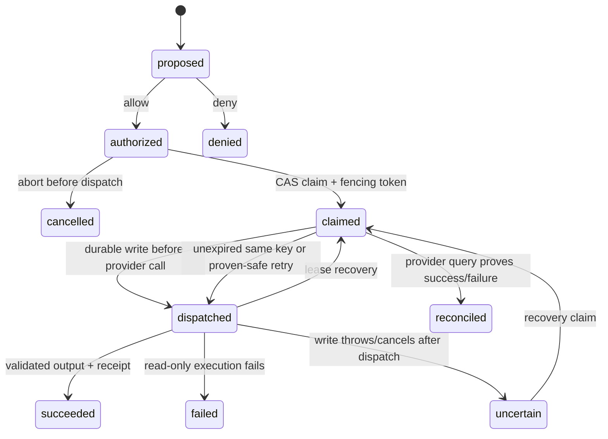
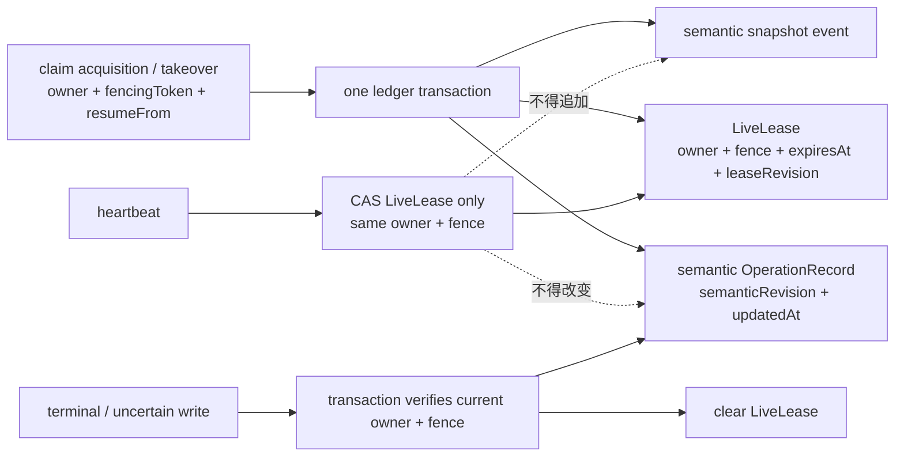
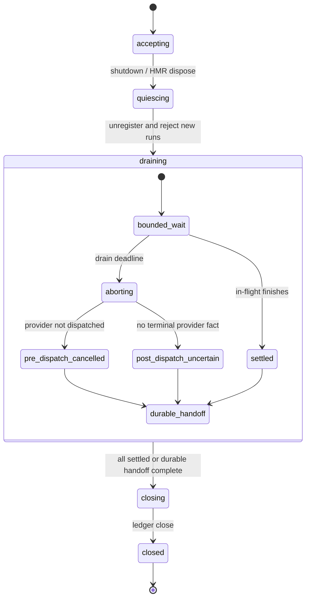

# Ordarium Safe Action 合同

> Contract revision：`ORDARIUM-ACTION-2`  
> 状态：首个公开版本的目标运行合同。当前 private v1 实现与本合同的差距只记录在 `14`；G1/G2 允许 clean break 与一次性前向迁移，不保留双合同。

## 1. 合同对象

一个 Action 必须声明：

- 稳定的小写 `name` 与显式 `version`；
- 输入、输出 JSON Schema 与运行时 parser；
- 五种非线性 `EffectProfile` 之一；
- `execute(input, context)`；
- `reconcilable` Action 必须额外实现 `reconcile()`；
- 可选业务 `key()`、`cancel()` 与 receipt projector。

Action 输入和输出必须是 lossless JSON。`undefined`、`BigInt`、循环引用、稀疏语义或 class instance 不得穿过合同边界。

Action hooks 还有以下纯度约束：

- input/output parser、`key()`、receipt projector 与 DSH output renderer 必须确定、无外部副作用；
- `key()` 对同一 parsed input 与 identity 必须返回同一字符串；
- `reconcile()` 必须是事实查询，不得创建新的业务效果；
- `execute()` 是唯一允许创建目标业务效果的主路径；
- `cancel()` 只是 Provider best-effort 请求，不能自行宣告最终取消成功。

### 1.1 EffectProfile 的唯一目标形状

公开作者使用 `effects.*()` 构造 profile，不直接拼接冗余布尔字段。G1 冻结并实现以下语义 union；当前 private `hasExternalSideEffect/requiresAuthorization/idempotency` 平铺形状不构成兼容承诺：

```ts
type IdempotencyWindow =
  | { kind: "durable" }
  | { kind: "finite"; expiresAfterMs: number };

type EffectProfile =
  | { kind: "read-only" }
  | { kind: "guarded" }
  | { kind: "idempotent"; window: IdempotencyWindow }
  | {
      kind: "reconcilable";
      idempotencyWindow?: IdempotencyWindow;
      cancellable: boolean;
    }
  | { kind: "unmanaged" };
```

构造器语义固定为：

- `effects.readOnly()`：没有外部写副作用；
- `effects.guarded()`：managed write，没有可证明的 Provider 恢复原语；
- `effects.idempotent()`：等价于 durable window；有限窗口使用 `effects.idempotent({ window: { kind: "finite", expiresAfterMs } })`；
- `effects.reconcilable({ idempotencyWindow?, cancellable? })`：必须实现 query-only `reconcile()`；未给幂等窗口时，只能在 authoritative `absent + retrySafe` 后 redispatch；
- `effects.unmanaged()`：显式退出 managed recovery，不能被文档或类型描述成安全保证。

有限幂等窗口在 operation 首次创建时计算一次绝对 `idempotencyExpiresAt` 并持久化。它不在进程重启、Action reload、配置变化或每次 attempt 时重新延长。超过该 deadline 后，正常 Runtime 与 Operations 都不得再调用 `execute()`；只能 query，无法 query 时保持 `uncertain`。

### 1.2 Schema 是端口，不是第二套生态

`ActionSchema<T>` 只有两项权威：宿主可消费的 JSON Schema，以及确定、纯净的 `parse(unknown): T`。内置 `schema.*` 是零依赖便利层；已有 validator 通过 `defineSchema(jsonSchema, parse)` 适配。Core 不依赖 Zod、Valibot、DSH 私有 schema 包或其他 validator，也不要求作者维护两份互相独立的约束。

## 2. Identity

默认 invocation identity 为：

```text
source + scope + callId
```

DSH 映射为：

```text
source     = "dsh"
scope      = agent.session.id → agent.id → "dsh"
callId     = ToolRunContext.callId
rootCallId = ToolRunContext.rootCallId
```

Action 可以用 `key(input, identity)` 改成稳定业务键。Ordarium 不保存原始 key，只保存摘要。

自定义 `key()` 会完全替代默认 `source + scope + callId`。多租户或多 Provider account Action 必须把非敏感 tenant/account namespace 纳入业务 key；credential 本身不得进入 key。

宿主或 per-action binding 可以同时提供瞬态 `providerPrincipalRef = { namespace, subject }`。Core 只持久化其 canonical digest，不保存原值或 credential。该 digest 不替代 logical key，但作为同 operation 的冲突字段：恢复时重新取得的 credential 必须解析为相同 principal digest；缺失、变化或无法证明时，不得继续原 operation。这样即使作者遗漏业务 key 的 account namespace，也会 fail closed，而不是换一个账号继续执行。

```text
logical_key_digest = SHA-256(canonical JSON(logical key))
operation_id       = "op_" + SHA-256(action name + version + logical_key_digest)[0:40]
input_digest       = SHA-256(canonical JSON(parsed input))
idempotency_key    = operation_id
```

同一 operation id 再次出现时：

- action/version、logical key digest 和 input digest 全部相同：视为同一工作；
- 任一不同：抛出 `OPERATION_CONFLICT`，不得静默覆盖或创建第二项工作。

DSH adapter 总是提供显式 identity。其他宿主也必须如此。首个发布合同要求 managed side-effect Action 在直接调用 core 时没有显式稳定 identity 就 fail closed；随机 process-local identity 只允许用于 `read-only` 或明确 `unmanaged` 调用，且不提供跨重启恢复保证。当前 Runtime 的随机 direct identity 是待收紧的实现兼容项。

## 3. 状态与权威顺序



必须先持久化 `dispatched`，然后才允许调用外部 Provider。`claimed` 通过 revision CAS 获得，并分配单调递增的 fencing token。终态成功结果可直接复用，不重新调用 Action。

运行时选择的 conformant ledger 是 operation record 的当前权威副本；默认 managed DSH 使用 SQLite。语义状态、claim acquisition/fence 与终态 `semanticRevision` 追加完整快照事件，用于审计状态轨迹。Live lease 是独立 operational liveness，不属于业务历史。MemoryLedger 只用于测试、纯读取、显式 `unmanaged`，或明确不要求进程恢复的嵌入场景。



目标 SQLite schema 使用 `ordarium_operations` 保存当前语义记录、`ordarium_operation_events` 保存语义快照、`ordarium_operation_leases` 保存当前 liveness。Heartbeat 只增加 `leaseRevision` 和 `expiresAt`，不增加 `semanticRevision`、不改变语义 `updatedAt`、不把 operation 推回 list 顶部。

## 4. 授权证据

- `read-only` 与明确 opt-out 的 `unmanaged` 可隐式允许；
- `guarded`、`idempotent`、`reconcilable` 在 dispatch 前必须获得 `allow`；
- 无显式 decision 且 Runtime 无 authorizer 时，状态留在 `proposed` 并抛出 `AUTHORIZATION_REQUIRED`；
- deny 持久化为 `denied`，后续相同 identity 仍然拒绝；
- 授权记录包含 decision、kind、source、可选安全 actor/reason/reference 和时间，不包含 credential。

同一 operation 的首次持久授权决定不可变；authorization 不是撤销通道。并发 authorizer 必须对相同 operation 返回一致决定。若宿主后来提供矛盾决定，Adapter 必须报告 authorization integration conflict，而不是覆盖现有记录；已经 dispatch 的 allow 只能通过取消与 Provider reconciliation 处理，不能被事后 deny 改写。

Action authorization evidence 的 `kind` 只允许：

| kind | 含义 | 不能宣称 |
|---|---|---|
| `host-admission` | 原生 Tool pipeline 已准许进入 body | 人工点击或特定 policy 已通过 |
| `policy-decision` | 宿主明确命名的 policy/guard 给出决定 | 人工确认 |
| `human-approval` | 宿主 approval 系统给出可审计的人类决定 | Provider 已执行或结果已成功 |

DSH 适配器在工具主体已经穿过 DSH admission pipeline 后提供 `decision=allow, kind=host-admission, source=dsh:tool-body-admitted`。要求特定 policy 或人类确认的插件必须通过 DSH 原生配置与 binding 提供相应 evidence；Ordarium 只验证、持久化和检测冲突，不实现审批策略，也不从字符串 source 猜测 kind。

Operations 使用独立的 `OperatorAuthorization` 边界，不把普通 Action authorization 复用成 operator 权限。模型或普通 tool input 不能自带一个 `kind=human-approval` 或 `operator=true` 来取得权限；证据只能由受信宿主 adapter 注入。

## 5. 崩溃与恢复矩阵

| 观察点 | 可知事实 | 恢复动作 |
|---|---|---|
| `proposed` | 未获允许，未 dispatch | 重新取授权 |
| `authorized` | 已允许，未 dispatch | 重新 claim 后执行 |
| `claimed` / `resumeFrom=authorized` | 执行者可能在 dispatch 前崩溃 | lease 到期后重新 claim |
| `dispatched` | Provider 可能未收到、处理中或已成功 | 进入 guarantee-specific recovery |
| `uncertain` | 本地不能判定外部结果 | 只允许 reconcile 或相同 Provider 幂等键路径 |
| `succeeded` | 输出已验证并持久化 | 直接返回结果 |
| `reconciled/succeeded` | Provider 查询证明成功 | 直接返回结果 |
| `failed`、`denied`、`cancelled`、`reconciled/failed` | 已有终态 | 返回对应错误，不再执行 |

Recovery 顺序固定为：

1. 有 `reconcile()`：先查询 Provider；
2. 查询为 `succeeded/failed`：持久化 `reconciled` 终态；
3. 查询为 `absent + retrySafe`：允许重新 dispatch；
4. 查询为 `pending/unknown` 或查询异常：保持 `uncertain`；
5. 无查询但声明 operation-key 幂等，且持久化 deadline 尚未过期：用相同 `operationId` 再调用；
6. 其他情况：抛出 `OPERATION_UNCERTAIN`，禁止盲重试。

实际进程重启后的恢复是 **同一 Action invocation 再次进入 Runtime 时的惰性恢复**。Ordarium 不保存原始输入，因此不会在没有宿主重投参数的情况下后台重放任意 Action；这同时避免把 credential-bearing input 写入 ledger。

## 6. 并发、lease 与 fencing

一次 operation 同时只有一个有效 claim owner。SQLite 用事务、semantic CAS 与独立 LiveLease CAS 实现跨进程协调；内存实现依赖单一 JavaScript isolate 的同步 Map 更新。Action 或 reconciliation 正在运行时，owner 以 lease 三分之一为默认调度周期更新 liveness；heartbeat 失败会 abort 组合 signal，旧 owner 不得提交终态。

`ActionExecutionContext` 暴露：

```ts
{
  operationId,
  idempotencyKey,
  attempt,
  fencingToken,
  identity,
  signal,
}
```

Provider 支持 fencing 时必须拒绝较小 token。仅有本地 fencing token、而外部 Provider 不校验时，不能单独证明跨进程 exactly-once。

### 6.1 Ledger capability gate

`OperationLedgerPort` 不等于 SQLite，但每个实现必须返回只读、稳定的静态能力描述，并由 conformance fixture 验证声明与行为一致：

```ts
interface LedgerCapabilities {
  durability: "volatile" | "crash-durable";
  coordination:
    | "single-isolate"
    | "single-process-exclusive"
    | "local-multi-process";
  semanticCas: true;
  liveLease: boolean;
  semanticHistory: boolean;
}
```

- 所有实现都必须满足同一个 semantic CAS 端口；否则不属于 OperationLedger。
- `read-only` 可以使用 volatile ledger；`unmanaged` 只有在调用者显式 opt out 时可以使用，并且不获得 restart guarantee。
- `guarded`、`idempotent`、`reconcilable` 要求 `crash-durable + liveLease + semanticHistory`，且 coordination 必须覆盖安装时声明的部署拓扑。
- 默认 DSH 拓扑声明 `local-multi-process`，因此使用 SQLite reference ledger；高级 single-process 部署可以注入经过 conformance 的 exclusive durable ledger。
- capability 不足在 operation create 与 Provider dispatch 前返回 `LEDGER_CAPABILITY_REQUIRED`；SQLite/custom ledger 打开失败不得自动 fallback 到 MemoryLedger。

这条 gate 允许测试和纯读取路径保持真正轻量，同时避免用“无数据库”换取一个表面更小、实际失去崩溃语义的 managed product。

## 7. 数据与 Secret 边界

目标 `schemaVersion=2` 的 semantic OperationRecord 持久化：

- Action name/version、`contractFingerprint` 与 identity；
- input digest、logical key digest 与可选 provider principal digest；
- effect kind、idempotency mode 与首次冻结的可选 `idempotencyExpiresAt`；
- 分类后的 authorization evidence、state、semantic revision、attempt 与 last fencing token；
- claim acquisition snapshot：owner、fence、acquiredAt、resumeFrom，但不含 heartbeat expiresAt；
- JSON output、receipt、安全错误和不确定性原因。

LiveLease 另存 `operationId/owner/fencingToken/expiresAt/leaseRevision`。Semantic event 保存对应 revision 的 OperationRecord 快照，不把 LiveLease heartbeat 伪装成业务事件。分页固定按 `updatedAt DESC, operationId DESC`，cursor opaque；数据集无并发变化时不得遗漏或重复，并发变化时只承诺文档化的 live-cursor 语义。

SQLite 文件固定 `application_id = ORDA`；首个公开版本的目标为 `user_version = 2`、operation `schemaVersion = 2`。当前 private v1 只能在 `@ordarium/ledger-sqlite` 边界事务性前向迁移一次；迁移后 core、Runtime、Operations 与 DSH 只看到 v2，不接受 `v1 | v2` union。打开其他应用数据库、未来版本数据库、半迁移或结构损坏 record 必须失败关闭。

Ledger 不持久化：

- 原始输入和业务 key；
- DSH Credentials 或环境变量；
- 任意异常 stack/raw message；
- Provider request/response 的未筛选副本。

Action output 与 receipt 本来就是工具可见或审计数据，因此会被保存；Action 作者不得把 token、密码、私钥或未脱敏 Provider 响应放入其中。`reconcile().failed.error` 是 Action 作者声明的安全错误，必须遵守同一约束。

Runtime 默认拒绝持久化超过 1 MiB 的单个 output 或 receipt，可通过 `maxPersistedJsonBytes` 下调或显式上调。副作用已经 dispatch 后才发现结果超限时，operation 必须进入 `uncertain`；不得丢弃结果限制后伪装成普通失败。

## 8. DSH 与其他宿主

DSH adapter 保留原生 pipeline 权威：

```text
DSH schema/admission/guards
→ Ordarium identity + classified authorization evidence
→ durable claim/dispatched
→ Action body
→ Ordarium terminal/recovery state
→ DSH output validation/render/result event
```

Ordarium 不注册自己的 Agent Loop，也不绕过 `tools/execute` wrapper。其他宿主只要能提供稳定 `source/scope/callId`、AbortSignal、分类后的 authorization evidence 和 ToolDefinition 映射，就可以复用 `@ordarium/core`。

DSH tool arguments 必须是 object JSON Schema，因此 `asDshTool()` 会拒绝 primitive input schema；core 本身仍允许 primitive Action，供非 DSH 宿主或内部组合使用。

Subagent 是否需要 Ordarium 取决于副作用路径，而不是“是否叫 subagent”：同进程或远程 subagent 只要最终可能重投同一副作用 Action，就应传播 root identity，并在副作用边界使用 Ordarium；纯推理 subagent 不需要。

## 9. Runtime 与 HMR 生命周期

DSH/Cordis 拥有 HMR 触发与插件生命周期；Ordarium 只定义自己的安全响应。Runtime 生命周期只有一条生产路径：



固定顺序为：`quiesce → unregister → bounded drain → abort remaining → persist terminal/cancelled/uncertain or revoke terminal authority → close`。

- `quiescing` 后新调用稳定返回 `RUNTIME_QUIESCING`，不得新建 operation 或 dispatch；
- deadline 前正常完成的调用按普通状态机提交；
- deadline 后，dispatch 前调用可写 `cancelled`，dispatch 后没有 Provider 事实的调用写 `uncertain`；
- 如果 Action 忽略 AbortSignal，Runtime 必须先持久化可恢复 handoff、撤销旧 execution token/terminal write authority，并吸收迟到 callback，之后才能关闭 ledger；
- `dispose()` 不能在仍有代码可能使用旧 Ledger 写终态时返回；当前 unregister 后立即 close 的路径必须被直接替换，不保留 legacy mode。

## 10. Operations 最小闭环

`OrdariumOperations` 位于 `@ordarium/core`，公开且仅公开以下首发能力：

- `inspect(operationId)`；
- `list(filter, cursor)`；
- `history(operationId, cursor)`；
- `reconcileOnly(operationId, verifiedRecoveryMaterial)`。

前三者只读；`reconcileOnly` 复用正常 Runtime 的同一个 RecoveryEvidenceEvaluator，但 mode 永久禁止 `execute()`，即使 Provider 返回 `absent + retrySafe` 也保持 `uncertain`。首发没有 `forceRetry`、raw SQL、开放式 `forceTransition` 或 manual attestation。

Operations 默认不注册为模型工具。DSH 侧的受信注册点是**官方插件壳**（G9：`createOrdariumPlugin` 的 `operations.authorization` 注入，构造期校验）；工具只见 model 视图，operator 审计全文走 `plugin.ops`（进程内 API，宿主命令消费）。它使用 core 的同一 sanitized projector，不能直接读 SQLite、复制 record DTO 或自行解释状态。
