# Ordarium 产品形态与完整架构

> Architecture revision：`ORDARIUM-ARCH-3`  
> 状态：首个可发布版本的架构冻结稿。`ARCH-3` 按 `delta-ARCH-001` 把结构链重排为 kernel-first 四层，冻结 HostInvocationPort 为 core 一等端口，把真实第二宿主（`@ordarium/host-mcp`）与显式共账拓扑纳入发布门。产品边界以 `12-ordarium-product-baseline.md` 为准，运行语义以 `13-ordarium-action-contract.md` 为准，当前实现快照见 `14-ordarium-implementation-plan.md`，阶段目标与验收顺序以 `17-ordarium-goals-and-acceptance.md` 为准；全部视角的 Mermaid 投影见 `16-ordarium-mermaid-architecture-atlas.md`。

## 1. 最终产品判断

Ordarium 的准确产品形态是：

> **多 agent harness 的公共基石：Node.js host-neutral 的 Safe Action SDK，以及随宿主进程嵌入的 Effect Authority。**

这里的 host-neutral 指不绑定任何单一 harness 的内部实现、可适配任意 Node.js Tool 宿主；它不表示当前 `@ordarium/core` 可以运行在浏览器、edge isolate 或非 Node 平台。core 使用 Node 能力，但不要求 SQLite；默认 durable topology 通过独立 ledger 包使用 `node:sqlite`。“公共基石”表示多个 harness、多个 agent、多个本机进程共享同一套副作用安全语义与同一个本地 operation authority，而不是 Ordarium 提供调度或编排。

这句话同时冻结九项决定：

1. **它是开发者基础设施，不是另一个 Agent Harness，也不是多 agent 调度器。** 各宿主继续拥有 Agent Loop、Tool Pipeline、Approval、Session、Credentials、Sandbox、Client Surface、HMR 与 Cordis 生命周期；agent 间的分派与编排不属于 Ordarium。
2. **它不能作为透明拦截器，自动增强任意既有工具。** Ordarium 必须知道 Action 的稳定身份、effect profile、Provider 幂等或查询能力，才能作出可证明的恢复判断。
3. **普通 DSH 插件作者只安装 `@ordarium/dsh`。** 根入口是精选 author façade 与唯一 `installOrdarium` golden path；低层 Runtime/Ledger 不从根入口宽重导出。其他宿主作者实现 HostInvocationPort 合同或采用对应宿主叶包。
4. **最终用户通常安装的是“Ordarium-aware 插件”，而不是单独安装 Ordarium。** 独立 Ordarium 插件只有在提供 operation inspect/reconcile 等运维入口时才有直接用户价值。
5. **默认没有 daemon、端口、容器或远程控制平面。** 权威内核与插件同进程运行；managed 默认写本机 SQLite，纯读取/测试/明确 unmanaged 才可显式选择 volatile ledger。
6. **Palimpsest 只保留未来宿主接口。** 它不进入当前依赖图，也不影响首个版本的合同。
7. **SQLite 是 reference ledger，不是 core 本体。** Runtime 按 LedgerCapabilities 决定某个 profile 是否可执行，能力不足或 durable ledger 打开失败必须 fail closed，禁止静默降级。
8. **HostInvocationPort 是 core 的一等端口。** 宿主与 core 之间的最小边界（稳定 identity、分类 authorization evidence、AbortSignal、invocation metadata）由 core 冻结并进入 API snapshot；DSH adapter 只是它的第一个实现，不拥有合同。managed 副作用缺少宿主 identity 必须 `IDENTITY_REQUIRED` fail closed。
9. **内核四包 + 宿主适配叶包布局。** 内核运行时包保持四个（core / ledger-sqlite / dsh / testing）；DSH 之外的宿主适配器以独立叶包加入 workspace，首个为发布门交付的 `@ordarium/host-mcp`。叶包依赖只允许 core（与默认 ledger），宿主协议 SDK 依赖只允许出现在叶包，不得反向或横向依赖。

因此，Ordarium 的最小完整产品不是“一个更小的 DSH”，也不是“一个调用日志插件”，而是以下组合：

- Action authoring contract；
- stable operation identity 与多 agent 传播规则；
- authorization evidence consumption；
- durable state machine；
- CAS claim、lease 与 fencing；
- Provider-aware recovery；
- host-neutral HostInvocationPort 与宿主适配 conformance；
- DSH host adapter 与 MCP 第二宿主叶包；
- crash/conformance testing；
- 轻量的 operation 可观测与安全处置入口；
- 多宿主共账拓扑（共享本地 ledger 的命名空间隔离与跨 agent 审计可见性）。

这里的“完整架构”是发布目标，不表示每个方框当前都已实现；现有、发布前必需、发布后扩展与非目标在第 18 节明确分层。

## 2. 生态位与系统边界

全文图例约定：实线箭头表示当前或目标合同中的必经调用/数据流，双向箭头表示权威存储读写；虚线只表示辅助能力、验证、禁止依赖或未来扩展，必须以边上的文字为准。`subgraph` 表示职责或信任边界，只有第 16 节的 subgraph 同时表示部署边界。带“未来/待实现”的框不是现有产品能力；实际完成状态统一由第 18、20、26 节判定，而不靠颜色暗示。

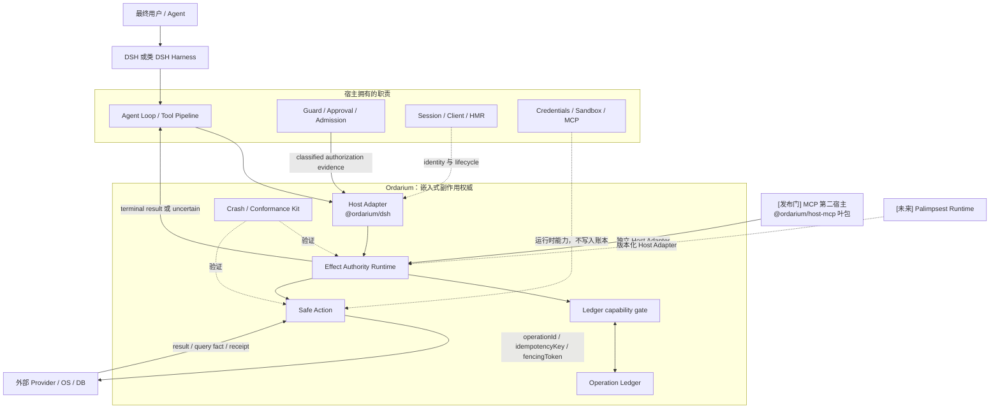

这张边界图的关键不是组件数量，而是 Ordarium 只占据 **tool body 与真实外部副作用之间** 的狭窄位置。它不决定 Agent 为什么调用工具，只决定这项已经被允许的工作以什么身份、由谁、在什么恢复证据下触达外部世界。

### 2.1 谁会安装它

| 角色 | 安装形态 | 直接收益 |
|---|---|---|
| DSH 插件作者 | 依赖 `@ordarium/dsh` | 用一个 Action 定义获得持久去重、崩溃恢复与测试夹具 |
| 其他 Harness 作者 | 依赖 `@ordarium/core` 与一个 ledger，实现 HostInvocationPort 合同 | 复用内核而不采用 DSH；合同由宿主 conformance harness 验证 |
| MCP 客户端 harness / 宿主 | 消费 `@ordarium/host-mcp` 暴露的 MCP 工具面 | 不写适配代码即获得 Ordarium Safe Action 与运维入口 |
| 多 agent 部署者 | 多个 agent/进程/宿主共享同一本地 ledger | 统一去重、claim 协调与跨 agent 审计视图（共账拓扑） |
| 最终用户 | 安装一个 Ordarium-aware 业务插件 | 避免重放、崩溃或并发造成重复支付、发信、创建或删除 |
| 运维者 | 使用宿主提供的 inspect/reconcile 入口 | 看清 `uncertain`，不靠模型猜测或强制重试 |
| 纯读取插件作者 | 通常无需安装；可选 `readOnly` | 需要统一 identity、审计或结果复用时才引入 |

### 2.2 为什么不能透明包装所有 DSH 插件

一个通用 wrapper 最多知道“工具开始了”和“本地 Promise 返回了”。它不知道：

- 相同调用的业务身份是什么；
- Provider 是否接受持久幂等键；
- 一个超时请求究竟未到达、处理中还是已经成功；
- 能否按业务键查询或取消；
- 哪些响应字段可以安全持久化。

缺失这些知识时，透明 wrapper 只能提供 `guarded` 级的 dispatch 记录，不能提供可靠恢复。Ordarium 的兼容策略因此是 **Action 合同兼容**，而不是对未知插件进行魔法式代理。

## 3. 三重权威模型

端到端正确性来自三个相邻但不可互相冒充的权威：

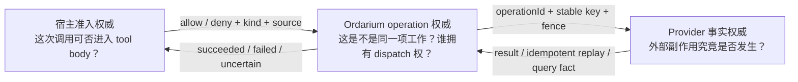

三者职责必须严格区分：

- **DSH admission** 表示工具主体可以开始执行；Adapter 把事实明确分类为 `host-admission`、`policy-decision` 或 `human-approval`。默认 `dsh:tool-body-admitted` 只能属于第一类。
- **Ordarium authority** 决定 operation identity、授权记录、claim owner、dispatch 顺序、终态和可否恢复。
- **Provider truth** 决定远端业务事实。Ordarium 的本地记录不能凭空证明远端已经或尚未生效。

这也是 `uncertain` 必须存在的原因：当 Provider 没有提供足够事实时，诚实地保留未知比把未知伪装成失败并重试更安全。

## 4. 产品的结构链条：kernel-first 四层

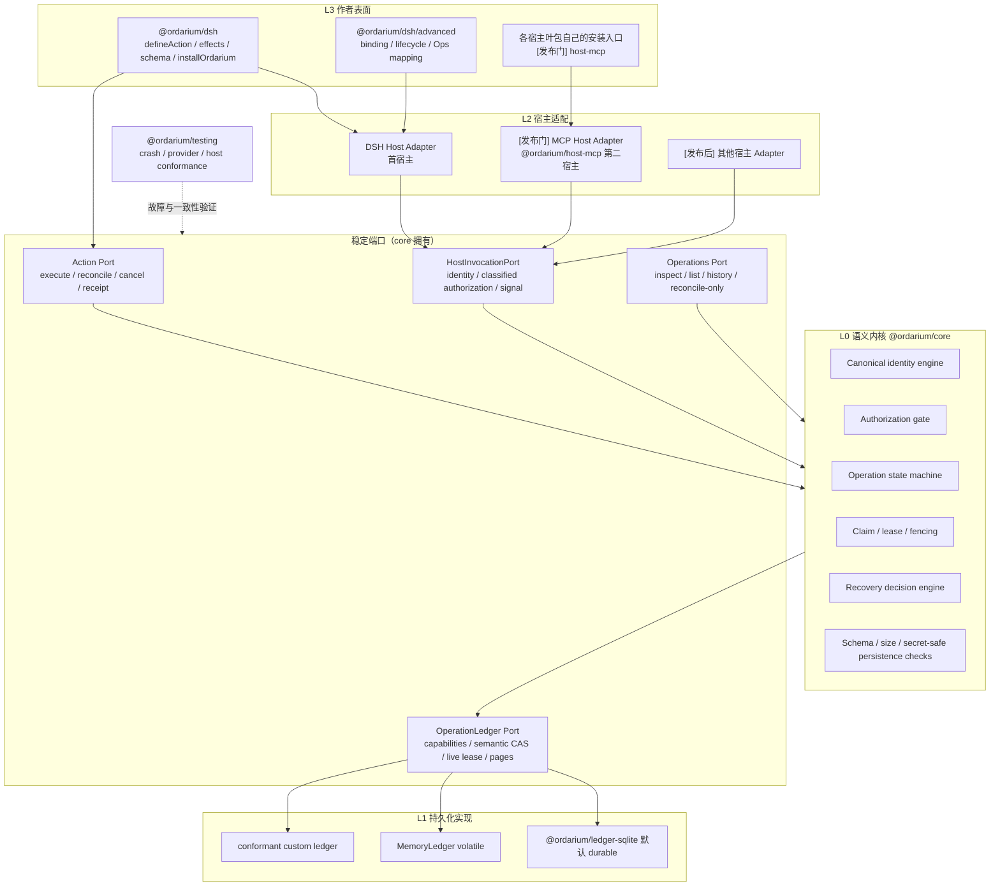

结构链条的读法自底向上：

1. **L0 语义内核**：identity、状态机、恢复评估的唯一语义来源，零外部依赖；四个端口（HostInvocation / Action / OperationLedger / Operations）都由 core 冻结。
2. **L1 持久化**：以 LedgerCapabilities 准入的实现选择；SQLite 是 reference default，不是语义依赖。
3. **L2 宿主适配**：把任意 harness 的调用翻译为 HostInvocationPort；DSH 是首个实现，MCP 叶包是发布前的第二实现，二者共同证明“适配器可替换、内核不变”。
4. **L3 作者表面**：普通作者看到的全部内容；不同宿主的作者各有一条 golden path，但都终止于同一内核。

对普通插件作者，这个链条塌缩成一次安装与一个入口；对 harness 作者，链条的全部意义在于：**替换 L2 不需要触碰 L0/L1，替换 L1 不需要触碰 L0**。

`Operations Port` 是完整产品所需的最小运维面，不等于新建 daemon 或 Web UI。它可以先以 core API 和宿主原生 tool/command 呈现。

## 5. 包结构与依赖方向

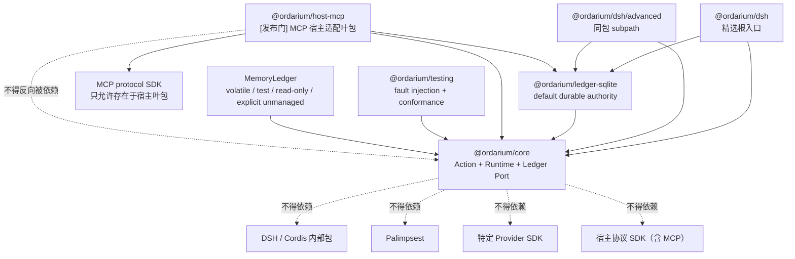

| 包 | 当前职责 | 不应吸收的职责 |
|---|---|---|
| `@ordarium/core` | Action、schema port、identity、Runtime、状态机、LedgerCapabilities/port、MemoryLedger、Operations、HostInvocationPort、公共错误 | 任何宿主生命周期、具体 Provider SDK、宿主协议 SDK、UI、远程调度 |
| `@ordarium/ledger-sqlite` | WAL、事务、semantic CAS、live lease、current/history、migration/backup | 通用数据库 ORM、网络数据库代理、Secret 存储 |
| `@ordarium/dsh` | 精选 author façade、正式 ToolDefinition/ContentBlock、身份/分类授权/signal 映射、一站式 durable default；`/advanced` 承担高级 binding/Ops | Agent Loop、Approval UI、Cordis fork、HMR engine、根入口宽重导出低层 API |
| `@ordarium/host-mcp`（发布门） | MCP server 宿主适配：把 MCP tools 面映射到 HostInvocationPort，含 ops 工具的受权暴露与 stdio 生命周期 | 第二套 Action 合同、自有状态机、绕过 core 的直连 ledger 写入 |
| `@ordarium/testing` | durable checkpoint crash、手动时钟、固定 identity、宿主适配 conformance harness、后续 Provider conformance | 测试框架替代品、模拟整个宿主 |

内核运行时包不再增加；宿主适配器作为**独立叶包**加入 workspace（首个为 `host-mcp`），依赖只允许 core（与默认 ledger），宿主协议 SDK 只允许出现在叶包，不得反向或横向依赖。Provider adapter 示例应优先作为小型独立集成或 recipes；只有出现多个稳定实现后才抽象公共包。

## 6. Action、Invocation、Operation、Attempt 与 Effect

这些名词必须分开，否则“去重”会变得含混：

| 对象 | 含义 | 基数关系 |
|---|---|---|
| Action | 可版本化的副作用能力定义，例如 `github.issue.create@1` | 一个 Action 可产生多个 operation |
| Invocation | 宿主投递的一次 tool call | 多次 replay 可指向同一 operation |
| Operation | Ordarium 认定的稳定业务工作 | 一个 operation 可有多个 attempt |
| Attempt | 一次持久化 `dispatched` 后的 Provider 尝试 | 只有证明安全时才允许增加 |
| External effect | Provider 中真实发生的业务变化 | 目标是一个 operation 最多形成一项业务效果，但能否证明取决于 Provider |

### 6.1 身份推导

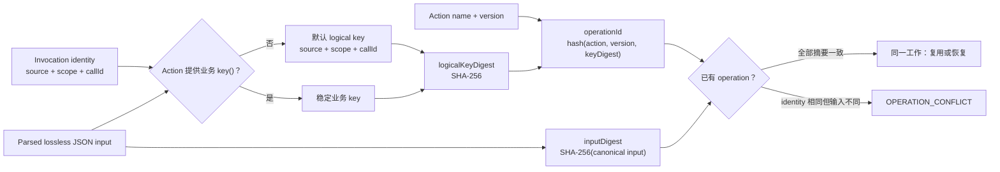

`rootCallId` 和 `lineage` 用于审计与关联，不进入默认 operation identity。否则同一根调用下的两个不同子任务可能被错误折叠。跨 transport 或跨 session 的业务去重应显式实现 `key()`。

DSH adapter 会显式构造 identity。对于直接使用 core 的 managed side-effect Action，首发合同要求缺少显式 identity 时 fail closed；当前 Runtime 自动生成 `direct/process/randomUUID` 的行为只能保留给 `read-only` 或明确 `unmanaged`，否则“安全默认”会在每次重启或重投时悄悄创建新 operation。

高价值生态 Action 应使用命名空间名称，例如 `github.issue.create`、`mail.message.send`，避免不同插件在共享 ledger 中碰撞。Action 的 `version` 是语义兼容边界：输入/输出 schema、key、effect、execute/reconcile 语义有不兼容变化时必须升级 version。

自定义业务 key 会完全替换默认 `source/scope/callId`，所以它必须显式包含需要隔离的非敏感 tenant、Provider account 或资源 namespace。`scope` 本身只是 identity 字段，不是访问控制；credential 也不能充当 namespace。恢复时新取得的 credential 若指向另一个 Provider principal，必须拒绝继续原 operation。

## 7. 正常执行主链

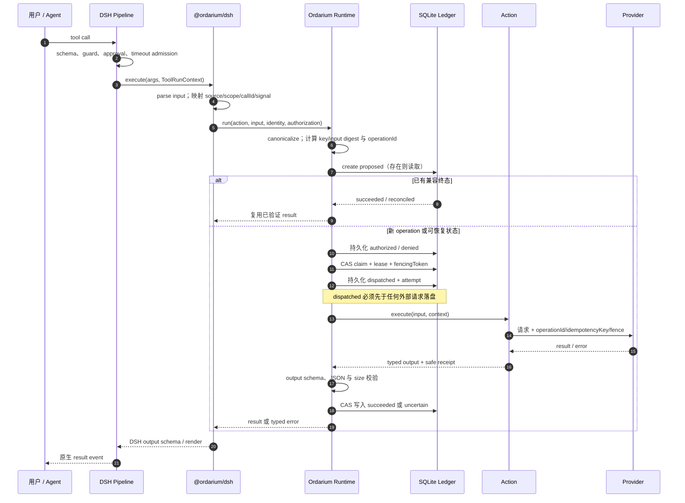

此链条有四个不能交换的顺序：

1. 宿主先完成 admission；
2. Ordarium 再持久化授权证据；
3. `dispatched` 落盘后才触达 Provider；
4. 只有输出通过 schema、JSON 与持久化上限校验后才能记录成功。

如果 Provider 已成功，但 output/receipt 校验、ledger 终态写入或进程随后失败，operation 必须保留在 `dispatched/uncertain` 路径，不能伪装成普通失败。

## 8. 状态机

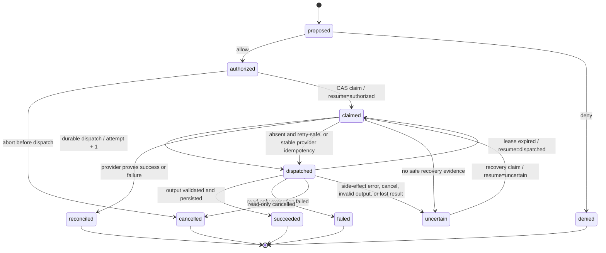

`claimed` 不是业务状态，而是短期执行所有权；真实恢复来源保存在 `resumeFrom`。`reconciled` 还必须携带 `outcome=succeeded|failed`，不能只看状态名判断结果。

`uncertain` 是稳定的待处置状态，不是普通 exception 的同义词。它表示“外部副作用可能已经发生，本地证据不足”。再次收到相同 invocation 时，Runtime 会进入恢复流程，而不是重新创建 operation。

## 9. 恢复决策与取消语义

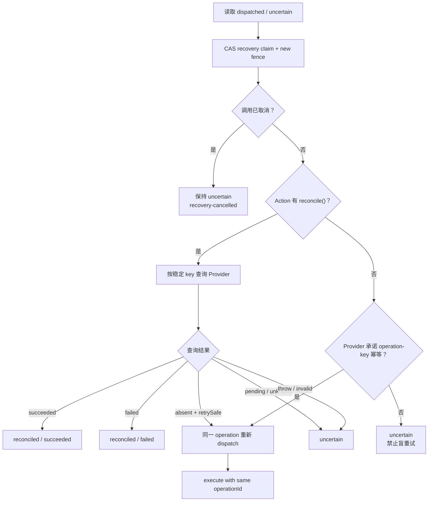

取消也服从同一证据原则：

- dispatch 前取消：可以确认没有外部调用，进入 `cancelled`；
- dispatch 后取消：只是停止意图，不能证明 Provider 未执行，默认进入 `uncertain`；
- `cancel()` 是 best-effort Provider hook，不会自动把外部事实改写为 `cancelled`；
- 可取消且可查询的 Action 应在取消后通过 `reconcile()` 确认最终事实。

恢复采用 **宿主重投触发的惰性恢复**。Ordarium 不保存原始输入，所以进程重启后不会自行从账本后台重放任意 Action。这既是 Secret 边界，也是无 daemon 形态的直接结果。

## 10. 保证不是线性等级，而是 Provider 能力剖面

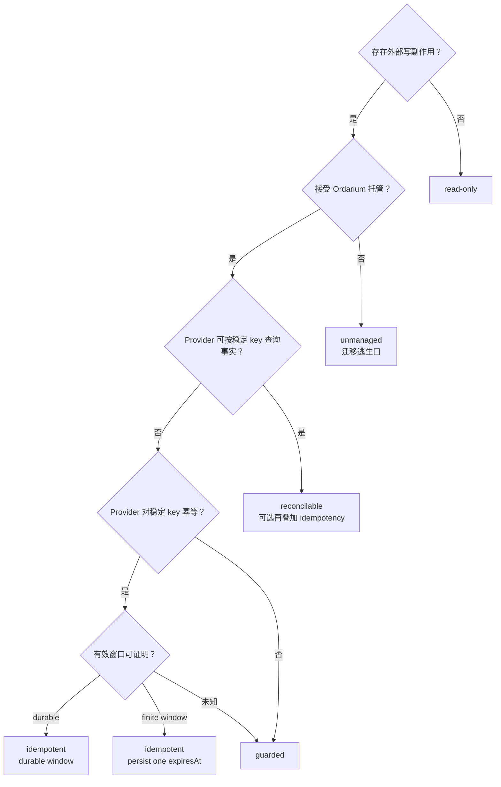

五种 profile 不是简单的 1–5 安全分数：

- `read-only` 是另一类效果；
- `guarded` 是缺少恢复原语时的诚实下限；
- `idempotent` 和 `reconcilable` 是两种不同 Provider 能力，后者可以同时带 operation-key idempotency；
- finite idempotency 在 operation 创建时冻结绝对 deadline；过期后只能 query 或 uncertain，不能通过重启续期；
- `unmanaged` 是明确退出托管的迁移通道，不是更高或更低等级。

端到端证明由下式组成：

```text
可证明保证 = 本地 operation authority
           ∩ 宿主 identity/admission 的稳定性
           ∩ Provider 的幂等、查询、业务唯一约束与 fencing 能力
```

| 证据 | Ordarium 本地能提供 | 必须由 Provider 提供 |
|---|---:|---:|
| 同一 operation 只有一个当前 claim owner | 是 | 否 |
| dispatch 前存在持久记录 | 是 | 否 |
| 重试始终复用同一 idempotency key | 是 | Provider 必须真正尊重该 key |
| 旧 owner 不再产生外部效果 | 只能发 abort signal | Provider 必须校验 fencing 或请求必须可中止 |
| 外部业务对象只创建一次 | 不能单方面证明 | 幂等键、唯一约束或可查询业务键 |
| 崩溃窗口中的最终事实 | 不能单方面证明 | reconcile/query |

因此 Ordarium 不宣传任意 Provider 的 unconditional exactly-once。

## 11. 并发、lease 与 fencing

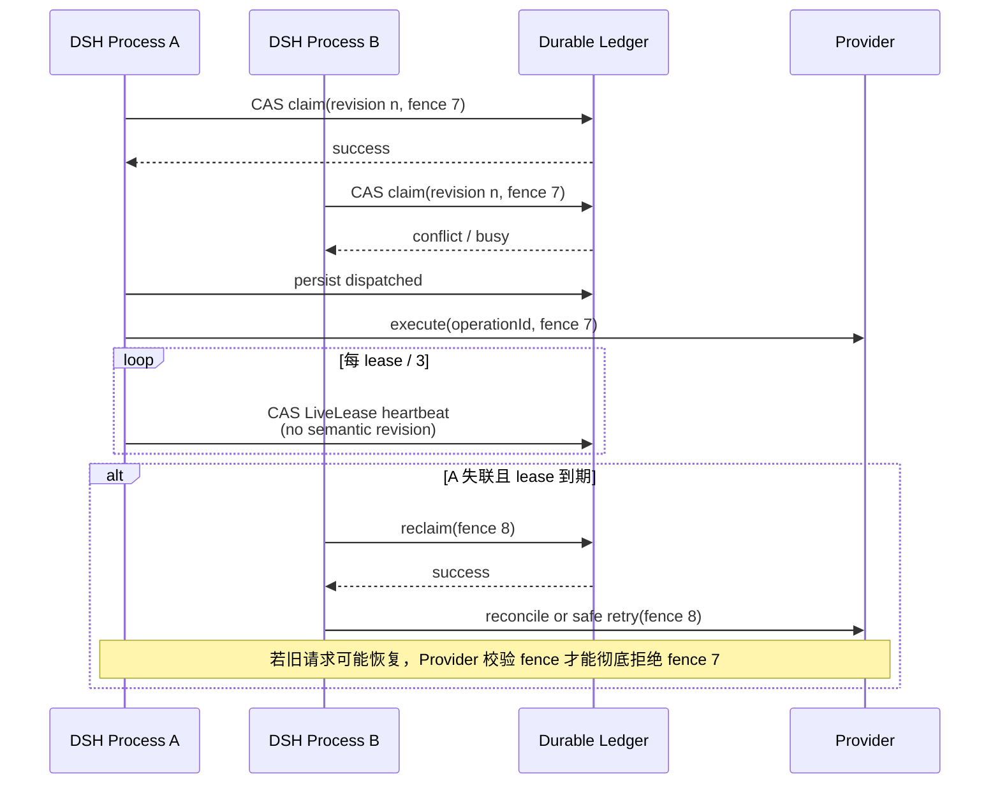

符合 capability contract 的 Ledger CAS 保证所声明拓扑中不会同时存在两个有效 owner；默认实现是 shared local SQLite。它不能强迫一个已经失联的外部请求停止。长任务应遵守组合 `AbortSignal`；高风险 Provider adapter 应传递并校验 fencing token。没有 Provider fencing 时，lease 解决的是本地协调，不构成分布式 exactly-once 证明。

## 12. 数据模型与 Secret 边界

### 12.1 收敛后的持久化模型

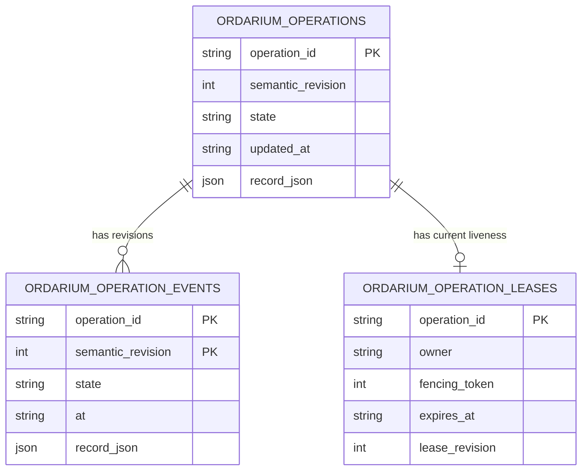

`ordarium_operations` 是当前语义权威快照；`ordarium_operation_events` 是每个 semantic revision 的完整快照日志；`ordarium_operation_leases` 是可覆盖的当前 liveness。Heartbeat 只更新 lease row，不增加 semantic revision/history，也不改变语义 `updatedAt`。History 提供审计与恢复轨迹，但不是要求 reducer 重放才能得到当前状态的 event-sourcing 系统。

首个公开版本目标固定 `application_id=ORDA`、`user_version=2`、record `schemaVersion=2`。当前 private v1 由 SQLite 边界事务性前向迁移；core 只接受 v2。非 SQLite ledger 也必须输出同一个 canonical record codec 与等价 semantic/live-lease 行为，不得建立第二套 Operation 模型。

### 12.2 数据流与禁止项

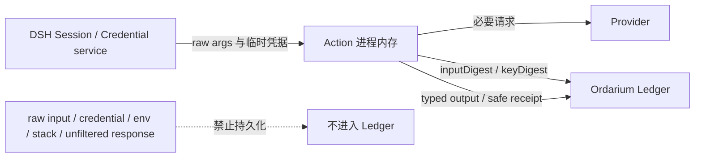

Ledger 可以保存：

- Action name/version、非敏感 identity；
- input/key digest；
- authorization source、state、revision、attempt、claim/fencing；
- 已验证且 secret-free 的 output、receipt、safe error；
- uncertainty 与 reconciliation 记录。

Ledger 不保存原始输入、原始业务 key、credential、环境变量、任意异常 message/stack 或未筛选 Provider 响应。output 与 receipt 会被持久化，因此 Action 作者必须把它们视为审计数据，而不是秘密传输通道。单值默认上限为 1 MiB。

## 13. 宿主适配合同：DSH 首宿主与 MCP 第二宿主

宿主适配的通用合同由 core 的 HostInvocationPort 冻结（第 4 节 L0 端口）；DSH adapter 与 `@ordarium/host-mcp` 是同一合同的两个实现。首发 DSH adapter 只依赖明确支持矩阵中的 DSH public types/lifecycle，不导入 RC 私有内部包；host-mcp 只依赖 MCP 协议的公开 server 合同。当前结构近似类型只是待替换实现，不形成第二入口。DSH 侧映射：

| DSH 侧 | Ordarium 侧 | 约束 |
|---|---|---|
| Tool `name/description/parameters` | Action metadata/input schema | DSH 输入必须是 object JSON Schema |
| `output.schema/render` | Action output schema/renderer | renderer 必须是纯展示，不产生副作用 |
| `ToolRunContext.callId` | `identity.callId` | 宿主 replay 若不保留 callId，必须使用业务 `key()` |
| `rootCallId` | 关联字段 | 不用于默认去重 |
| Agent session/id | `identity.scope` | scope 必须稳定且非敏感 |
| Tool signal | Action/lease 组合 signal | Action 与 Provider adapter 应响应中止 |
| admission/policy/approval | classified AuthorizationEvidence | host-admission、policy-decision、human-approval 不互相冒充 |

MCP 侧映射（`@ordarium/host-mcp`，发布门交付）：MCP `tools/list`/`tools/call` 映射到 Action 注册与执行；MCP 客户端的调用身份映射为 `source="mcp"` + 客户端稳定 scope/callId（客户端不能提供稳定 call identity 时，Action 必须声明业务 key，否则 fail closed）；ops 工具的暴露遵循第 17 节受权原则；stdio server 生命周期遵循第 9 节 quiesce/drain 合同。MCP 适配不把任何 MCP 类型带入 core。

Core output 始终是 typed JSON；ContentBlock 是 Host Adapter 的展示合同。当前 DSH adapter 只建模 text block，这不足以证明对 DSH 图片、资源或其他公开 content type 的完整兼容。发布前必须以 DSH 正式公开类型为准：默认 renderer 可以保持 JSON text，但自定义 renderer 不得被 Ordarium 私有窄类型无谓限制。

开发者表面保留两条路径但只有一个根入口：`@ordarium/dsh` 的 `installOrdarium(context, { actions })` 是默认路径；自定义 render、timeout、concurrency、actor、lineage、principal、custom ledger 或 Ops 时显式导入 `@ordarium/dsh/advanced` 的 per-action binding。当前宽重导出与 `.tool()` 形状是 private gap，应 clean break 收敛，不保留两个 public façade。

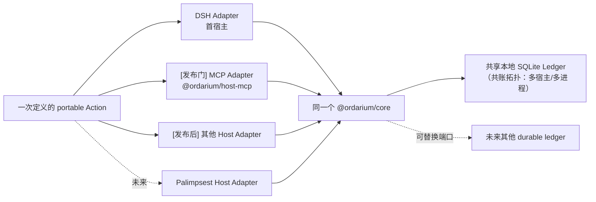

一个合格 Host Adapter 必须提供（即 `@ordarium/testing` 宿主 conformance harness 的验收清单）：

1. 稳定、非空、非敏感的 `source/scope/callId`；
2. 正确的授权来源，不能伪造人工决策；
3. 调用取消 signal；
4. 输入/输出 schema 与宿主 Tool pipeline 的双向映射；
5. register/dispose 生命周期；
6. replay、并发和重启语义的真实集成测试。

Ordarium 不要求其他宿主模仿 DSH，也不输出一个新的通用 Tool 协议；兼容面是 HostInvocationPort。DSH 与 MCP 两个实现共同证明：适配器可替换、内核不随宿主变化。

## 14. 多 agent 模型：subagent、code-mode、transport 与共账拓扑

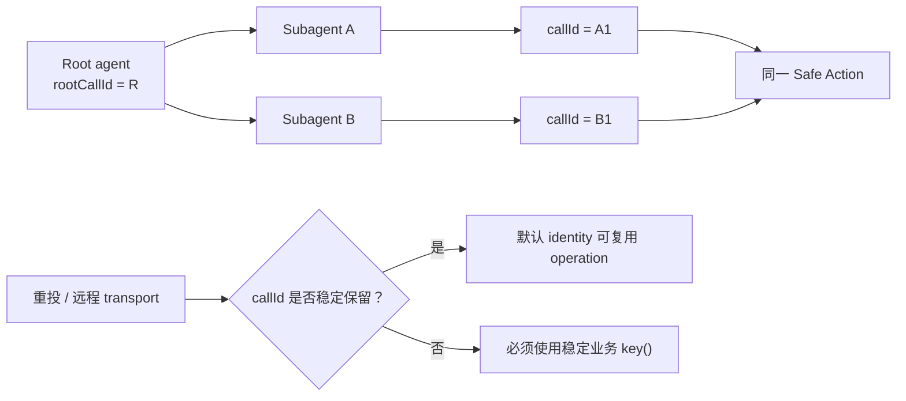

Ordarium 不实现 subagent 调度。纯推理 subagent 不需要 Ordarium；只有最终副作用边界需要它。`rootCallId` 保留因果关联，`callId` 或业务 `key()` 决定 operation identity。

如果 transport 不能保留稳定 call identity，Adapter 不得随机制造“看起来唯一”的身份并继续声称去重；高风险 Action 必须要求业务 key，否则只能退化为 `guarded/unmanaged` 的明确较弱保证。

### 14.1 多 agent identity 传播规则

多 agent 语义收敛为四条合同（由 core 冻结，宿主 adapter 只做映射，不得另解释）：

1. `identity.source` 标识宿主（如 `dsh`、`mcp`），跨宿主共账时天然隔离默认 logical key；
2. `identity.scope` 标识 agent/session，`callId` 标识单次调用；`rootCallId` 与 `lineage[]` 只作因果关联与审计，绝不进入默认去重键——同一根调用下的两个 subagent 兄弟任务是两个 operation；
3. transport 重投保留 callId 时默认 identity 汇合；丢失时必须由 Action 的稳定业务 `key()` 汇合，否则 managed 高风险 Action fail closed；
4. 共享 ledger 的 Action 必须使用命名空间名称（如 `github.issue.create`），避免多插件/多宿主碰撞；多租户隔离靠 database path/进程权限，`scope` 不是 ACL（第 23 节）。

### 14.2 显式共账拓扑

多个 agent、进程或宿主共享同一个本地 ledger 是受测试的一等部署形态（不是多主机、不是网络文件系统）：

- 协调基础是既有 local-multi-process 语义：transaction CAS、semantic claim、LiveLease 与单调 fencing token（第 11 节），双宿主/双进程只有一个 claim 能进入 dispatch；
- 跨 agent 可见性走 Operations Port：operator 审计视图包含 lineage/rootCallId 以回答“哪个 agent 的哪次调用”；model 视图脱敏规则不变（第 21 节）；
- 该拓扑的验收 fixture 属于 G2（双宿主进程共账）与 G5（DSH + host-mcp 真实双宿主）；
- 它不改变 trust model：共享 ledger 的各方必须同属一个 OS-user trust domain。

## 15. HMR、版本与生命周期

DSH 继续拥有 HMR 和插件生命周期。Ordarium 规定跨 reload 的语义与安全 dispose 顺序：

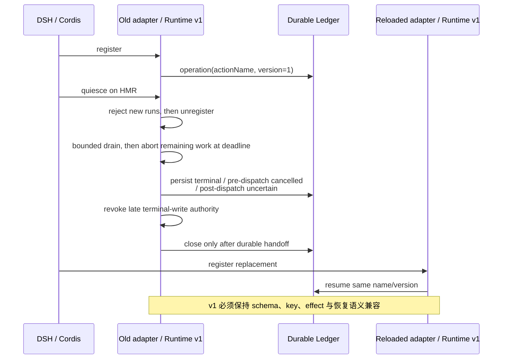

- 同一 `name + version` 的 reload 必须语义兼容；函数源码 hash 不是可靠合同。
- 改变 input/output schema、key 生成、effect profile、Provider idempotency/reconcile 语义时必须 bump version。
- Ledger 比插件实例生命周期更长；dispose 不删除 operation。
- 安全 dispose 顺序是 quiesce → unregister → 有界 drain → abort remaining → 持久化可达状态或 durable handoff → 撤销迟到写权限 → close ledger。硬进程退出可以跳过 drain，但随后必须依赖 durable recovery。
- 当前 `installOrdarium().dispose()` 只是 unregister 后立即 close，尚未实现 in-flight drain；这是发布前生命周期缺口，而不是已完成能力。
- HMR 后同一 call 的恢复由重新注册的相同 Action version 完成。
- 发布前 conformance 应对 schema/effect metadata 生成诊断 digest，以发现意外漂移；该 digest 是检查工具，不替代版本责任。

## 16. 部署拓扑

### 16.1 默认：单机嵌入式

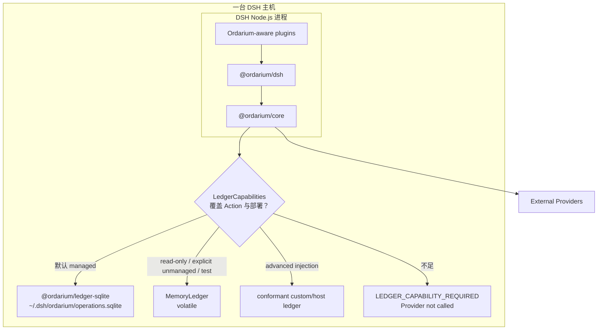

SQLite 不是 core 必需依赖；它是默认 managed DSH topology 的 reference ledger。多个本机进程可以打开同一个本地 SQLite 文件并通过 transaction/CAS 竞争 operation，但必须用真实双进程夹具验证。MemoryLedger 不能承接 managed crash-recovery promise，SQLite/custom ledger 失败也不得静默 fallback。网络文件系统、多个主机共享 SQLite、跨地域执行或分布式共识不属于首个版本承诺。

### 16.2 “更轻存储”的准确取舍

SQLite 不是二进制体积意义上的唯一轻方案，但在 Ordarium 要求的完整本地 durable semantics 下，它是总工程复杂度最低的默认方案：

| 方案 | 表面成本 | 为 managed write 仍必须解决 | 决策 |
|---|---:|---|---|
| `MemoryLedger` | 最低、零文件 | 无法补出 crash/restart durability 与跨进程 coordination | 内置保留，但只限 test/read-only/explicit unmanaged |
| JSON snapshot / append log | 少一个数据库名词 | atomic replace、fsync 顺序、损坏尾截断、进程锁、跨进程 CAS、history index、migration、backup | 不内置；这些工作会重新造一个更弱数据库 |
| embedded KV/LMDB/Level 一类 | API 可能更窄 | 事务/CAS 语义、跨平台 binary/runtime dependency、schema/index、backup 与 conformance | 可由 advanced custom ledger 验证后接入，不增加首发默认依赖 |
| host-owned durable store | 对已有宿主最省 | canonical codec、semantic CAS、LiveLease、history、topology capability | 正式 extension seam；通过 conformance 后可替代 SQLite |
| SQLite reference ledger | Node 内置、一个逻辑本地数据库 | 仍需管理 WAL sidecars、migration、backup、busy/corrupt mapping 与双进程实测 | 默认 managed DSH 实现 |

因此“更轻”有两个合法含义：若放弃 crash/restart promise，MemoryLedger 确实更轻；若保留完整 managed promise，SQLite 通常比自制文件协议更轻。Core 通过 capability gate 同时容纳两者，不用假装它们提供同一保证。

### 16.3 未来远程形态

只有当真实生态出现多主机共同执行同一 operation 的需求时，才考虑远程 Effect Authority service 或网络 ledger。届时 Host/Action API 应保持不变，替换的是 Ledger/claim 实现。当前不为假想分布式需求加入 daemon。

## 17. 运维闭环

仅有自动恢复还不构成完整产品：用户必须能看见并安全处置 `uncertain`。但运维面必须保持窄，不能变成让模型任意强制重试的万能控制台。

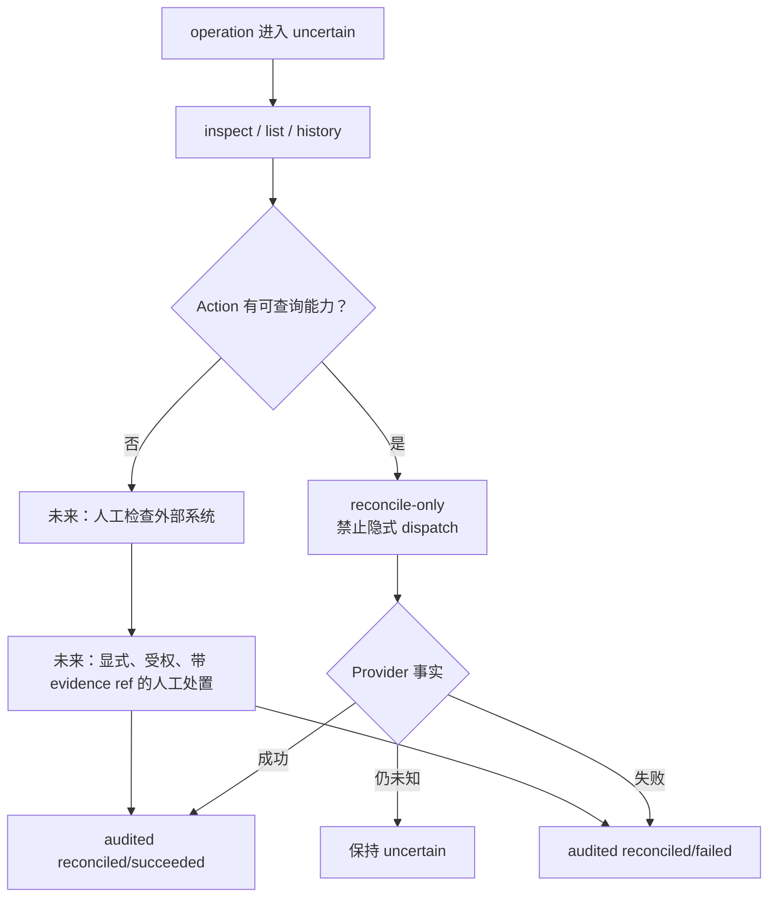

冻结的运维原则：

- inspect、list、history 是只读操作；
- reconcile-only 只能调用 `reconcile()`，不得在“查询不到”时自动 dispatch；
- 普通模型 tool 不暴露 `forceRetry`；
- Runtime 只有在现有保证矩阵证明安全时才能重新 dispatch；
- 人工处置若实现，必须显式授权、记录 actor/source/evidence reference，并验证补录 output/error；
- 人工处置不是首个内核版本的前置条件，但 inspect 与 reconcile-only 是 DSH 成品化的发布门。

`uncertain` 保持未知本身是语义闭环；运维入口解决的是可见性与后续处置闭环。

## 18. 当前实现、发布前必需与延后项

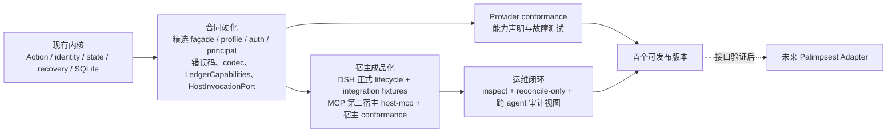

| 层次 | 内容 | 决策 |
|---|---|---|
| 已实现内核 | 四包、五种 profile、identity、授权、CAS/lease/fencing、恢复、SQLite、DSH 结构适配、故障注入 | 保留并继续硬化 |
| 发布前必需 | 精选 façade、HostInvocationPort 冻结、宿主 conformance harness、LedgerCapabilities gate、schema v2/live lease、双 Node 进程竞争、共账拓扑 fixture、公共错误/状态冻结、真实 DSH lifecycle/replay/parallel/restart、`@ordarium/host-mcp` 第二宿主、recovery material、inspect/reconcile-only、跨 agent 审计视图、Provider conformance、ledger 生命周期策略 | 属于完整产品闭环 |
| 发布后扩展 | 更多宿主 Adapter、少量 Provider adapters、更完善的 operator UX | 由真实采用推动 |
| 明确延后 | Palimpsest Adapter | 只保留 Host Port，不进入当前实现 |
| 明确不做 | Agent Loop、workflow/subagent scheduler、多 agent 编排、secret vault、sandbox、client、Cordis fork、Rust runner、远程 worker、默认 daemon | 不进入路线图 |

## 19. 必须长期保持的不变量

1. 同一 operation identity 与不同 input 永远 conflict，不做 last-write-wins。
2. 外部调用之前必须持久化 `dispatched`。
3. managed side effect 没有授权证据不得 dispatch。
4. 相同 operation 的所有安全重试复用同一 idempotency key。
5. lease 丢失的 owner 不得写入终态，并应中止正在运行的 Action。
6. Provider 事实不明时进入 `uncertain`，不得把它改写成普通失败并盲重试。
7. 原始 input/key、credential、raw stack 与未筛选响应不得进入 ledger。
8. result/receipt 必须先通过 output/JSON/size 约束才能成为成功事实。
9. DSH pipeline 始终包围 Ordarium；Ordarium 不绕过或复制宿主的 Agent 与安全职责。
10. core 不依赖 DSH、Palimpsest 或特定 Provider。
11. `name + version` 是跨 HMR/restart 的 Action 语义边界。
12. 默认 managed DSH 架构保持 library + local SQLite；core 只依赖 LedgerCapabilities，不把 SQLite 写入 Action/Operation 语义。
13. Volatile ledger 不得承接 managed crash-recovery promise，durable ledger 故障不得静默 fallback。

## 20. 逐框责任与可追溯审计

以下目录按“语义框”审计全部 Mermaid。多个图中只为观察角度不同而重复出现的框合并为一行；状态机中的具体状态、恢复判断分支和 identity 中间值分别由第 8、9、6 节定义，不再把每次重复出现当成新组件。

### 20.1 宿主与外部参与者

| 图中框或别名 | 唯一职责 | 输入 | 输出 | 不拥有的权威 | 状态 |
|---|---|---|---|---|---|
| 最终用户 / Agent、用户 / Agent | 发起工具意图并消费结果 | Prompt、宿主交互 | Tool call、后续选择 | 不直接获得 operation claim、Provider 事实或强制重试权 | 外部参与者，已阐明 |
| DSH 或类 DSH Harness、DSH Pipeline | 运行 Agent Loop 与原生 Tool Pipeline | Tool definition、模型调用、session | 已校验的 tool invocation、result event | 不推断 Provider 是否已经产生副作用 | DSH 当前宿主，真实集成待完成 |
| Agent Loop / Tool Pipeline | 决定何时调用哪个工具、怎样将结果返回模型 | 上下文、tool schema | ToolRunContext、工具结果 | 不拥有 Ordarium operation state | 宿主已有职责 |
| Guard / Approval / Admission、宿主准入权威 | 决定一次 invocation 是否允许进入 tool body | 策略、用户确认、宿主状态 | classified AuthorizationEvidence | 不证明远端执行结果；三种 evidence kind 不互相冒充 | 基础 admission 已实现，kind 与真实映射待集成 |
| Session / Client / HMR | 保存会话、展示结果、reload 插件，并在显式恢复时提供原 invocation 的定位能力 | call/root/session identity、宿主事件 | identity、lifecycle、可选原始参数解析 | 不写 Ordarium 状态，不决定安全重试 | DSH 拥有；recovery material resolver 待接入 |
| Credentials / Sandbox / MCP、Credential service | 在运行时提供临时凭据与隔离能力 | 宿主配置、credential handle | 进程内能力 | 不把 credential 交给 ledger；Ordarium 不复制 sandbox | 明确非目标 |
| 外部 Provider / OS / DB、Provider 事实权威 | 执行真实业务效果并提供可查询事实 | 业务请求、operation key、可选 fence | result、query outcome、safe receipt | 不决定宿主 admission 或本地 claim | 外部依赖；能力必须 conformance 验证 |
| 其他 Tool 宿主、第二 Host Adapter | 证明 core 与 DSH 解耦 | 稳定 identity、authorization、signal、schema 映射 | HostInvocation | 不要求模仿 DSH 内部实现 | `@ordarium/host-mcp` 为发布门交付物；更多宿主发布后按需 |
| 未来 Palimpsest Runtime / Adapter | 未来把已授权副作用映射为 Action invocation | 版本化 HostInvocation | terminal/uncertain 结果 | 不读取或修改 Ordarium 内部 ledger | 明确延后，无当前依赖 |
| Root/Subagent、call A1/B1、transport | 传播因果 lineage 与稳定 invocation/business key | rootCallId、callId、业务 key | Host identity | 不承担 subagent 调度；rootCallId 不做默认去重 | 规则已定义，远程集成待宿主证明 |

### 20.2 Ordarium 产品与内核

| 图中框或别名 | 唯一职责 | 输入 | 输出 | 失败行为 | 状态 |
|---|---|---|---|---|---|
| `defineAction / schema / effects`、Action authoring DSL | 声明稳定、可验证、可移植的 Action 合同 | name/version、schemas、effect、functions | 冻结的 `Action<I,O>` | 无效命名、profile 或 JSON 合同立即拒绝 | 已实现 |
| Host Adapter、DSH Adapter、`@ordarium/dsh` | 用精选根入口和 `/advanced` 把宿主调用映射到 core，并把结果交回原生 pipeline | ToolRunContext、Action、分类 authorization evidence | DSH ToolDefinition、HostInvocation | identity/schema/evidence 不足时 fail closed | 结构适配已实现；façade、正式 lifecycle、ContentBlock 与 binding fixture 待完成 |
| Host Invocation Port | core 与任意宿主之间的最小边界 | identity、authorization、signal、原 input | `ActionRunOptions` 与 parsed input | managed effect 缺稳定 identity 必须 fail closed | ARCH-3 冻结为 core 一等端口；独立接口与 `IDENTITY_REQUIRED` 在 G1 切换 |
| Effect Authority Runtime、Ordarium operation 权威 | 编排 identity、authorization、claim、dispatch、terminal/recovery | Action、input、HostInvocation | typed result 或 Ordarium error | 状态/证据不足时 fail closed 或 `uncertain` | 已实现主链 |
| Canonical identity engine | 生成稳定摘要与 operation id，并检测冲突 | Action name/version、identity、parsed input、可选 key | key/input digest、operationId | 非 lossless JSON、空 key、digest 冲突时拒绝 | 已实现 |
| Authorization gate | 在 managed dispatch 前消费并持久记录分类证据 | effect profile、host-admission/policy-decision/human-approval | authorized 或 denied record | 缺 decision 为 required；deny 为终态；矛盾 evidence 不覆盖首次决定 | 主链已实现；kind/conflict metadata 需硬化 |
| Operation state machine | 约束所有持久状态转换 | 当前 record、事件结果 | 下一 revision | 非法/未知状态 fail closed | 已实现，public state 待冻结 |
| Claim / lease / fencing | 为一个 operation 分配短期执行所有权 | record revision、owner、clock | claim、expiry、单调 fence、heartbeat | CAS 失败为 busy；lease 丢失会 abort | 已实现；真实双进程和时钟异常待补 |
| Recovery decision engine | 只在 Provider 证据允许时 query 或 redispatch | dispatched/uncertain、Action capability、input | reconciled、same-key dispatch 或 uncertain | 查询异常、未知、无安全路径均保持 uncertain | 已实现 invocation recovery；reconcile-only 待实现 |
| Schema / size / secret-safe persistence checks | 阻止不合法或过大的持久数据成为成功事实 | parsed output、receipt、safe error | 可持久化 JSON | dispatch 后校验失败必须落入恢复/uncertain 路径 | 已实现；自动 redaction 明确不默认提供 |
| Safe Action、Action Port | 封装 Provider-specific execute/reconcile/cancel/receipt | typed input、execution context | typed output/query outcome/safe receipt | execute 是唯一业务写路径；reconcile/key/receipt 必须 query-only 或纯函数 | 主链已实现；纯度由 conformance 证明 |
| OperationLedger Port / capability gate | 提供能力声明、当前语义记录、semantic CAS、live lease 与 cursor history | OperationRecord、expected revision/fence、filter | record、CAS/lease result、history/list | managed profile 与拓扑能力不匹配时 dispatch 前拒绝 | 基础 port 已实现；capability/lease/page target 待切换 |
| SQLite Ledger、shared local SQLite、durable ledger | 在本机提供 WAL/FULL、semantic CAS、独立 live lease、schema v2 migration/backup | ledger operations | durable records/events/liveness | busy/full/corrupt 必须按第 24 节处理；不得 fallback | v1 已实现；v2 与维护策略待实现 |
| MemoryLedger | 提供 single-isolate volatile 测试、read-only 或 explicit unmanaged 嵌入 | ledger operations | in-memory records/history | 进程退出即丢失；managed capability gate 拒绝 | 已实现；能力声明待实现 |
| Operations Port、inspect/list/history/reconcile-only | 让受权操作者观察和只查询恢复 operation | operationId、Action、匹配 input、operator authorization | sanitized view 或 reconciled/uncertain | 不暴露通用 force retry；缺恢复材料时只读 | 发布前目标，合同见第 21 节 |
| Crash / Conformance Kit、`@ordarium/testing` | 证明崩溃窗口、identity 与 Provider 能力声明 | Action、Runtime、fault point、provider fixture | 可重复测试证据 | 不替代真实 DSH/Provider integration | checkpoint/clock 已实现；Provider conformance 待补 |

### 20.3 数据、部署与演进框

| 图中框或别名 | 解释 | 权威性或限制 | 状态 |
|---|---|---|---|
| `Action name + version`、Invocation、Operation、Attempt、External effect | 五个不同基数对象，防止把“调用次数”误当“业务效果次数” | operation 是 Ordarium 去重单位；external effect 仍由 Provider 证明 | 已定义 |
| default/business logical key、key/input digest、operationId、same/conflict | identity 推导中间值 | rootCallId 不进入默认 key；input digest 不进入 operation id，而用于冲突检查 | 已实现 |
| proposed…reconciled 状态框 | operation 生命周期 | `reconciled` 必须读取 outcome；`uncertain` 是待处置状态 | 已实现 |
| read-only/guarded/idempotent/reconcilable/unmanaged | Provider 能力剖面，不是安全分数 | idempotency/query 的持续期与一致性必须满足第 22 节 | profile 已实现，能力证据待硬化 |
| current operation / semantic event / live lease table | 当前语义快照、semantic revision 历史与独立 liveness | 当前 v1 仍把 heartbeat 写入完整快照；目标 v2 分离，历史不是 tamper-evident event sourcing | v1 已实现，v2 待迁移 |
| Action 进程内存、raw args/credentials、blocked persistence | 短期敏感数据边界 | raw input/key/credential/stack 不进入 ledger | 已定义并实现主要限制 |
| DSH Node process / local machine / default SQLite path / explicit volatile mode | 默认嵌入式部署与较弱可选路径 | managed 默认 SQLite；volatile 只限 read-only/test/explicit unmanaged；多 tenant 分库/权限隔离 | SQLite 默认已实现，capability gate 待实现 |
| HMR Action v1 instances | reload 前后相同 version 的语义连续性 | 不兼容 schema/key/effect/recovery 必须 bump version | 作者合同已冻结，diagnostic 待补 |
| 现有内核→合同硬化→DSH/运维/conformance→发布→第二宿主→Palimpsest | 交付依赖图，不是运行时组件 | 虚线未来框不代表现有能力 | 路线已定义 |
| future ledger / remote authority / manual attestation | 明确扩展缝 | 未给出实现前不得形成当前产品承诺 | 有边界、无当前实现 |

逐框审计后的结论是：所有运行时框已有 owner，但 Operations、recovery material、Provider 能力有效期、ledger capability/lifecycle、trust model 与基础设施失败语义必须形成闭合合同。代码审计还确认 façade 泄漏、authorization kind、provider principal、HMR drain、完整 codec、live lease、Node/SQLite 平台承诺与资源上限都属于发布缺口，不能被总图中的“已有内核”掩盖。第 21–26 节与 `13/17` 将它们归位。

## 21. Operations Port 与 recovery material 合同

Ordarium 不保存原始输入，而现有 `reconcile(input, context)` 又可能需要输入。因此 operation inspector 不能仅凭 `operationId` 凭空执行 reconcile。完整路径必须包含宿主提供的 recovery material：

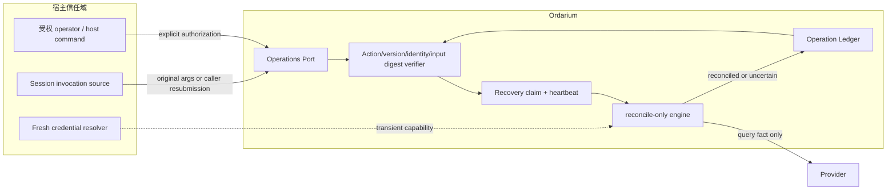

目标端口语义为：

```ts
interface OrdariumOperations {
  inspect(operationId: string): Promise<OperationView | undefined>;
  list(filter?: OperationListFilter, cursor?: string): Promise<OperationPage>;
  history(operationId: string, cursor?: string): Promise<OperationEventPage>;

  reconcileOnly<I extends JsonValue, O extends JsonValue>(request: {
    operationId: string;
    action: Action<I, O>;
    input: unknown;
    identity: InvocationIdentity;
    authorization: OperatorAuthorization;
    providerPrincipalRef?: ProviderPrincipalRef;
    signal?: AbortSignal;
  }): Promise<O>;
}
```

`reconcileOnly` 必须：

1. 重新 parse input，并校验 action name/version、operationId、logical key digest 与 input digest 全部匹配现有 record；
2. 接受 `dispatched`、`uncertain`，或 lease 已过期且 `resumeFrom` 为二者之一的 `claimed`，并通过 CAS 获得 recovery claim；
3. 只调用 `reconcile()`，绝不调用 `execute()`；
4. `succeeded/failed` 写入 `reconciled`；`pending/unknown/throw/invalid` 保持 `uncertain`；
5. 即使得到 `absent + retrySafe`，在 reconcile-only 模式也只保持 `uncertain`，重新 dispatch 必须走正常 Runtime 保证路径；
6. 重新从宿主取得当前 credential，credential 不参与 digest、不写 ledger；
7. 返回脱敏的 `OperationView`，而不是默认把全部 output、identity 与 authorization reason 暴露给模型。

`inspect/list/history` 必须使用稳定分页：显式 bounded limit、按 `(updatedAt, operationId)` 排序并返回 opaque cursor；模型视图默认只包含 operationId、action/version、guarantee、state、attempts、updatedAt 与安全 reason code。当前 MemoryLedger 与 SQLiteLedger 的默认 list limit 不一致，不能直接作为发布级 Operations API。

Recovery material 的来源优先级固定为：宿主按 `source/scope/callId` 找回原 invocation → 操作者显式重新提交相同参数 → Action 的 reconcile 实现只依赖 `operationId` 并忽略 input。三者都不可用时，系统只能 inspect，不能自动 query。

人工 attestation 属于未来 schema，不属于首发端口。若以后实现，必须增加独立 `ManualResolutionRecord { actor, source, evidenceRef, outcome, at }`，要求强授权并验证 typed result/safe error；不得复用普通 admission，也不得触发 Provider 重试。

## 22. Provider 能力证明合同

`effects.idempotent()` 不是一句开发者自我声明就足够。完整能力证明必须覆盖：

| 能力 | 允许的 Runtime 行为 | Provider 必须证明 | 不满足时的降级 |
|---|---|---|---|
| operation-key idempotency | 相同 operationId 可以在已证明窗口内再次 execute | key 作用域、冲突语义、响应复用方式，以及 durable/finite window 的真实边界 | `guarded`，或叠加 authoritative reconcile；finite 过期后禁止 execute |
| reconciliation | dispatch/uncertain 后先 query | query key 稳定、状态含义、最终一致性上界 | pending/unknown 保持 uncertain |
| authoritative absence | `absent + retrySafe` 后允许 redispatch | “不存在”不是 eventual-consistency 假阴性，或等待窗口已经结束 | `absent` 只能按 unknown 处理 |
| business uniqueness | 可以把重复 create 解释为同一业务对象 | 唯一约束键和冲突读取方式 | 不得声称单一业务效果 |
| cancellation | 可以请求 Provider 停止 | cancel 是否幂等、是否只表示 accepted、如何查询最终结果 | dispatch 后仍 uncertain |
| fencing | lease takeover 后拒绝旧 owner | Provider 原子保存并比较单调 token | fencing 只作为本地诊断，不能证明旧请求被拒绝 |

有限期幂等键不能被建模为永久 durable idempotency。首发 contract 已固定为 finite window：operation 首次创建时只计算并持久化一个绝对 `idempotencyExpiresAt`；deadline 前可以同 key redispatch，deadline 后只能 query 或保持 `uncertain`，且重启、reload、配置变化或新 attempt 都不得续期。若既没有仍有效的幂等窗口也没有 authoritative query，正确 profile 是 `guarded`。

Conformance suite 至少覆盖：首次成功、相同 key 同输入、相同 key 不同输入、响应丢失后重放、TTL 边界、query pending→success、假 `absent` 风险、cancel 后查询，以及支持时的 stale fence。

## 23. Trust model：Effect Authority 的真实含义

Ordarium 是协作式正确性内核，不是操作系统级安全 reference monitor。它的威胁边界必须诚实：

| 主体 | Ordarium 是否信任 | 说明 |
|---|---:|---|
| 宿主进程与插件代码 | 是 | 插件可以绕过 Ordarium 直接调用 Provider；没有 sandbox/provider gateway 时，Ordarium 无法强制所有副作用经过自己 |
| Action definition | 条件信任 | Runtime 校验 schema/profile/结果，但无法证明 execute 没有隐藏副作用或 key 语义正确 |
| Authorization hook | 条件信任 | 当前记录是来源声明，不是密码学签名；宿主必须保证 source/actor 真实性 |
| 本机 OS 与 SQLite 文件权限 | 是 | 当前没有 ledger encryption、签名或防本机管理员篡改 |
| revision event history | 仅作运行审计 | 它不是 hash chained、append-only tamper evidence；有数据库写权限的人可以修改 |
| Provider capability 声明 | 必须测试 | Provider 文档或 adapter 声明必须由 conformance 与真实集成约束 |
| 模型/普通 tool caller | 否 | 不授予 force retry、ledger write 或人工 attestation 权限 |

因此 “Effect Authority” 精确表示：**对所有选择通过 Ordarium 的 Action，ledger 是 operation 状态和 dispatch ownership 的唯一应用级权威。** 它不表示 Ordarium 能阻止恶意插件绕过，也不表示本地数据库天然具备防篡改审计能力。

Operations Port 必须由宿主权限保护。默认面向模型的 view 应省略 authorization reason、actor、完整 lineage 和可能敏感的 result/receipt；完整审计视图只交给受权 operator。

默认本地 SQLite 是一个 OS-user trust domain，不是多租户安全边界。`identity.scope` 只参与 operation identity，不能阻止同进程插件读取其他 scope。若 DSH 部署服务于互不信任的 tenant，必须按 tenant 使用不同 database path/进程权限，或未来使用带 ACL 的远程 ledger；仅在 `list()` 上加过滤条件不足以形成隔离。

确定性 SHA-256 digest 只避免直接保存原文，不等于加密：它会暴露相等关系，低熵邮箱、账号或短 key 还可能被离线字典猜测。Credential 不得作为 Action input/key；敏感对象应通过宿主 credential handle 或高熵 opaque reference 间接引用。未来若引入 keyed digest，必须解决多个进程共享密钥与轮换后历史 identity 的兼容问题，不能轻率替换当前 operation id。

Ordarium 也不是资源 sandbox。宿主仍负责 tool timeout、进程内存和原始请求大小；Action schema 应给字符串/数组设置业务上限。当前 1 MiB 只限制持久化 output/receipt，不限制 input、identity 或执行期内存。发布前应为持久 identity、lineage、authorization metadata 和 safe error 建立统一长度上限，并加入 oversized-input 负载测试。

## 24. Ledger 生命周期、基础设施失败与时钟

### 24.1 Retention 与清理

Operation record 是去重安全状态，不是可随意删除的日志。首个版本冻结为：

- 不自动删除 operation 或 revision history；
- `claimed/dispatched/uncertain` 永不自动清理；
- 删除 terminal operation 会重新打开相同调用产生第二次副作用的可能，因而不提供普通 GC；
- 将来若需要压缩，只能先归档 history，并保留不可重用的 identity tombstone；若 result 被清除，同一 invocation 应返回 `RESULT_EXPIRED`，不能重新 execute；
- retention horizon 必须不短于宿主 replay horizon。Provider durable idempotency 必须覆盖全部已承诺 redispatch horizon；finite window 则在 operation 创建时冻结绝对 `expiresAt`，并把该时点之后的 redispatch horizon 收敛为零，而不是伪装成 durable。

当前 v1 heartbeat 每次通过通用 CAS 更新都会追加完整 record snapshot：默认 30 秒 lease 会约每 10 秒产生一次写入，长任务会造成明显 write amplification。目标 v2 要求 claim acquisition、fence 和语义状态进入 history，而 heartbeat renewal 只更新独立 LiveLease；不能用自动删除安全 operation 的方式掩盖该问题。

### 24.2 Backup、restore 与 migration

- 活跃 WAL 数据库不能只复制主 `.sqlite` 文件；必须使用 SQLite 一致性 backup/checkpoint 流程或在所有连接关闭后复制完整文件集。
- 恢复旧备份会丢失备份之后的 operation identity，可能重新打开重复副作用窗口；恢复流程必须先与 Provider 业务事实 reconcile。
- Ledger schema 只做前向 migration；更高 `user_version` 或未知 record schema fail closed，不做自动 downgrade。
- 当前 schema v1 尚无通用 migration runner、backup API 或 tombstone；公开目标已经冻结为 user/record v2 与独立 lease table，这些是 ledger 成品化任务，不得由文档暗示为已实现。
- 当前 SQLite decoder 只完整检查了部分顶层字段；发布前必须用单一 `OperationRecord` codec 校验 authorization、claim、resumeFrom、result/receipt、error、uncertainty、reconciliation、identity 长度以及跨字段状态不变量。未完成前不能把“任意损坏 record 都 fail closed”描述成已验证事实。

### 24.3 失败矩阵

| 故障点 | 可证明事实 | 必须行为 |
|---|---|---|
| create/authorization/claim 写入失败 | Provider 尚未被调用 | fail closed，返回 infrastructure error |
| `dispatched` 写入失败 | Provider 尚未被调用 | 严禁 execute |
| `dispatched` 成功后 Provider 调用失败 | Provider 结果未知 | 尽力写 uncertain；写不了则 record 至少仍是 dispatched |
| Provider 成功后 terminal 写入失败 | 外部可能已成功，本地只有 dispatched | 返回 infrastructure error；下次同 identity 走恢复 |
| heartbeat/CAS 失败 | owner 已不能证明拥有 claim | abort Action；不得提交终态 |
| ledger locked/busy | 另一执行者或维护活动可能占用 | 返回稳定 busy/infrastructure error，不更换 identity |
| record/schema corrupt | 本地权威不可相信 | fail closed，不调用 Provider |
| disk full | 后续持久化不可保证 | dispatch 前停止；dispatch 后保留未知并要求维护 |

Lease 当前使用同一主机的 wall clock 与定时 heartbeat。系统时钟大幅跳变或 event-loop 长时间停顿可能导致过早/过晚 takeover；真实双进程测试必须加入 forward/backward clock 与 stall 场景。Provider fencing 仍是防止旧 owner 恢复执行的最终外部防线。未来多主机实现必须改用 authority-controlled time，不能沿用本地 wall clock 假设。

平台政策已经收敛：SQLite/DSH durable default 的最低目标是 Node 24.15.0，并接受该版本起 `node:sqlite` 的 release-candidate 状态，以换取零 native runtime dependency；最低版本与发布时当前 Node 必须通过 G2/G7 矩阵。Core/Testing 的最低 Node 单独按实际 API 决定。若矩阵证明内置 binding 不满足合同，只能在 ledger 边界替换，不得改变 core 的 Action/Operation 合同，也不得自动退化为 MemoryLedger。

## 25. 公共错误与调用者动作

| Error code | 含义 | 调用者允许动作 |
|---|---|---|
| `AUTHORIZATION_REQUIRED` | managed Action 没有决策 | 通过宿主取得真实授权后，以同一 identity 再进入 |
| `IDENTITY_REQUIRED` | managed side effect 缺少宿主提供的稳定 identity | 由 Host Adapter 补齐，不得用随机 id 绕过 |
| `LEDGER_CAPABILITY_REQUIRED` | ledger durability/coordination 不覆盖 Action 或部署 | 配置 conformant durable ledger 或显式降低到合法 profile；不得 fallback |
| `RUNTIME_QUIESCING` | Runtime 已停止接收新调用 | 由新插件实例处理新意图；旧实例不得新建 operation |
| `ACTION_DENIED` | 此 operation 已持久 deny | 不自动重试；新的用户意图必须产生新的 invocation/business intent revision |
| `AUTHORIZATION_CONFLICT` | 同一 operation 收到矛盾的授权证据 | 视为 Host Adapter 集成错误，现有持久决定不可覆盖 |
| `PRINCIPAL_CONFLICT` | 同 operation 绑定的 Provider principal digest 与本次解析不一致，或绑定后缺失 ref | 视为 credential/宿主集成错误；不得换账号继续原 operation，也不得随机重建 identity |
| `OPERATION_CONFLICT` | 同一 operation identity 被不同输入复用 | 修复 identity/key；绝不能自动生成随机 identity 绕过 |
| `OPERATION_BUSY` | 另一 owner 的 claim 仍有效或 CAS 被抢占 | 稍后以同一 identity 重试；不得创建第二 operation |
| `OPERATION_FAILED` | 已有可证明失败终态 | 返回业务失败，不再 execute |
| `OPERATION_CANCELLED` | dispatch 前取消，或 read-only 取消 | 可由新的显式意图重新调用 |
| `OPERATION_UNCERTAIN` | 外部结果未知且拒绝盲重试 | inspect/reconcile-only/人工外部核查 |
| `PERSISTED_VALUE_TOO_LARGE` | output/receipt 超过持久化上限 | dispatch 前可修正；dispatch 后必须按 uncertain 处理 |
| `SIMULATED_PROCESS_CRASH` | 测试夹具故障 | 只允许测试环境使用，不作为产品错误 |

SQLite I/O、corruption 与未来 migration 错误目前还没有冻结的 Ordarium error code。发布前必须把这些异常映射为稳定 infrastructure error family，避免 DSH 根据任意底层 message 判断是否重试。

## 26. 架构完整性判定

| 审计维度 | 结论 | 仍需实现的证明 |
|---|---|---|
| 产品/生态边界 | 闭合 | 无 |
| 宿主、Ordarium、Provider 三权分工 | 闭合 | DSH approval evidence 实际映射 |
| 包、façade 与依赖方向 | 闭合 | 当前四包仍为 private 且 DSH 根入口过宽；需精选 exports、`/advanced`、manifest 与版本策略 |
| Action/identity/version | 闭合 | managed identity-required、contract digest 诊断、真实 replay identity fixture |
| 正常执行与状态机 | 闭合且已实现 | public state/error freeze |
| Ledger capability、并发、lease、fencing | 合同闭合 | capability gate、v2 live lease、双子进程、clock/stall、Provider fence fixture |
| 崩溃恢复 | invocation recovery 已闭合 | reconcile-only 实现与 recovery material resolver |
| Provider 保证边界 | 合同现已闭合 | TTL/absence/cancel/fence conformance suite |
| Secret、tenant 与 trust boundary | 合同现已闭合 | ops view 脱敏、tenant 数据库隔离与权限集成 |
| Ledger 数据模型 | v2 target 已闭合，v1 为当前实现 | 完整 codec、v1→v2 migration、backup/retention、Node 24.15+ 矩阵 |
| 运维闭环 | 合同现已闭合 | inspect/list/history/reconcile-only 成品化 |
| HMR 与生命周期 | 合同现已闭合 | Runtime quiesce/drain API、真 DSH dispose/reload/restart fixture |
| Subagent 与其他宿主 | 边界闭合 | HostInvocationPort 冻结、`host-mcp` 第二宿主、双宿主共账 fixture（14.1/14.2） |
| Palimpsest | 有意保留接口，不构成当前缺口 | 当前不实现 |
| 分布式/远程 Authority | 明确非目标，不构成当前缺口 | 有真实需求后重新立项 |

最终判定：**架构现在达到“所有运行时框都有职责、I/O、权威、失败和状态说明”的合同完整度；实现仍未达到发布完整度。** 未完成内容已全部落在明确发布门或未来扩展缝中，不再存在由某个无主框暗示出来的隐藏子系统。

## 27. 最终架构结论

Ordarium 的完整性不来自功能面变宽，而来自把副作用主链做成一个可证明的闭环：

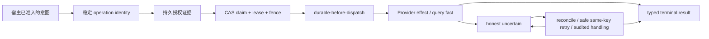

产品应当保持“窄而深”：让各宿主继续做 Harness，让 Provider 继续拥有外部事实，Ordarium 只成为多 agent harness 之下可靠、可移植、可测试的公共副作用执行权威。kernel-first 四层结构链的意义在于：DSH 与 MCP 可以替换、SQLite 可以替换、更多宿主可以加入，而 L0 语义内核不动——这是“基石”的全部含义，也是它保持轻量的原因。这一形态既有独立价值，也为未来 Palimpsest 留出了足够而不过早耦合的接口。
