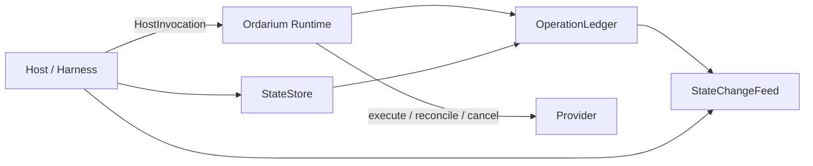
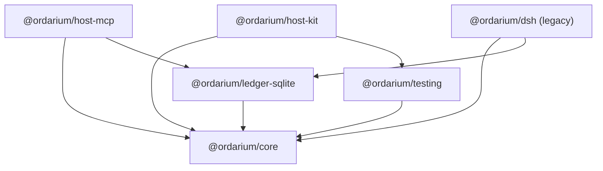
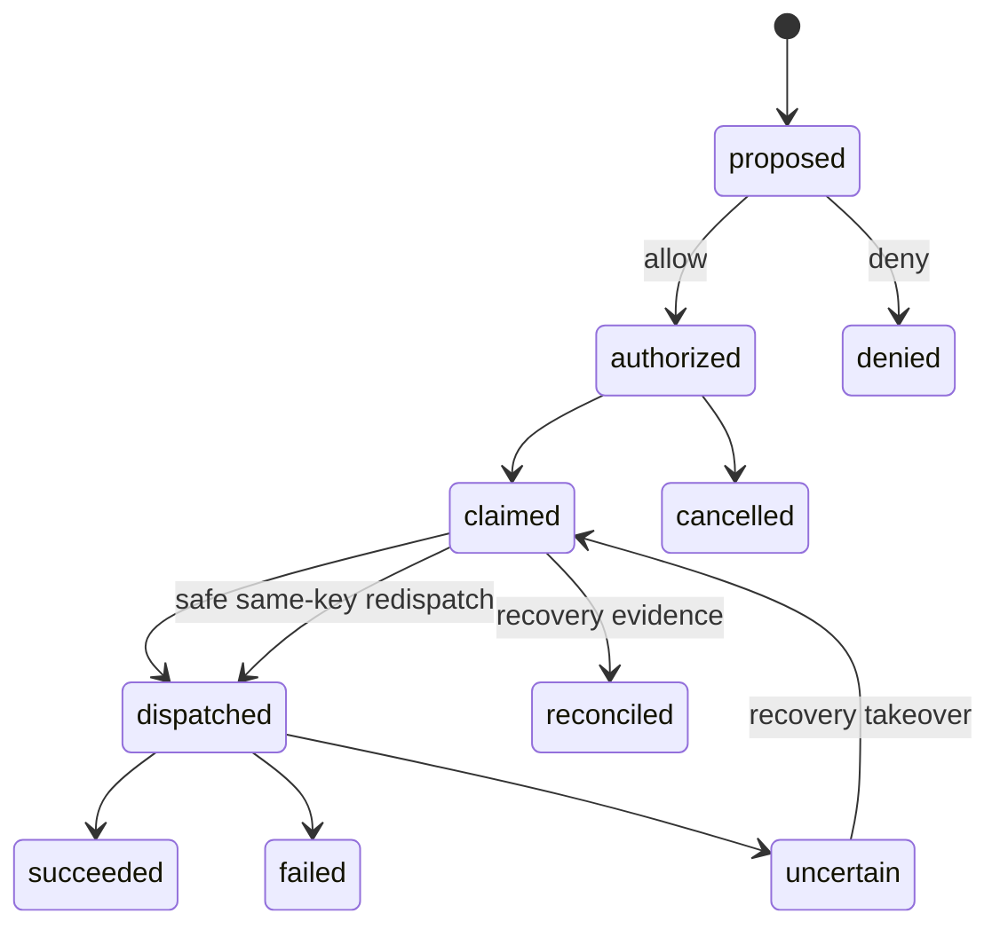
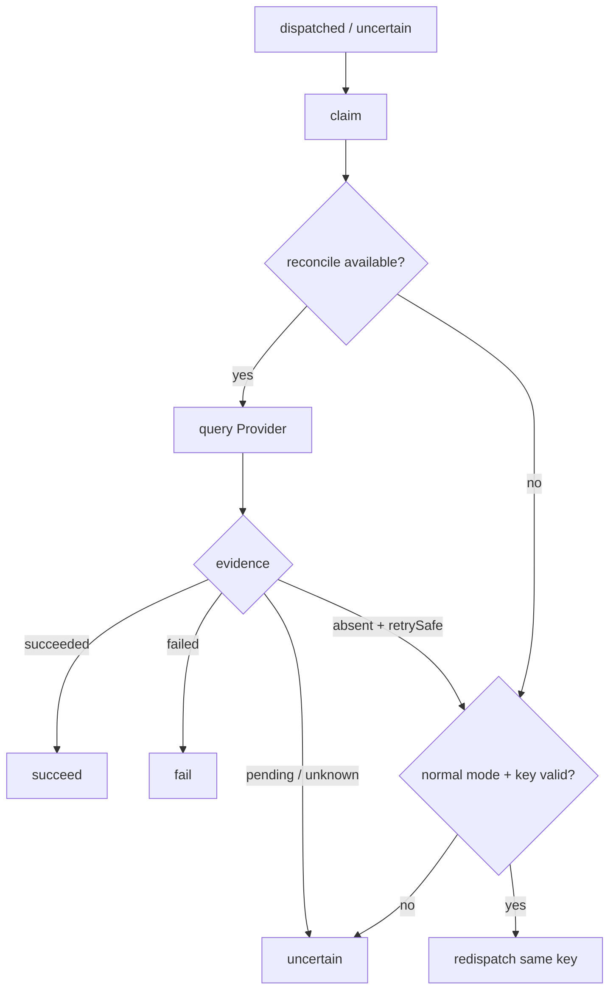
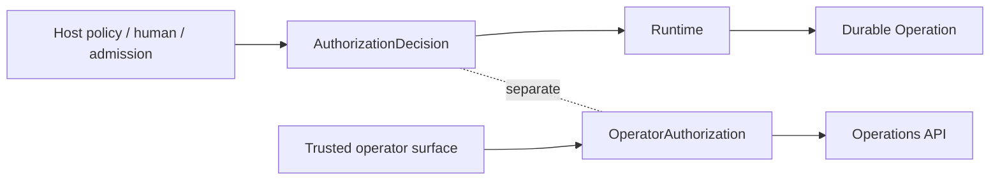
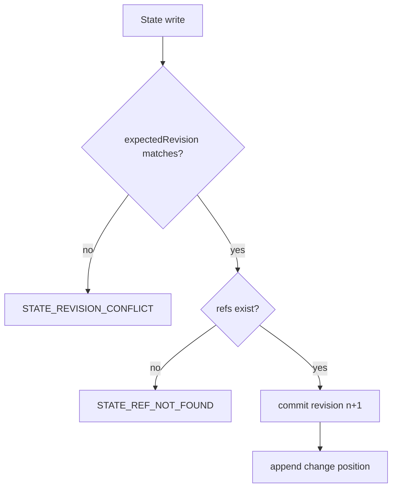
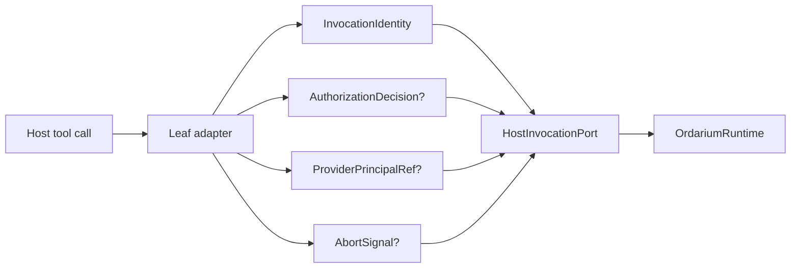
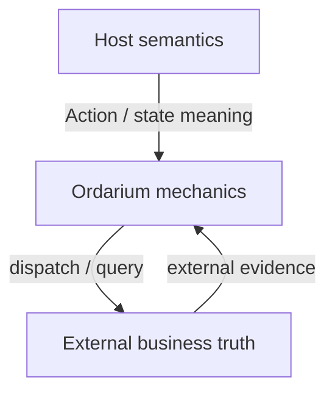
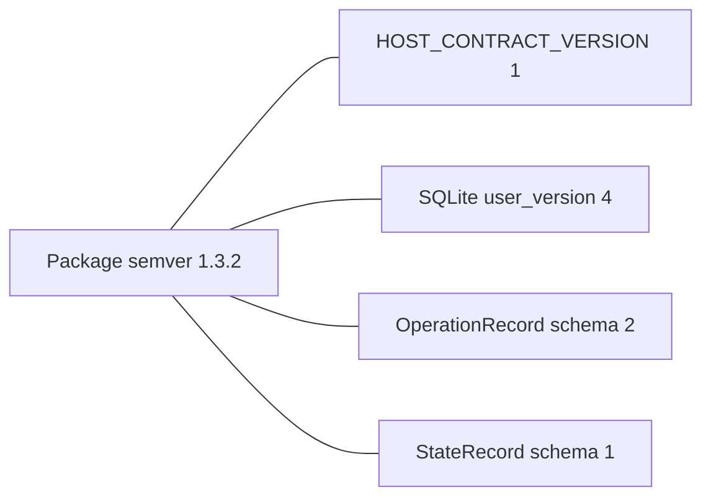

# 16 · Architecture atlas

这里是当前架构的视觉投影。

规范语义见 [13](13-ordarium-action-contract.md)，完整文字说明见 [15](15-ordarium-complete-architecture.md)。

## 1. Product boundary

## 2. Package topology

## 3. Operation lifecycle

## 4. Recovery decision

## 5. Authorization boundaries

## 6. State & refs

## 7. Host seam

## 8. Data ownership

## 9. Version axes

这里的连线表示“有关联但独立版本化”，不是“必须一起 bump”。
