# Ordarium Mermaid 完整架构图谱

> Atlas revision：`ORDARIUM-ATLAS-3`  
> 状态：`12–15` 的 Mermaid-first 视觉投影。`ATLAS-3` 同步 `delta-ARCH-001`：产品定位为多 agent harness 公共基石，第二宿主（MCP）与共账拓扑进入发布门。产品边界仍以 `12-ordarium-product-baseline.md` 为准，运行语义以 `13-ordarium-action-contract.md` 为准，当前实现快照以 `14-ordarium-implementation-plan.md` 为准，逐框解释以 `15-ordarium-complete-architecture.md` 为准，阶段目标与验收以 `17-ordarium-goals-and-acceptance.md` 为准。本文不另造第二套运行合同，而是把这些合同完整投影为可追溯图谱。

## 0. 图谱读法与完整性边界

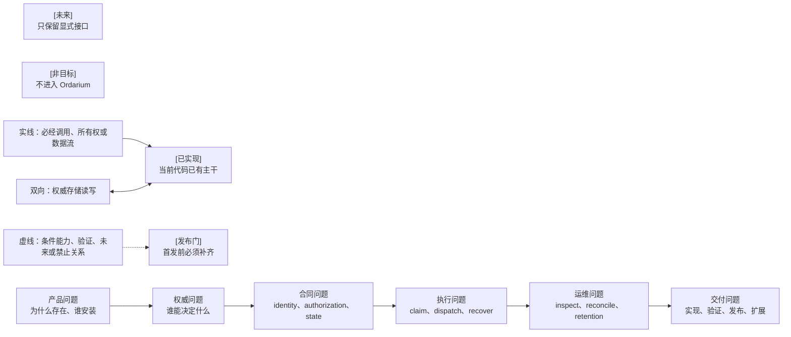

这套图谱以“决策能否沿箭头走完”为完整性判据。某个框只有名称而没有输入、输出、权威、失败行为或交付状态，就不算闭合。

## 1. 产品结论如何推出

### 1.1 从 DSH 已有职责推导 Ordarium 的窄边界

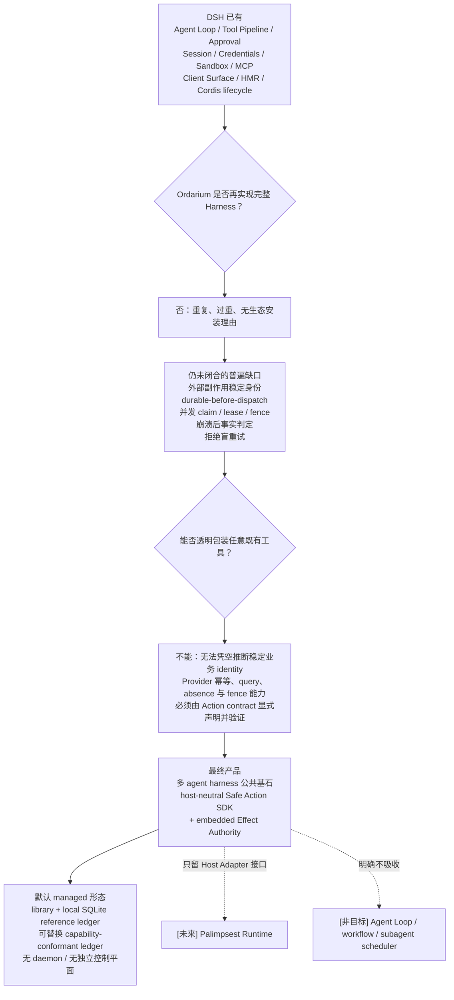

### 1.2 谁为什么安装

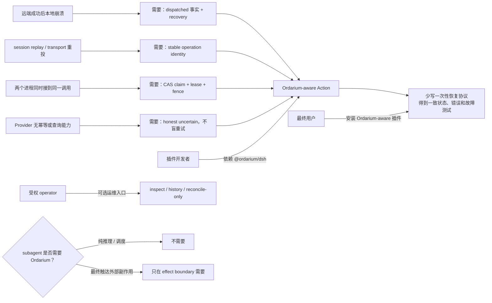

### 1.3 全系统总图

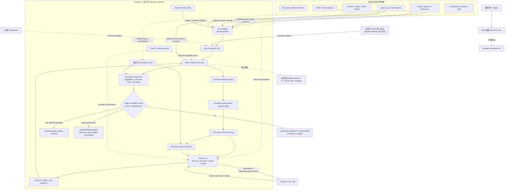

### 1.4 单图完整结构：内部、宿主、外部服务与未来接口

```mermaid
flowchart TB
    subgraph ACTORS["外部参与者"]
        direction LR
        END_USER["最终用户"]
        PLUGIN_AUTHOR["Ordarium-aware 插件开发者"]
        OPERATOR["受权 operator / administrator"]
        SUB_TRANSPORT["Root agent / subagent / transport"]
    end

    subgraph HOST_EXTERNALS["宿主使用的外部系统"]
        direction LR
        LLM["LLM / Model Provider"]
        MCP_SERVER["MCP Servers"]
        SECRET_BACKEND["Credential / Secret Backend"]
        HOST_UI["DSH Client / UI"]
    end

    subgraph MACHINE["默认部署边界：单机、单 OS-user trust domain"]
        direction TB

        subgraph NODE_PROCESS["DSH Node.js 进程"]
            direction LR

            subgraph DSH_HOST["DSH Host Authority：Ordarium 外部"]
                direction TB
                AGENT_LOOP["Agent Loop / model orchestration"]
                TOOL_REGISTRY["Cordis plugin lifecycle / Tool Registry"]
                TOOL_PIPELINE["Native Tool Pipeline"]
                HOST_SCHEMA["Input schema / output schema / renderer"]
                ADMISSION["Guard / Approval / Admission"]
                SESSION["Session / replay / callId / rootCallId"]
                CLIENT_SURFACE["Client Surface / result event"]
                HOST_SECURITY["Credentials / Sandbox / MCP runtime"]
                HOST_CACHE["Host / model cache<br/>仅性能职责"]
                HMR["HMR / register / quiesce / dispose"]
                RECOVERY_MATERIAL["RecoveryMaterialResolver<br/>原 invocation 或显式 resubmission"]
                CREDENTIAL_RESOLVER["CredentialResolver<br/>fresh same-principal capability"]
                MCP_PATH["普通 MCP / legacy tool path<br/>不会被 Ordarium 自动透明增强"]
            end

            subgraph ORDARIUM["Ordarium：Safe Action SDK + embedded Effect Authority"]
                direction TB

                subgraph DEV_SURFACE["开发者与宿主适配表面"]
                    direction LR
                    DSH_PACKAGE["@ordarium/dsh<br/>精选 author façade / installOrdarium"]
                    DSH_ADVANCED["@ordarium/dsh/advanced<br/>per-action / lifecycle / Ops binding"]
                    DSL["defineAction / effects / schema / defineSchema"]
                    BINDING["install golden path / advanced binding"]
                    DSH_ADAPTER["DSH Host Adapter<br/>ToolDefinition ↔ HostInvocation"]
                    HOST_PORT["HostInvocationPort<br/>identity + classified authorization<br/>principal + signal + input"]
                    OPS_PORT["[发布门] OperationsPort<br/>inspect / list / history / reconcileOnly"]
                end

                subgraph CORE["@ordarium/core：operation authority"]
                    direction TB
                    ACTION_CONTRACT["Portable Action contract<br/>name + version + schemas + effect"]
                    PARSER["Input parse + lossless canonical JSON"]
                    IDENTITY["Canonical identity engine<br/>logicalKeyDigest + inputDigest + operationId"]
                    INFLIGHT["同 isolate in-flight coalescing"]
                    AUTH_GATE["Classified authorization evidence gate<br/>host / policy / human；首个决定不可覆盖"]
                    OP_STATE["Durable operation state machine"]
                    CLAIM["CAS claim + lease + monotonic fencing token"]
                    DISPATCH["durable-before-dispatch<br/>attempt + 1"]
                    ACTION_PORT["ActionPort<br/>execute / reconcile / cancel / receipt"]
                    RECOVERY["Recovery engine<br/>reconcile-first / proven same-key retry / uncertain"]
                    VALIDATION["Output / receipt<br/>schema + JSON + size + secret-safe validation"]
                    RESULT["Typed result / stable error / honest uncertain"]
                    OPS_VERIFY["Recovery verifier<br/>action/version/opId/key/input digest"]
                    OPS_VIEW["Sanitized OperationView<br/>bounded cursor pagination"]
                end

                subgraph LEDGER_LAYER["Ledger abstraction 与实现"]
                    direction LR
                    LEDGER_PORT["OperationLedgerPort<br/>capabilities / semantic CAS / live lease / pages"]
                    LEDGER_GATE{"Capability covers<br/>profile + topology?"}
                    SQLITE_PACKAGE["@ordarium/ledger-sqlite<br/>WAL / FULL / schema v2 / migration / backup"]
                    MEMORY_LEDGER["MemoryLedger<br/>volatile：read-only / test / explicit unmanaged"]
                    CUSTOM_LEDGER["Conformant custom/host ledger<br/>advanced injection"]
                    PERSISTENCE_FILTER["只持久化 metadata / digests / control state<br/>validated output / receipt / SafeError"]
                end
            end
        end

        SQLITE_DB["$DSH_HOME/ordarium/operations.sqlite<br/>次选 ~/.dsh/ordarium/operations.sqlite<br/>semantic current/events + live lease"]
        OTHER_LOCAL_PROCESS["[发布门] 可选第二本机 DSH / Ordarium 进程<br/>通过 transaction CAS 竞争"]
        OS_PERMISSIONS["OS process / file permissions<br/>当前实际 tenant 隔离边界"]
    end

    subgraph EFFECT_EXTERNALS["外部副作用与事实权威"]
        direction TB
        BUSINESS_PROVIDER["Business Provider / SaaS / OS / external DB"]
        WRITE_API["Business write API"]
        QUERY_API["Reconciliation / query API"]
        IDEMPOTENCY["Operation-key idempotency<br/>scope + conflict semantics + TTL"]
        UNIQUENESS["Business unique constraint / duplicate lookup"]
        CANCELLATION["Best-effort cancellation + final query semantics"]
        PROVIDER_FENCE["Provider-side fencing<br/>拒绝 stale owner"]
        PROVIDER_FACT["Provider fact<br/>succeeded / failed / absent / pending / unknown"]
    end

    subgraph PROOF["开发与发布验证"]
        direction LR
        TESTING_PACKAGE["@ordarium/testing"]
        CRASH_TESTS["Durable checkpoint crash injection<br/>manual clock / fixed identity"]
        DSH_FIXTURES["[发布门] real DSH fixtures<br/>replay / parallel / restart / HMR drain"]
        PROVIDER_TESTS["[发布门] Provider conformance<br/>lost response / TTL / absence / cancel / fence"]
        LEDGER_TESTS["[发布门] dual-process / corruption / disk-full<br/>migration / backup / clock-stall tests"]
    end

    subgraph EXTENSIONS["外部宿主与未来替换缝"]
        direction LR
        HOST_MCP["[发布门] MCP 第二宿主<br/>@ordarium/host-mcp"]
        OTHER_HOST["[发布后] 更多 Node Tool Host"]
        OTHER_ADAPTER["Versioned Host Adapter"]
        PALIMPSEST["[未来] Palimpsest Runtime"]
        PAL_ADAPTER["Palimpsest Host Adapter"]
        REMOTE_AUTHORITY["[未来，仅真实多主机需求] Remote Effect Authority / ACL ledger"]
    end

    subgraph NON_GOALS["不得进入 Ordarium core 的外部职责"]
        direction LR
        NG_HARNESS["Agent Loop / prompt assembly / workflow"]
        NG_SUBAGENT["Subagent scheduler / remote worker / Rust runner"]
        NG_SECURITY["Secret vault / sandbox / Approval UI / Client Surface"]
        NG_LIFECYCLE["Cordis fork / HMR engine"]
        NG_DAEMON["默认 daemon / distributed consensus"]
    end

    END_USER --> HOST_UI --> CLIENT_SURFACE
    CLIENT_SURFACE --> AGENT_LOOP
    AGENT_LOOP <--> LLM
    AGENT_LOOP --> TOOL_PIPELINE
    SUB_TRANSPORT -->|"stable call identity / lineage"| SESSION
    SESSION --> TOOL_PIPELINE
    ADMISSION -->|"admission evidence"| TOOL_PIPELINE
    HOST_SCHEMA --> TOOL_PIPELINE
    TOOL_REGISTRY --> TOOL_PIPELINE
    HMR --> TOOL_REGISTRY
    SECRET_BACKEND --> HOST_SECURITY
    HOST_SECURITY --> CREDENTIAL_RESOLVER
    TOOL_PIPELINE --> MCP_PATH --> MCP_SERVER

    PLUGIN_AUTHOR --> DSL
    PLUGIN_AUTHOR --> BINDING
    DSL --> ACTION_CONTRACT
    ACTION_CONTRACT --> DSH_PACKAGE
    BINDING --> DSH_PACKAGE --> DSH_ADAPTER
    BINDING --> DSH_ADVANCED --> DSH_ADAPTER
    DSH_ADAPTER --> TOOL_REGISTRY
    TOOL_PIPELINE -->|"Ordarium-aware tool invocation"| DSH_ADAPTER
    DSH_ADAPTER --> HOST_PORT
    HMR -->|"quiesce → unregister → bounded drain<br/>→ abort/persist/revoke → close"| DSH_ADAPTER

    HOST_PORT --> PARSER --> IDENTITY --> INFLIGHT --> AUTH_GATE
    AUTH_GATE --> OP_STATE
    OP_STATE <--> LEDGER_PORT
    OP_STATE --> CLAIM --> DISPATCH --> ACTION_PORT
    RECOVERY --> ACTION_PORT
    ACTION_PORT --> VALIDATION --> OP_STATE
    OP_STATE --> RESULT --> DSH_ADAPTER
    DSH_ADAPTER --> TOOL_PIPELINE --> CLIENT_SURFACE

    ACTION_CONTRACT --> ACTION_PORT
    ACTION_CONTRACT --> RECOVERY
    CREDENTIAL_RESOLVER -.->|"transient credential；不入账本"| ACTION_PORT
    SESSION --> RECOVERY_MATERIAL
    OPERATOR --> ADMISSION
    OPERATOR --> OPS_PORT
    RECOVERY_MATERIAL --> OPS_VERIFY
    CREDENTIAL_RESOLVER -.-> OPS_VERIFY
    OPS_PORT --> OPS_VERIFY --> CLAIM
    OPS_VERIFY -->|"query-only"| RECOVERY
    OPS_PORT --> OPS_VIEW
    LEDGER_PORT --> OPS_VIEW --> OPERATOR

    LEDGER_PORT --> LEDGER_GATE
    LEDGER_GATE -->|"default managed"| PERSISTENCE_FILTER --> SQLITE_PACKAGE <--> SQLITE_DB
    LEDGER_GATE -->|"legal weaker path"| MEMORY_LEDGER
    LEDGER_GATE -->|"advanced + conformance"| CUSTOM_LEDGER
    LEDGER_GATE -->|"insufficient"| CAP_FAIL["LEDGER_CAPABILITY_REQUIRED<br/>no Provider call / no memory fallback"]
    OTHER_LOCAL_PROCESS <--> SQLITE_DB
    OS_PERMISSIONS --> SQLITE_DB
    HOST_CACHE -.->|"不能替代 operation authority"| LEDGER_PORT
    PARSER -.->|"raw input 禁止持久化"| PERSISTENCE_FILTER
    CREDENTIAL_RESOLVER -.->|"credential 禁止持久化"| PERSISTENCE_FILTER

    ACTION_PORT -->|"execute + operationId / idempotencyKey / fence"| WRITE_API
    RECOVERY -->|"reconcile query"| QUERY_API
    ACTION_PORT -.->|"best-effort cancel"| CANCELLATION
    WRITE_API --> BUSINESS_PROVIDER
    QUERY_API --> BUSINESS_PROVIDER
    CANCELLATION --> BUSINESS_PROVIDER
    BUSINESS_PROVIDER --> IDEMPOTENCY
    BUSINESS_PROVIDER --> UNIQUENESS
    BUSINESS_PROVIDER --> PROVIDER_FENCE
    BUSINESS_PROVIDER --> PROVIDER_FACT
    PROVIDER_FACT --> ACTION_PORT
    IDEMPOTENCY -.->|"能力证明后才允许 same-key retry"| RECOVERY
    UNIQUENESS -.-> RECOVERY
    PROVIDER_FENCE -.-> CLAIM

    TESTING_PACKAGE --> CRASH_TESTS --> OP_STATE
    TESTING_PACKAGE --> DSH_FIXTURES --> DSH_ADAPTER
    TESTING_PACKAGE --> PROVIDER_TESTS --> BUSINESS_PROVIDER
    TESTING_PACKAGE --> LEDGER_TESTS --> SQLITE_DB

    HOST_MCP --> HOST_PORT
    OTHER_HOST --> OTHER_ADAPTER --> HOST_PORT
    PALIMPSEST --> PAL_ADAPTER --> HOST_PORT
    REMOTE_AUTHORITY -.->|"未来替换 Ledger / claim 实现，不改变 Host / Action contract"| LEDGER_PORT

    ORDARIUM -.->|"明确不拥有"| NG_HARNESS
    ORDARIUM -.->|"明确不拥有"| NG_SUBAGENT
    ORDARIUM -.->|"明确不拥有"| NG_SECURITY
    ORDARIUM -.->|"明确不拥有"| NG_LIFECYCLE
    ORDARIUM -.->|"默认不引入"| NG_DAEMON
```

## 2. 三重权威与端口

### 2.1 每项决定只有一个权威所有者

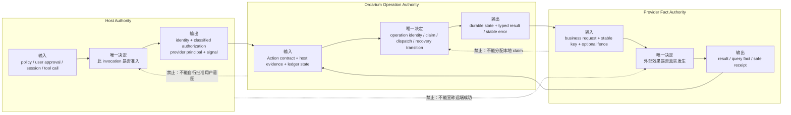

### 2.2 正式端口、能力 gate 与两个宿主解析器

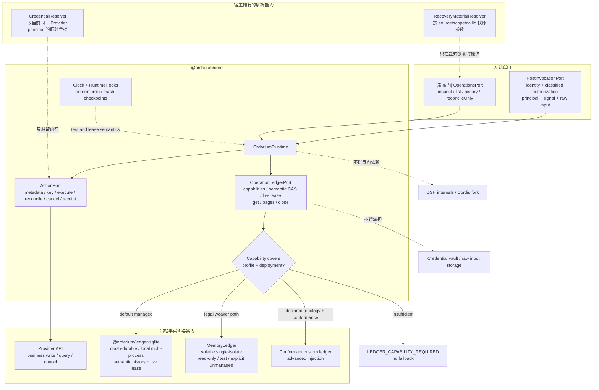

## 3. 工程与开发者表面

### 3.1 一站式入口和内部依赖方向

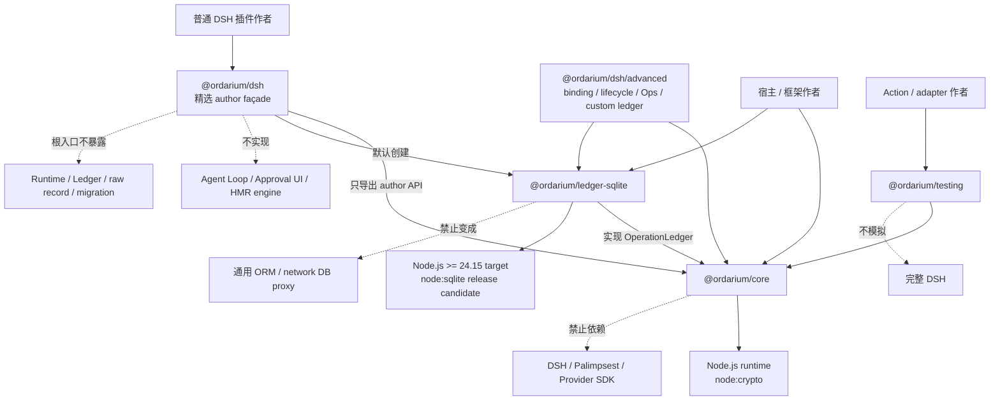

### 3.2 Action 作者的最短路径与高级路径

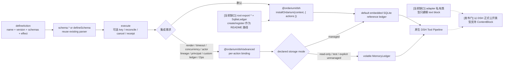

### 3.3 Action 内各函数的副作用法律

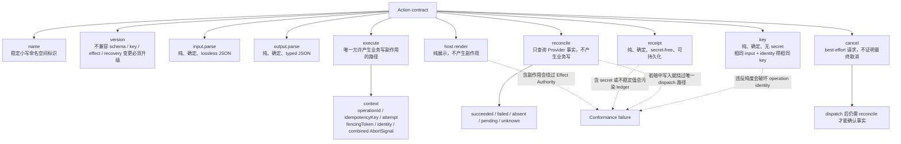

## 4. 领域对象、身份与授权

### 4.1 五个对象不能混为一次调用

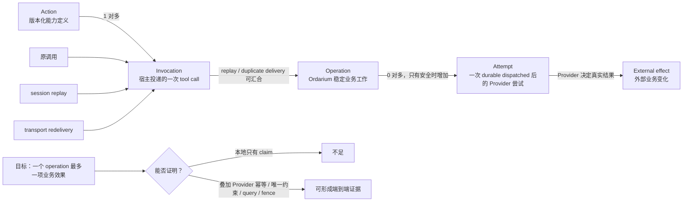

### 4.2 Identity 推导、冲突与 principal 约束

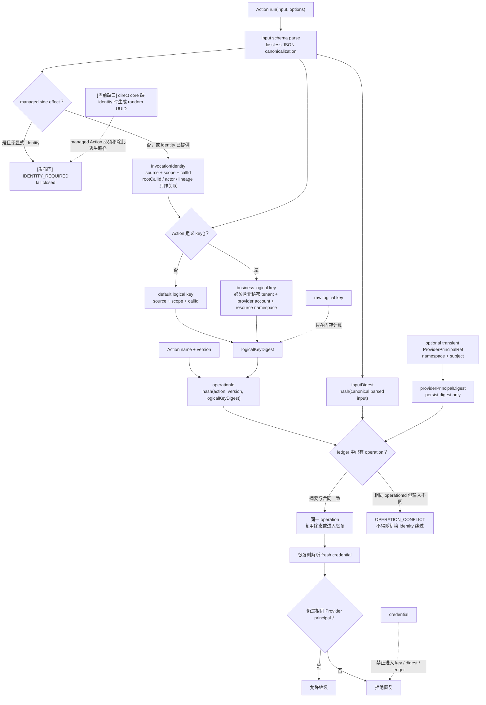

### 4.3 授权证据的不可覆盖性

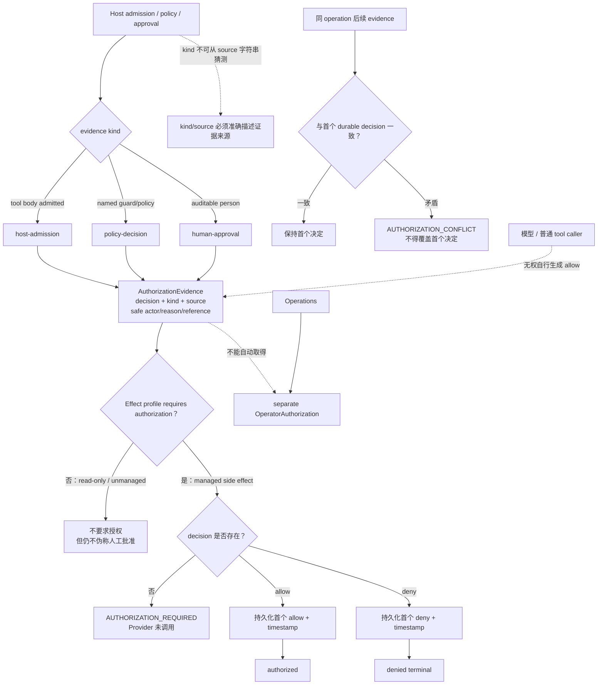

## 5. 正常执行、状态与故障窗口

### 5.1 正常执行主链

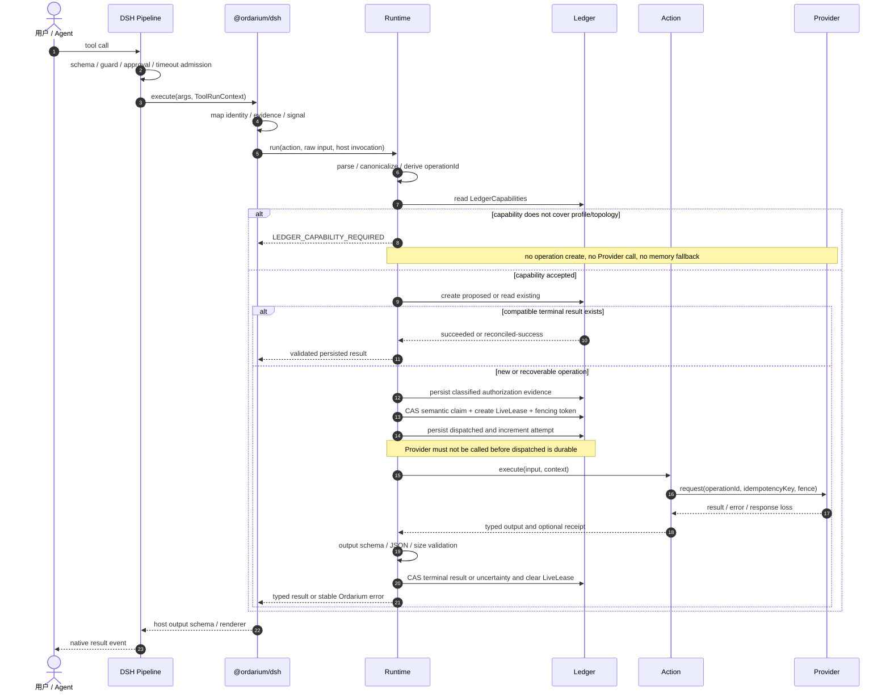

### 5.2 完整 operation 状态机

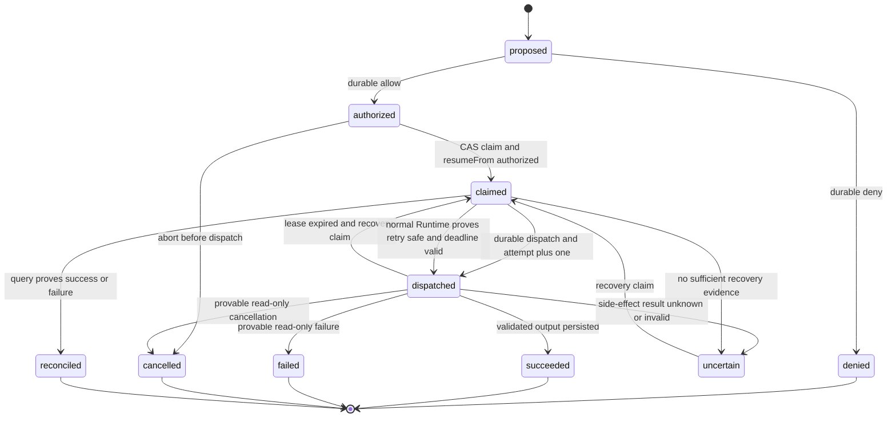

### 5.3 进程崩溃窗口如何收敛

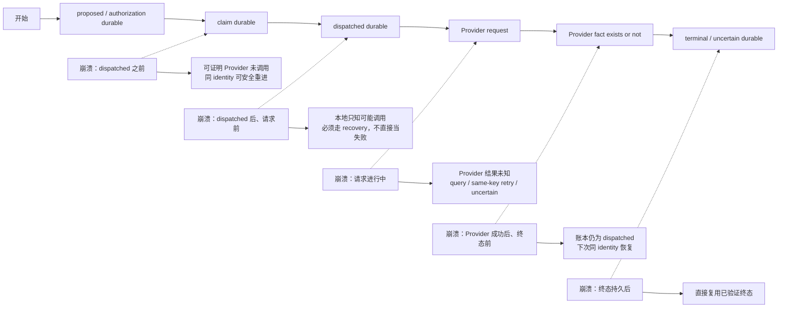

### 5.4 基础设施失败矩阵

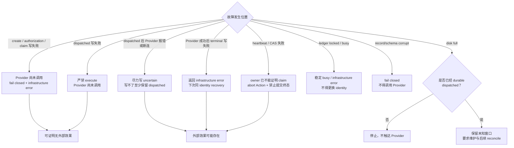

## 6. 恢复、保证与 Provider 证明

### 6.1 正常 Runtime 与 reconcile-only 的权限分叉

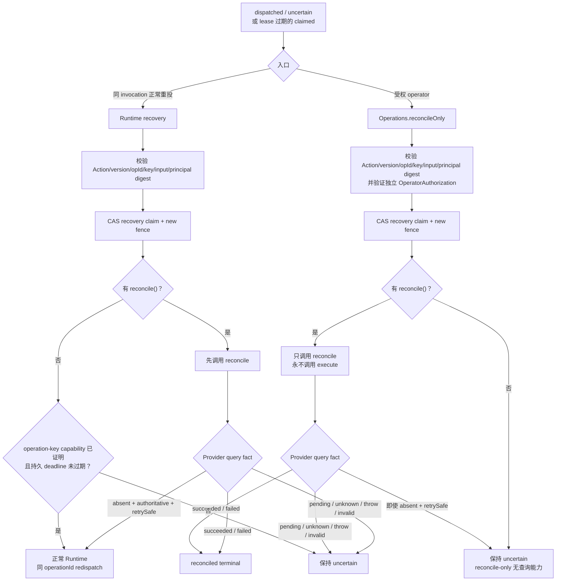

### 6.2 五种 profile 是能力剖面，不是安全分数

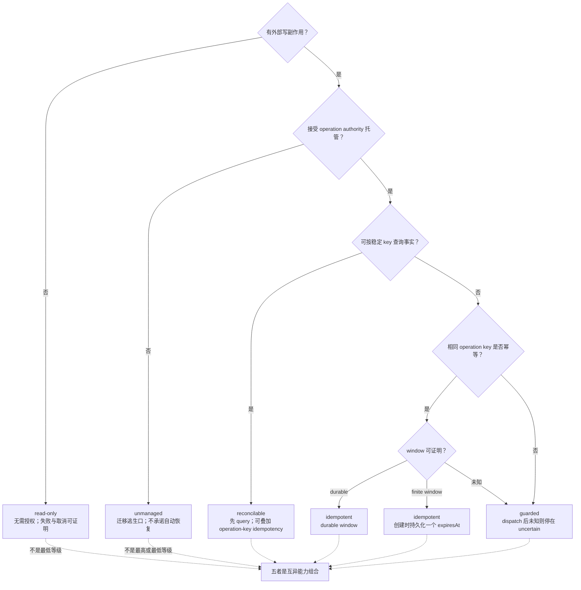

### 6.3 端到端保证的交集

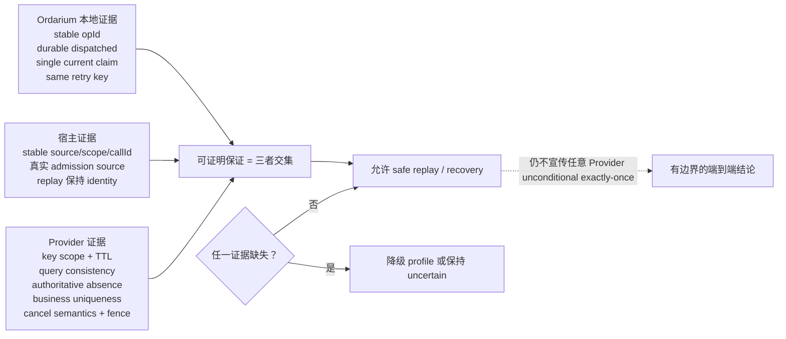

### 6.4 Provider capability conformance 闭环

```mermaid
flowchart TD
    DECLARE["Provider adapter capability declaration"] --> TESTS["Conformance suite"]
    TESTS --> KEY["同 key 同输入响应复用"]
    TESTS --> CONFLICT["同 key 不同输入冲突"]
    TESTS --> LOSS["响应丢失后重放"]
    TESTS --> WINDOW{"idempotency window"}
    WINDOW -->|"durable"| DURABLE["跨重启与任意已承诺恢复时点<br/>同 key 仍指向同一效果"]
    WINDOW -->|"finite"| FINITE["首次创建持久化唯一 expiresAt"]
    FINITE --> BEFORE["deadline 前 same-key retry"]
    FINITE --> AFTER["deadline 后 execute count = 0<br/>只能 query 或 uncertain"]
    TESTS --> QUERY["query pending to terminal"]
    TESTS --> ABSENT["absence 是否 authoritative"]
    TESTS --> CANCEL["cancel accepted 后仍查询最终事实"]
    TESTS --> FENCE["stale fencing token 被拒绝"]

    KEY --> VERDICT{"证据是否满足声明？"}
    CONFLICT --> VERDICT
    LOSS --> VERDICT
    DURABLE --> VERDICT
    BEFORE --> VERDICT
    AFTER --> VERDICT
    QUERY --> VERDICT
    ABSENT --> VERDICT
    CANCEL --> VERDICT
    FENCE --> VERDICT

    VERDICT -->|"是"| CAPABILITY["冻结 capability + scope + window"]
    VERDICT -->|"否"| DOWNGRADE["降级为 guarded<br/>或仅保留已证明的 reconcile"]
    CAPABILITY --> RUNTIME["Runtime 才能启用相应 redispatch / query / fence 行为"]

    EXPIRED["finite expiresAt 已过"] --> STOP["禁止 execute；不得因重启或新 attempt 续期"]
    STOP --> DOWNGRADE
```

### 6.5 两层并发协调不能混为一层

```mermaid
flowchart TD
    CALLS["相同 operationId 的并发调用"] --> SCOPE{"发生在哪里？"}
    SCOPE -->|"同一 Runtime isolate"| LOCAL["in-flight map coalescing"]
    LOCAL --> INPUT{"inputDigest 相同？"}
    INPUT -->|"是"| SHARE["共享同一 Promise / result"]
    INPUT -->|"否"| CONFLICT["OPERATION_CONFLICT"]

    SCOPE -->|"超出单 isolate"| GATE{"Ledger coordination capability<br/>覆盖实际部署拓扑？"}
    GATE -->|"是"| DURABLE["semantic transaction/CAS + LiveLease"]
    GATE -->|"否"| REJECT["LEDGER_CAPABILITY_REQUIRED<br/>dispatch 前失败"]
    SQLITE["默认本机实现：SQLite transaction"] -.-> DURABLE
    CUSTOM["高级实现：conformant custom ledger"] -.-> DURABLE
    DURABLE --> WINNER["唯一 current claim owner"]
    DURABLE --> LOSER["其他调用得到 busy 或读取新 semantic revision"]

    WINNER --> LEASE["lease 只证明本地临时所有权"]
    LEASE --> FENCE["Provider-side fencing 才能拒绝复活的旧 owner"]
    LOCAL -.->|"不能替代跨进程协调"| DURABLE
    DURABLE -.->|"不能单独证明旧外部请求停止"| FENCE
```

### 6.6 多进程竞争、lease 与 fencing

```mermaid
sequenceDiagram
    participant A as DSH Process A
    participant B as DSH Process B
    participant L as Conformant durable ledger (default SQLite)
    participant P as Provider

    A->>L: CAS claim(revision n, fence 7)
    L-->>A: success and lease expiry
    B->>L: CAS claim(revision n, fence 7)
    L-->>B: conflict / OPERATION_BUSY
    A->>L: durable dispatched
    A->>P: execute(operationId, fence 7)

    loop every lease divided by three
        A->>L: LiveLease CAS(owner, fence, leaseRevision)
        Note over A,L: renew expiresAt only, semantic revision/history unchanged
    end

    alt A loses lease or stalls
        A->>A: abort combined signal and forbid terminal CAS
        B->>L: reclaim with fence 8
        L-->>B: success
        B->>P: reconcile or proven safe retry(fence 8)
        Note over A,P: only Provider-side fence can reject a revived fence 7 request
    else A completes while owner
        A->>L: CAS validated terminal state
    end
```

## 7. 宿主兼容、subagent 与生命周期

### 7.1 DSH 映射与可移植 Host Adapter 合同

```mermaid
flowchart LR
    subgraph DSH["DSH public surface"]
        META["name / description / parameters"]
        CTX["ToolRunContext<br/>callId / rootCallId / session / signal"]
        ADMIT["admission / approval evidence"]
        OUT["output.schema / render / ContentBlock"]
        LIFE["register / dispose / replay / restart"]
    end

    subgraph ADAPTER["@ordarium/dsh"]
        MAP_META["Action metadata + input schema"]
        MAP_ID["InvocationIdentity"]
        MAP_AUTH["AuthorizationEvidence<br/>host-admission / policy-decision / human-approval"]
        MAP_PRINCIPAL["transient ProviderPrincipalRef<br/>persist digest only"]
        MAP_OUT["typed JSON to host renderer"]
        MAP_LIFE["quiesce-aware lifecycle"]
    end

    subgraph CORE["Host-neutral Node core"]
        PORT["HostInvocationPort"]
        RUNTIME["OrdariumRuntime"]
    end

    META --> MAP_META
    CTX --> MAP_ID
    ADMIT --> MAP_AUTH
    CTX -.->|"credential/principal resolver"| MAP_PRINCIPAL
    MAP_OUT --> OUT
    LIFE --> MAP_LIFE
    MAP_META --> PORT
    MAP_ID --> PORT
    MAP_AUTH --> PORT
    MAP_PRINCIPAL --> PORT
    MAP_LIFE --> RUNTIME
    PORT --> RUNTIME --> MAP_OUT

    OTHER["[发布门] MCP 第二宿主 host-mcp<br/>满足同一六项合同"] -.->|"真实第二实例"| PORT
    CORE -.->|"禁止输出新的通用 Tool 协议"| PROTOCOL["Ordarium-owned Harness protocol"]
```

### 7.2 Subagent 与 transport 的身份规则

```mermaid
flowchart TD
    ROOT["Root call<br/>rootCallId = R"] --> SA["Subagent A"]
    ROOT --> SB["Subagent B"]
    SA --> A1["callId = A1"]
    SB --> B1["callId = B1"]
    A1 --> ACTION["同一 Safe Action"]
    B1 --> ACTION
    ACTION --> TWO["默认是两个 operation<br/>rootCallId 只用于 lineage"]

    TRANSPORT["transport replay / redelivery"] --> STABLE{"是否原样保留 callId？"}
    STABLE -->|"是"| DEFAULT["默认 identity 汇合到同 operation"]
    STABLE -->|"否"| BUSINESS{"是否有稳定业务 key()？"}
    BUSINESS -->|"是"| MERGE["跨 transport 汇合"]
    BUSINESS -->|"否"| FAIL["managed 高风险 Action fail closed<br/>或明确降级保证"]

    SCHEDULER["subagent scheduler"] -.->|"[非目标]"| ACTION
    REASONING["纯推理 subagent"] --> NO["无需 Ordarium"]
```

### 7.3 HMR 的安全交接协议

```mermaid
sequenceDiagram
    participant D as DSH / Cordis
    participant O as Old adapter and Runtime v1
    participant L as Conformant durable ledger
    participant N as New adapter and Runtime v1

    D->>O: quiesce (accepting to quiescing)
    O->>O: reject new invocations with RUNTIME_QUIESCING
    D->>O: unregister tools
    O->>O: enter draining and bounded wait for in-flight Actions
    O->>O: abort remaining Action signals at deadline
    O->>L: persist reachable terminal/uncertain state or durable handoff
    O->>L: revoke old owners' late-write authority and LiveLease
    O->>L: enter closing and close after all Runtime writes settle
    O->>O: closed
    D->>N: register replacement
    N->>L: open same durable authority
    N->>L: resume same action name and version
    Note over O,N: same version requires compatible schema, key, effect and recovery semantics

    alt incompatible contract change
        D->>N: require bumped Action version
    else hard process exit
        N->>L: rely on durable recovery from dispatched or uncertain
    end
```

```mermaid
flowchart LR
    CURRENT["[当前缺口] installOrdarium.dispose<br/>unregister 后立即 close"] --> RISK["in-flight Action 可能失去持久化边界"]
    RISK --> TARGET["[发布门] quiesce → unregister → bounded drain → abort remaining<br/>→ persist/handoff → revoke late writes → close"]
    SAME["同 name + version reload"] --> DIGEST["[发布门] schema/effect metadata diagnostic digest"]
    DIGEST --> DRIFT{"发现 contract drift？"}
    DRIFT -->|"是"| BUMP["要求 bump version"]
    DRIFT -->|"否"| RESUME["允许从同一 ledger 恢复"]
    DIGEST -.->|"诊断不替代作者的版本责任"| SAME
```

## 8. 数据、安全、运维与账本生命周期

### 8.0 Operation Ledger 不是缓存

```mermaid
flowchart LR
    HOST_CACHE["Host / model cache<br/>性能优化，可按宿主策略失效"]
    PROVIDER_CACHE["Provider response cache<br/>由 Provider 语义控制"]
    LEDGER["Operation Ledger<br/>identity、dispatch ownership 与结果事实"]

    REPLAY["相同 invocation replay"] --> LEDGER
    LEDGER -->|"复用 terminal result 是语义去重"| RESULT["不得因普通 cache eviction 而重新 execute"]
    HOST_CACHE -.->|"不能替代"| LEDGER
    PROVIDER_CACHE -.->|"不能证明业务效果唯一"| LEDGER
    LEDGER -.->|"不能当可随意清空的性能缓存"| EVICT["普通 cache clear / TTL eviction"]
```

### 8.1 当前 v1 到公开目标 v2 的唯一 durable 模型

```mermaid
flowchart LR
    V1["[当前 private v1]<br/>operations + events<br/>revision + claim.expiresAt"] -->|"SQLite boundary<br/>one forward transaction"| V2["[公开目标 v2]<br/>semantic current + semantic events + LiveLease"]
    V2 --> CORE["core / Runtime / Operations / DSH<br/>只接收 canonical schemaVersion 2"]
    UNKNOWN["foreign application_id<br/>higher user_version / corrupt / half-migrated"] --> FAIL["fail closed"]
    UNKNOWN -.->|"禁止进入"| CORE
    CUSTOM["non-SQLite conformant ledger"] -->|"同一 codec 与等价语义"| CORE
```

```mermaid
erDiagram
    ORDARIUM_OPERATIONS ||--o{ ORDARIUM_OPERATION_EVENTS : "has semantic revisions"
    ORDARIUM_OPERATIONS ||--o| ORDARIUM_OPERATION_LEASES : "has live lease"
    ORDARIUM_OPERATIONS ||--|| OPERATION_RECORD : "record_json"
    ORDARIUM_OPERATION_EVENTS }o--|| OPERATION_RECORD : "snapshot record_json"
    OPERATION_RECORD ||--|| INVOCATION_IDENTITY : "contains"
    OPERATION_RECORD ||--o| AUTHORIZATION_EVIDENCE : "may contain"
    OPERATION_RECORD ||--o| SEMANTIC_CLAIM : "may contain"
    OPERATION_RECORD ||--o| SAFE_OUTCOME : "may contain"

    ORDARIUM_OPERATIONS {
        string operation_id PK
        int semantic_revision
        string state
        string updated_at
        json record_json
    }
    ORDARIUM_OPERATION_EVENTS {
        string operation_id PK
        int semantic_revision PK
        string state
        string at
        json record_json
    }
    ORDARIUM_OPERATION_LEASES {
        string operation_id PK
        string owner
        int fencing_token
        string expires_at
        int lease_revision
    }
    OPERATION_RECORD {
        int schemaVersion
        string operationId
        string actionName
        string actionVersion
        string contractFingerprint
        string inputDigest
        string logicalKeyDigest
        string providerPrincipalDigest
        string effectKind
        string idempotencyMode
        string idempotencyExpiresAt
        string state
        int semanticRevision
        int attempts
        int lastFencingToken
        string createdAt
        string updatedAt
        string resumeFrom
    }
    INVOCATION_IDENTITY {
        string source
        string scope
        string callId
        string rootCallId
        string actor
        json lineage
    }
    AUTHORIZATION_EVIDENCE {
        string decision
        string kind
        string source
        string reason
        string actor
        string evidenceRef
        string at
    }
    SEMANTIC_CLAIM {
        string owner
        int fencingToken
        string acquiredAt
        string resumeFrom
    }
    SAFE_OUTCOME {
        json result
        json receipt
        json safeError
        json uncertainty
        json reconciliation
    }
```

### 8.2 Secret 边界与持久化过滤

```mermaid
flowchart LR
    subgraph HOST["宿主信任域"]
        RAW["raw input"]
        CRED["fresh credential / env capability"]
        SESSION["session recovery material"]
    end

    subgraph MEMORY["Action 进程内存"]
        PARSED["parsed typed input"]
        REQUEST["Provider request"]
        OUTPUT["typed output / safe receipt"]
        ERROR["mapped SafeError"]
    end

    subgraph LEDGER["可持久化审计数据"]
        META["Action/version + non-secret identity"]
        DIGEST["inputDigest + logicalKeyDigest<br/>optional providerPrincipalDigest"]
        CONTROL["classified authorization + semantic state/claim/fence"]
        LIVE["LiveLease liveness<br/>owner + fence + expiresAt + leaseRevision"]
        SAFE["validated output / receipt / SafeError<br/>output 与 receipt 单值默认上限 1 MiB"]
    end

    RAW --> PARSED --> REQUEST
    CRED --> REQUEST --> PROVIDER["Provider"]
    PARSED --> DIGEST
    OUTPUT --> SAFE
    ERROR --> SAFE
    META --> LEDGER_FILE["selected conformant ledger<br/>default local SQLite"]
    DIGEST --> LEDGER_FILE
    CONTROL --> LEDGER_FILE
    LIVE --> LEDGER_FILE
    SAFE --> LEDGER_FILE

    RAW -.->|"禁止原文持久化"| BLOCK["blocked persistence"]
    CRED -.->|"禁止持久化或直接参与 identity"| BLOCK
    SESSION -.->|"只在恢复时短暂供给"| MEMORY
    STACK["raw stack / arbitrary exception / unfiltered response"] -.->|"禁止"| BLOCK

    DIGEST -.->|"SHA-256 不是加密<br/>会泄露相等关系和低熵字典风险"| RISK["敏感对象使用高熵 opaque reference"]
    RISK -.->|"若未来改 keyed digest"| KEYED["必须解决跨进程共享密钥、轮换<br/>与历史 operation identity 兼容"]
```

### 8.3 真实 trust model 与 tenant 边界

```mermaid
flowchart TD
    AUTHORITY["Effect Authority 的准确含义<br/>对选择经过 Ordarium 的 Action<br/>ledger 是 operation state 与 dispatch ownership 的应用级权威"]

    HOST["宿主进程与插件代码<br/>受信任，可绕过 Ordarium"] --> AUTHORITY
    ACTION["Action definition<br/>条件信任，需 schema + conformance"] --> AUTHORITY
    AUTHHOOK["authorization hook<br/>条件信任，source 真实性由宿主保证"] --> AUTHORITY
    OS["本机 OS 与所选 ledger 权限<br/>当前受信任"] --> AUTHORITY
    PROVIDER["Provider capability 声明<br/>必须测试"] --> AUTHORITY

    MODEL["模型 / 普通 tool caller<br/>不受信任"] -.->|"无 ledger write / force retry / attestation 权限"| AUTHORITY
    BYPASS["恶意或错误插件直接调用 Provider"] --> LIMIT["Ordarium 无法阻止<br/>它不是 OS reference monitor"]
    HISTORY["revision history"] --> AUDIT["运行审计，不是 hash-chain 防篡改证据"]

    DB["默认一个 local SQLite path<br/>或隔离的 custom ledger namespace"] --> TRUSTDOMAIN["一个 authority trust domain"]
    TRUSTDOMAIN --> TENANT{"tenant 是否互不信任？"}
    TENANT -->|"否"| SHARED["可共享 authority"]
    TENANT -->|"是"| ISOLATE["不同 DB path + 进程/文件权限<br/>或未来 ACL remote ledger"]
    SCOPE["identity.scope"] -.->|"只参与 identity，不是 ACL"| ISOLATE
```

### 8.4 Operations Port 的安全处置闭环

```mermaid
flowchart TD
    ACTOR["受权 operator / host command"] --> AUTHZ["separate OperatorAuthorization<br/>不复用 Action authorization"]
    AUTHZ --> OPS["Operations Port"]
    OPS --> READ{"请求类型"}
    READ -->|"inspect"| VIEW["sanitized OperationView"]
    READ -->|"list"| PAGE["bounded limit<br/>order by updatedAt + operationId<br/>opaque cursor"]
    READ -->|"history"| EVENTS["sanitized revision views"]
    READ -->|"reconcileOnly"| MATERIAL["Recovery material verifier"]

    SESSION["优先级 1<br/>宿主找回 source/scope/callId 的原 invocation"] --> MATERIAL
    RESUBMIT["优先级 2<br/>operator 显式重交相同参数"] --> MATERIAL
    INPUTLESS["优先级 3<br/>reconcile 只依赖 operationId"] --> MATERIAL
    LEDGER["existing record"] --> MATERIAL
    MATERIAL --> MATCH{"action/version/opId/key/input/principal digest 全匹配？"}
    MATCH -->|"否"| REJECT["fail closed"]
    MATCH -->|"是"| CLAIM["recovery claim + LiveLease"]
    CREDENTIAL["fresh same-principal credential"] -.-> CLAIM
    CLAIM --> QUERY["reconcile only<br/>禁止 execute"]
    QUERY --> PROVIDER["Provider query"]
    PROVIDER -->|"proved success / failure"| TERMINAL["audited reconciled"]
    PROVIDER -->|"pending / unknown / absent / invalid"| UNCERTAIN["保持 uncertain"]

    NO_MATERIAL["三种 recovery material 都不可用"] --> ONLY_READ["只允许 inspect/list/history"]
    MODEL["默认模型视图"] --> REDACT["省略 reason / actor / lineage / full result / receipt"]
    REDACT --> VIEW
    FORCE["forceRetry"] -.->|"不属于公共 Operations Port"| OPS
    CURRENT_LIST["[当前缺口] MemoryLedger 与 SQLiteLedger 默认 list limit 不一致"] -.->|"发布前统一 cursor contract"| PAGE
    HUMAN["[未来] manual resolution<br/>strong authorization + actor/source/evidenceRef<br/>typed outcome，且不得重试 Provider"] -.-> TERMINAL
```

### 8.5 Ledger retention、heartbeat、backup 与 migration

```mermaid
flowchart TD
    RECORD["Operation identity record"] --> STATE{"状态"}
    STATE -->|"claimed / dispatched / uncertain"| ACTIVE["永不自动清理"]
    STATE -->|"terminal"| TERMINAL["首发也不自动删除"]
    TERMINAL --> WHY["删除会重新打开同 identity 的重复副作用窗口"]

    FUTURE_GC["[未来] 压缩需求"] --> ARCHIVE["先归档 semantic history"]
    ARCHIVE --> TOMBSTONE["保留不可重用 identity tombstone"]
    TOMBSTONE --> EXPIRED["result 已清除时返回 RESULT_EXPIRED<br/>不得重新 execute"]

    CURRENT_HB["[当前 v1] heartbeat 走通用 CAS<br/>每次追加完整 record snapshot"] --> WRITEAMP["长任务 write amplification"]
    HEARTBEAT["lease heartbeat"] --> TARGET["[发布门] 只更新轻量 liveness / current claim"]
    SEMANTIC["claim acquisition / fence / state transition"] --> HISTORY["进入 semantic revision history"]
    HEARTBEAT -.->|"禁止继续每次写完整 snapshot"| WRITEAMP

    RETENTION_HORIZON["operation identity retention horizon"] -->|"必须不短于"| REPLAY_HORIZON["host replay horizon"]
    IDEM_WINDOW["Provider idempotency window"] --> WINDOW{"durable or finite?"}
    WINDOW -->|"durable"| RECOVERY_HORIZON["覆盖全部已承诺 redispatch horizon"]
    WINDOW -->|"finite"| DEADLINE["首次创建冻结 expiresAt<br/>过期后 redispatch horizon 立即归零"]

    BACKUP["backup"] --> CONSISTENT["SQLite backup/checkpoint<br/>或 custom ledger 自身的一致性快照合同"]
    RESTORE["restore old backup"] --> LOST["备份后 identity 可能丢失"]
    LOST --> RECON["先与 Provider 事实 reconcile<br/>再恢复执行"]

    OPEN["open selected ledger"] --> CAP{"LedgerCapabilities 足够？"}
    CAP -->|"否"| FAIL["LEDGER_CAPABILITY_REQUIRED<br/>fail closed；不 fallback 到 memory"]
    CAP -->|"是且为 SQLite"| VERSION{"application_id = ORDA<br/>user_version = 2<br/>record schemaVersion = 2？"}
    CAP -->|"是且为 custom"| CODEC["canonical OperationRecord v2 codec<br/>嵌套字段 + 长度 + 跨状态 invariants"]
    VERSION -->|"v1"| MIGRATE["SQLite boundary 事务性前向迁移到 v2"] --> CODEC
    VERSION -->|"v2"| CODEC
    VERSION -->|"foreign / higher / corrupt"| FAIL
    CODEC -->|"有效"| RUN["允许 Runtime 使用"]
    CODEC -->|"损坏"| FAIL
    CURRENT_CODEC["[当前缺口] decoder 只完整检查部分顶层字段"] -.-> CODEC
    HISTORY -.->|"完整 revision snapshots 不是 reducer event sourcing<br/>也不是 tamper-evident log"| RUN
```

## 9. 部署、错误、交付与扩展

### 9.1 默认部署与明确不支持的拓扑

```mermaid
flowchart TB
    subgraph MACHINE["单台 DSH 主机 / 单 OS-user trust domain"]
        subgraph P1["Node process A"]
            PLUGINA["Ordarium-aware plugins"] --> DSH_A["@ordarium/dsh"] --> CORE_A["@ordarium/core"]
        end
        subgraph P2["[发布门] 可选 Node process B，需真实双进程证明"]
            PLUGINB["Ordarium-aware plugins"] --> DSH_B["@ordarium/dsh"] --> CORE_B["@ordarium/core"]
        end
        CORE_A --> GATE{"LedgerCapabilities 覆盖<br/>profile + 实际拓扑？"}
        CORE_B --> GATE
        GATE -->|"默认 managed"| DB["@ordarium/ledger-sqlite<br/>$DSH_HOME/ordarium/operations.sqlite<br/>次选 ~/.dsh/ordarium/operations.sqlite<br/>WAL / FULL / transaction CAS"]
        GATE -->|"advanced injection"| CUSTOM["conformant custom/host ledger"]
        GATE -->|"read-only / test / explicit unmanaged"| MEMORY["MemoryLedger<br/>volatile single-isolate"]
        GATE -->|"能力不足或 open 失败"| REJECT["LEDGER_CAPABILITY_REQUIRED<br/>Provider not called；no memory fallback"]
        CORE_A <--> DB
        CORE_B <--> DB
        CORE_A <--> CUSTOM
        CORE_B <--> CUSTOM
    end

    CORE_A --> PROVIDERS["External Providers"]
    CORE_B --> PROVIDERS

    NFS["network filesystem shared SQLite"] -.->|"[非承诺]"| DB
    MULTIHOST["多个主机共享 local SQLite"] -.->|"[非目标]"| DB
    DAEMON["默认 daemon / remote control plane"] -.->|"[非目标]"| CORE_A

    NEED{"未来出现真实多主机同 operation 需求？"} -->|"否"| KEEP["保持 embedded library + local SQLite"]
    NEED -->|"是"| REMOTE["[未来] authority-controlled time<br/>remote ledger / Effect Authority service"]
    REMOTE -.->|"保持 Host/Action API"| CORE_A
```

### 9.2 公共错误决定调用者动作

```mermaid
flowchart TD
    ERROR{"Ordarium stable error"}
    ERROR -->|"AUTHORIZATION_REQUIRED"| AUTH["取得真实宿主授权<br/>同 identity 再进入"]
    ERROR -->|"IDENTITY_REQUIRED"| ID["Host Adapter 补稳定 identity<br/>不得随机绕过"]
    ERROR -->|"ACTION_DENIED"| DENY["不自动重试<br/>新意图必须有新 identity 或业务 revision"]
    ERROR -->|"AUTHORIZATION_CONFLICT"| ACONFLICT["修复 Host Adapter<br/>不得覆盖 durable decision"]
    ERROR -->|"PRINCIPAL_CONFLICT"| PCONFLICT["恢复 credential 必须解析为相同 principal<br/>缺失或变化即 fail closed，不换号续跑"]
    ERROR -->|"OPERATION_CONFLICT"| OCONFLICT["修复 key / identity<br/>不得生成第二 operation"]
    ERROR -->|"OPERATION_BUSY"| BUSY["稍后以同 identity 重试"]
    ERROR -->|"OPERATION_FAILED"| FAILED["返回可证明业务失败<br/>不得 execute"]
    ERROR -->|"OPERATION_CANCELLED"| CANCELLED["只有新显式意图才可再调用"]
    ERROR -->|"OPERATION_UNCERTAIN"| UNCERTAIN["inspect / reconcile-only / 外部人工核查<br/>禁止盲重试"]
    ERROR -->|"LEDGER_CAPABILITY_REQUIRED"| CAP["选择能力覆盖当前 profile/拓扑的 ledger<br/>禁止降级到 volatile 后继续 managed write"]
    ERROR -->|"RUNTIME_QUIESCING"| QUIESCE["等待新实例/重新注册<br/>不得把 dispose 期间调用交给旧 Runtime"]
    ERROR -->|"PERSISTED_VALUE_TOO_LARGE"| LARGE{"是否已 dispatch？"}
    LARGE -->|"否"| FIX["修正 schema / output"]
    LARGE -->|"是"| UNCERTAIN
    ERROR -->|"SIMULATED_PROCESS_CRASH"| TEST["仅测试夹具消费"]
    ERROR -->|"[发布门] infrastructure family"| INFRA["按 dispatch 边界判断<br/>同 identity recovery，禁止解析底层 message"]
```

### 9.3 从当前代码到首发的依赖图

```mermaid
flowchart LR
    CURRENT["[已实现]<br/>四包 / 五 profiles / identity<br/>authorization / state machine<br/>CAS lease fence / recovery<br/>SQLite v1 / DSH 结构适配 / fault hooks"]

    CONTRACT["[发布门] 合同硬化<br/>curated root + advanced subpath<br/>profile union / classified authorization / principal<br/>public errors/states + complete codec"]
    PLATFORM["[发布门] 平台与 ledger<br/>LedgerCapabilities gate<br/>v2 migration / live lease / backup / retention<br/>SQLite/DSH target Node >= 24.15；no fallback"]
    CONCURRENCY["[发布门] 并发证明<br/>双进程 / clock jump / event-loop stall<br/>Provider fence fixture"]
    DSH["[发布门] DSH 成品化<br/>official ContentBlock<br/>per-action binding<br/>replay / parallel / restart<br/>quiesce and drain"]
    HOSTPKG["[发布门] 第二宿主与中立性<br/>HostInvocationPort 冻结<br/>host conformance harness<br/>@ordarium/host-mcp + 真实 MCP client fixture"]
    OPS["[发布门] 运维闭环<br/>inspect / cursor list / history<br/>recovery material / reconcile-only<br/>sanitized views"]
    PROVIDER["[发布门] Provider conformance<br/>TTL / conflict / lost response<br/>query / absence / cancel / fence"]
    PACKAGE["[发布门] 发布工程<br/>remove private<br/>root/subpath exports / semver<br/>per-package Node matrix / docs / examples"]
    RELEASE["首个可发布 Ordarium"]

    CURRENT --> CONTRACT
    CURRENT --> PLATFORM
    CURRENT --> CONCURRENCY
    CONTRACT --> DSH
    CONTRACT --> HOSTPKG
    CONTRACT --> OPS
    CONTRACT --> PROVIDER
    PLATFORM --> RELEASE
    CONCURRENCY --> RELEASE
    DSH --> RELEASE
    HOSTPKG --> RELEASE
    OPS --> RELEASE
    PROVIDER --> RELEASE
    PACKAGE --> RELEASE
    CURRENT --> PACKAGE
```

### 9.4 发布后、未来与永久非目标

```mermaid
flowchart TD
    RELEASE["首个可发布 Ordarium"] --> ADOPTION{"真实采用反馈"}
    ADOPTION -->|"更多宿主接入"| SECOND["[发布后] 更多 Host Adapter 叶包<br/>host-mcp 已在发布门交付"]
    ADOPTION -->|"多个成熟 Provider 实现"| PROVIDERS["[发布后] 少量 Provider adapters / recipes"]
    ADOPTION -->|"operator 使用量增长"| UX["[发布后] 更完善但仍受权的 Ops UX"]
    SECOND --> PAL["[未来] Palimpsest Host Adapter<br/>仅在其 Runtime 重构成熟后"]
    ADOPTION -->|"真实多主机需求"| REMOTE["[未来] Remote Effect Authority / ACL ledger"]

    RELEASE -.->|"永久不吸收"| N1["[非目标] Agent Loop / prompt assembly / workflow"]
    RELEASE -.->|"永久不吸收"| N2["[非目标] subagent scheduler / remote worker / Rust runner"]
    RELEASE -.->|"永久不吸收"| N3["[非目标] secret vault / sandbox / client / Approval UI"]
    RELEASE -.->|"永久不吸收"| N4["[非目标] Cordis fork / HMR engine"]
    RELEASE -.->|"默认不引入"| N5["[非目标] daemon / distributed consensus"]
```

### 9.5 给 Palimpsest 留出的接口恰到为止

```mermaid
flowchart LR
    PAL["[未来] Palimpsest Runtime"] --> ADAPTER["Palimpsest Host Adapter"]
    ADAPTER --> PORT["稳定 HostInvocationPort"]
    PORT --> CORE["Ordarium core"]
    CORE --> RESULT["typed terminal result or uncertain"]
    RESULT --> ADAPTER --> PAL

    PAL -->|"提供"| ID["stable identity"]
    PAL -->|"提供"| AUTH["authorization evidence"]
    PAL -->|"提供"| SIGNAL["cancellation signal"]
    PAL -->|"显式恢复时提供"| MATERIAL["recovery material"]

    CORE -.->|"禁止读取"| PAL_INTERNAL["Palimpsest internal state / scheduler tables"]
    PAL -.->|"禁止修改"| LEDGER_INTERNAL["Ordarium internal ledger schema"]
    ADAPTER -.->|"当前不实现、不构成首发缺口"| FUTURE["versioned seam only"]
```

## 10. 逐框完整性与最终闭环

### 10.1 所有语义框都必须落到五个问题

```mermaid
flowchart TB
    BOX["任意架构框"] --> Q1["职责：只负责什么？"]
    BOX --> Q2["输入：从哪个权威取得什么？"]
    BOX --> Q3["输出：向谁交付何种事实？"]
    BOX --> Q4["失败：fail closed、uncertain 还是 terminal？"]
    BOX --> Q5["状态：已实现、发布门、未来还是非目标？"]

    Q1 --> AUDIT{"五项都有明确归属？"}
    Q2 --> AUDIT
    Q3 --> AUDIT
    Q4 --> AUDIT
    Q5 --> AUDIT
    AUDIT -->|"否"| GAP["隐藏子系统或无主语义<br/>不能称为完整架构"]
    AUDIT -->|"是"| TRACE["可追溯到产品、合同、实现计划与验证门"]

    TRACE --> PRODUCT["12 产品边界"]
    TRACE --> CONTRACT["13 运行合同"]
    TRACE --> PLAN["14 当前实现快照"]
    TRACE --> ARCH["15 逐框解释"]
    TRACE --> ATLAS["16 Mermaid 全景投影"]
    TRACE --> GOALS["17 阶段 Goal 与验收"]
```

### 10.2 最终副作用安全闭环

```mermaid
flowchart LR
    INTENT["宿主已准入意图"] --> ID["稳定 operation identity"]
    ID --> AUTH["分类且不可覆盖的 durable authorization evidence"]
    AUTH --> PRINCIPAL["同 operation 的 provider principal digest 一致"]
    PRINCIPAL --> CAP{"LedgerCapabilities 覆盖<br/>profile + deployment？"}
    CAP -->|"否"| CLOSED["LEDGER_CAPABILITY_REQUIRED<br/>dispatch 前 fail closed"]
    CAP -->|"是"| OWN["semantic CAS claim + LiveLease + fencing"]
    OWN --> DISPATCH["durable-before-dispatch"]
    DISPATCH --> PROVIDER["Provider effect / query fact"]
    PROVIDER --> VALIDATE["typed schema / JSON / size validation"]
    VALIDATE --> TERMINAL["可证明 terminal result"]
    PROVIDER --> UNKNOWN["honest uncertain"]
    VALIDATE -->|"dispatch 后无法安全持久化"| UNKNOWN
    UNKNOWN --> RECOVERY["reconcile first<br/>或 deadline 内 proven same-key retry<br/>或保持 unknown"]
    RECOVERY --> TERMINAL
    RECOVERY --> UNKNOWN
    TERMINAL --> HOST["返回原生 Host pipeline"]
    UNKNOWN --> OPS["受权 inspect / reconcile-only / external review"]
    OPS --> RECOVERY

    HOST -.->|"新调用 / replay 仍从同一 identity 进入"| ID
```

最终判断：Ordarium 的完整不是继续横向扩张，而是让“宿主意图 → 本地 operation 权威 → Provider 事实 → 可证明结果或诚实未知 → 安全恢复/处置”这条主链没有任何隐式跳步。图中所有发布门都属于把现有内核做成可发布产品；所有未来框都有明确端口；所有非目标都被阻止反向侵入 core。
