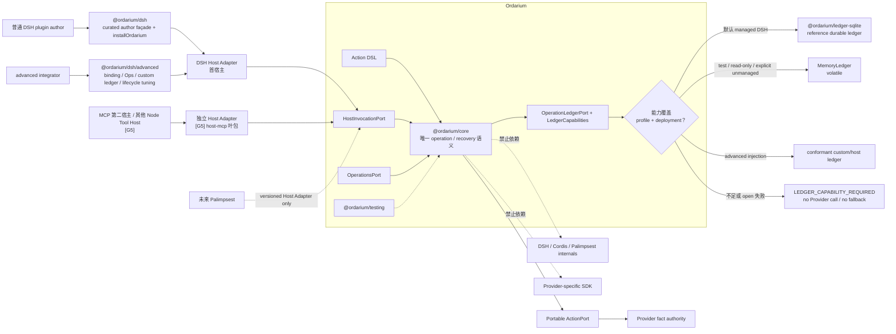
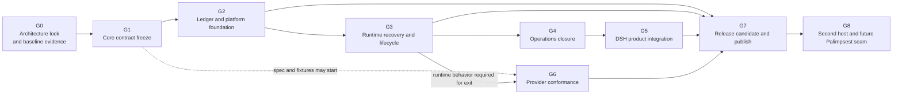
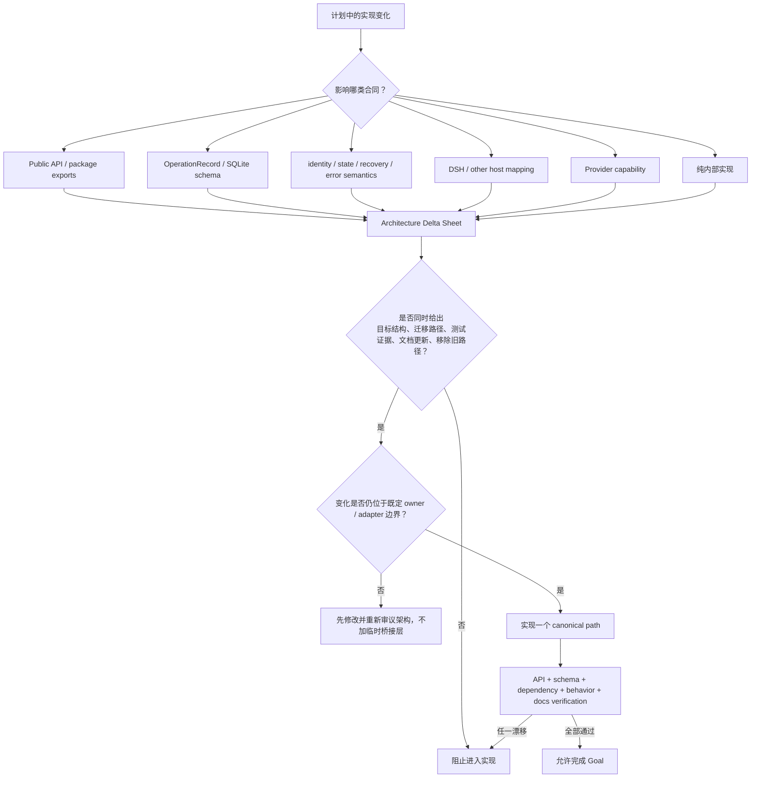
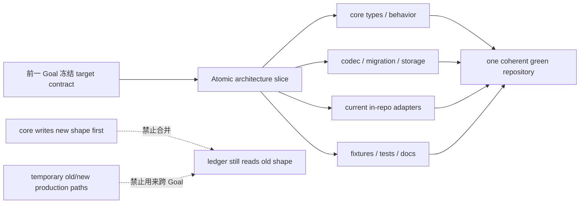
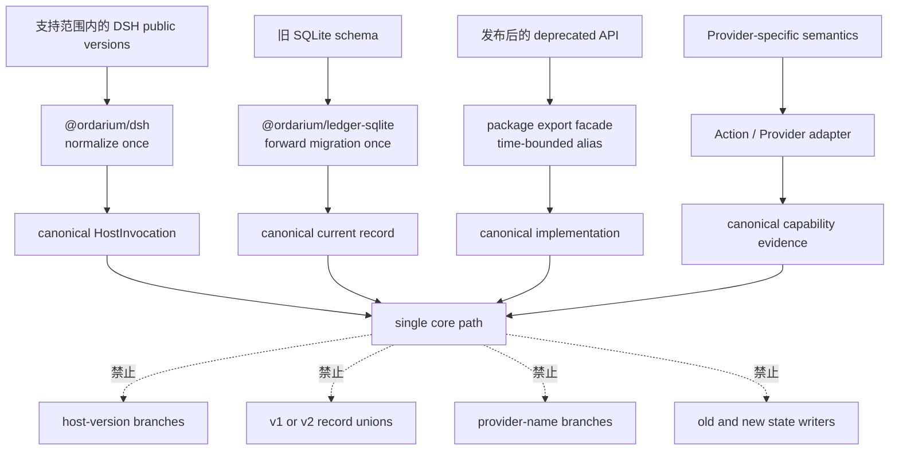
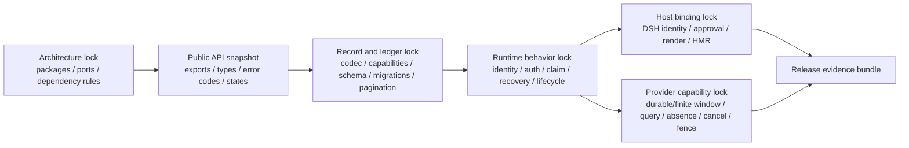
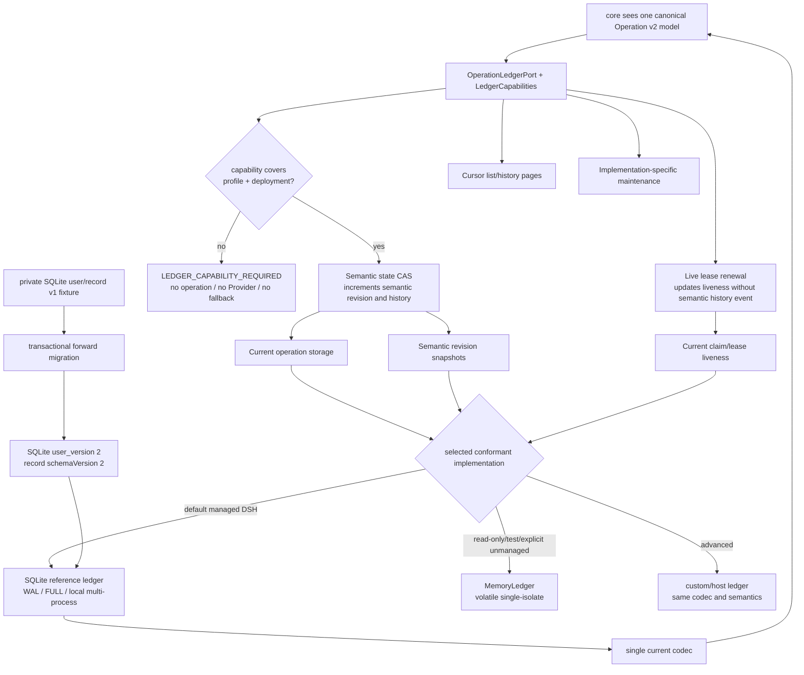
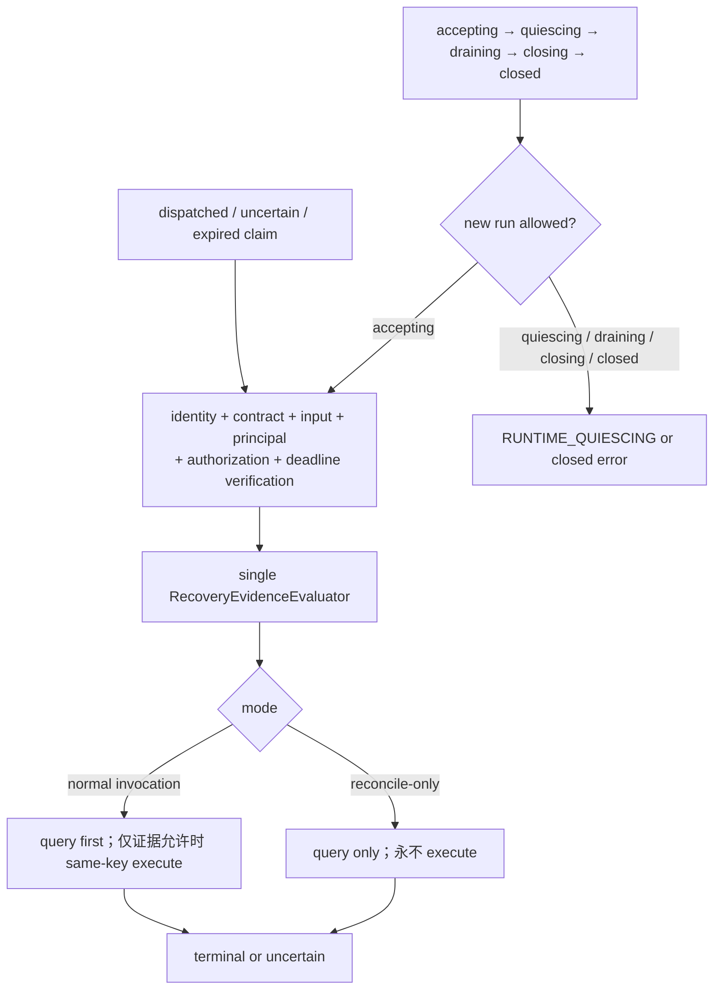
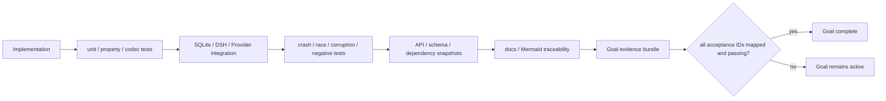

# Ordarium 阶段 Goal、架构一致性与验收合同

> Goal revision：`ORDARIUM-GOALS-3`  
> 状态：首个公开版本的执行基线。`GOALS-3` 按 `delta-ARCH-001` 把产品目标提升为“多 agent harness 公共基石”：HostInvocationPort 冻结、宿主 conformance harness、多 agent identity/共账合同进入 G1/G2/G4，真实第二宿主 `@ordarium/host-mcp` 进入 G5 发布门，G8 收窄为发布后扩展与 Palimpsest 缝。本文仍是阶段目标、实施顺序、进入/退出条件和验收证据的最高权威；`14-ordarium-implementation-plan.md` 继续记录当前实现快照，但其阶段顺序与发布门若和本文冲突，以本文为准。产品边界仍由 `12` 定义，运行语义由 `13` 定义，系统结构由 `15` 定义，完整视觉投影由 `16` 定义。

## 1. 总目标与完成定义

Ordarium 的目标不是“写完四个 package”，而是交付一个可以被普通 DSH 插件作者直接采用、可以被其他 harness 通过 HostInvocationPort 接入、并且在崩溃、重投、并发、跨 agent/跨宿主重投和 Provider 事实不完整时仍保持诚实语义的产品：

> **多 agent harness 的公共基石：host-neutral、随宿主进程嵌入的 Safe Action SDK + Effect Authority。**

首个公开版本只有同时满足以下七类结果才算完成：

1. **开发者结果**：普通 DSH 插件作者只安装 `@ordarium/dsh`，不需要理解四包组装、SQLite 事务或恢复状态机。
2. **副作用结果**：相同 operation 在 replay、进程崩溃和本机多进程竞争中不会因 Ordarium 自身产生未经证明的第二次业务写；不能证明时稳定返回 `uncertain`。
3. **宿主结果**：各宿主（DSH 首宿主、MCP 第二宿主）的 Agent Loop、原生 Tool Pipeline、Approval、Session、Credentials、Sandbox、Client Surface 与 HMR 继续包围 Ordarium，没有被复制或绕过。
4. **基石结果**：HostInvocationPort 是机器可验证的 core 导出；宿主中立性由 conformance harness 与真实第二宿主（`@ordarium/host-mcp`）双重证明；多 agent identity/命名空间合同与共账拓扑有发布级证据。
5. **运维结果**：受权 operator 能 inspect、分页 list/history、提供 recovery material 并执行 query-only reconcile；普通模型没有 `forceRetry` 或 ledger write 能力；跨 agent 审计视图可回答“哪个 agent 的哪次调用”。
6. **工程结果**：内核包可独立发布、安装和消费；精选 root/subpath API、record schema、ledger capability、migration、分包 Node 支持政策和版本策略都有机器可验证证据。
7. **架构结果**：实现和 `12–17` 的职责边界、依赖方向、端口和状态语义一致；不存在为了修补阶段错序而引入的无主兼容层、双状态源或第二条恢复路径。

“完成”不等于宣称任意 Provider 的 exactly-once，也不要求 Palimpsest、远程 Authority、daemon、workflow、subagent scheduler 或多 agent 编排引擎。

## 2. 当前起点与目标差距

### 2.1 当前代码基线

当前工作区已经具备：

- 四包结构：`@ordarium/core`、`@ordarium/ledger-sqlite`、`@ordarium/dsh`、`@ordarium/testing`；
- Action DSL、五种 effect profile、canonical JSON 与稳定 operation identity；
- authorization、operation state、CAS claim、lease heartbeat、fencing token；
- dispatched-before-provider、read-only/idempotent/reconcilable/guarded 恢复主链；
- MemoryLedger、真实 SQLite reopen、双 Runtime CAS 与 crash checkpoint；
- DSH 结构兼容 adapter、默认本地数据库和注册/dispose helper；
- core 拥有的 `HostInvocationPort`（`OrdariumRuntime.invoke`）与 managed 无 identity 的 `IDENTITY_REQUIRED` fail-closed，`@ordarium/testing` 的 `HostAdapterHarness` 宿主 conformance 基座（delta-G1-001）；
- 7 个测试文件、23 项测试的当前基线。

当前实现仍不是发布成品，主要因为：

- 真实 DSH 发布包的官方类型与 Cordis/HMR fixture 尚未接入（合同级 + 进程级 + tarball 级已覆盖，宿主终验待 DSH 产物可消费；发布目的地与 rc→1.0.0 为发布动作决议）。

### 2.2 当前状态

| Goal | 状态 | 说明 |
|---|---|---|
| G0 架构冻结与基线证据 | **已完成** | 机器化证据见 `ordarium/evidence/G0/baseline-report.md`、`ordarium/snapshots/`；`pnpm verify:architecture` 全绿，目标结构决策单未决项为零 |
| G1 Core 合同冻结 | **已完成** | 八切片交付（G1-001～008），A01–A12 全部有自动化证据，exit report 见 `ordarium/evidence/G1/exit-report.md`（64 测试 + 快照零漂移） |
| G2 Ledger 与平台基础 | **已完成** | 原子切换 record/port/schema v2 + lease 分离 + 事务性迁移 + 分页 + infra 错误族；A01–A12 全部有 fixture 证据，exit report 见 `ordarium/evidence/G2/exit-report.md`（真机 24.15/24.19 矩阵已闭环：`evidence/G7/node-matrix-report.md`，`pnpm verify:matrix` 可复跑） |
| G3 Runtime 恢复与生命周期 | **已完成** | 生命周期 + 有界 drain + durable handoff（G3-001）、统一 recovery evaluator（normal/reconcile-only）+ `IDEMPOTENCY_EXPIRED` 强制 + 时钟/取消/checkpoint 夹具（G3-002/003）；A01–A11 全部有 fixture 证据，exit report 见 `ordarium/evidence/G3/exit-report.md`（92 测试全绿） |
| G4 Operations 闭环 | **已完成** | `OrdariumOperations`（只读三件套 + reconcileOnly 预验委托）、双视图同一 projector、`OperatorAuthorization` 独立边界 + `OPERATOR_AUTHORIZATION_REQUIRED`；A01–A11 全部有 fixture 证据，exit report 见 `ordarium/evidence/G4/exit-report.md`（106 测试全绿） |
| G5 宿主产品集成（DSH + MCP） | **已完成（含披露项）** | host-mcp 第二宿主（真实 stdio 往返 + **官方 MCP SDK client**）、双宿主共账 e2e、dsh 结构化 ContentBlock/principal/recoveryMaterial 绑定、叶包 verifier 规则；A01–A14 证据齐备，真机矩阵已闭环（`evidence/G7/node-matrix-report.md`）；仅真实 DSH 包 fixture 携至 G7（exit report `ordarium/evidence/G5/exit-report.md`，118 测试全绿） |
| G6 Provider conformance | **已完成** | `@ordarium/testing` 声明+指纹+交叉校验、确定性 ProviderFixture（七预设）、A01–A12 场景套件（normal/reconcile-only 双模式，业务效果计数断言）；exit report 见 `ordarium/evidence/G6/exit-report.md`（131 测试全绿） |
| G7 发布候选与公开包 | **已完成（release candidate）** | 五包 `1.0.0-rc.1`/MIT/files 成品化；tarball 消费 fixture（隔离安装 + ESM smoke + 声明编译）；命令收敛（`test:integration/conformance/package`、`verify:docs/release`）；README 宣称审计；Docker Node 矩阵闭环；A01–A14 全 PASS，report 见 `ordarium/evidence/G7/release-candidate-report.md`（剩余为发布动作级事项：真实 DSH 包终验、registry 决议、rc→1.0.0） |
| G8 发布后扩展与 Palimpsest 缝 | 发布后 | 不进入首发关键路径；第二宿主已在 G5 交付 |

## 3. 不可变目标结构

阶段可以改变实现细节，但不能悄悄改变以下产品结构：

长期冻结的不变量：

1. 内核运行时保持四个包（core / ledger-sqlite / dsh / testing）；不为 Operations、Provider 或 compatibility 再拆内核包。宿主适配器以独立叶包加入 workspace（首个为 `@ordarium/host-mcp`），依赖只允许 core 与默认 ledger，宿主协议 SDK 只允许出现在叶包，不得反向或横向依赖。
2. core 不导入任何宿主（DSH、MCP、Palimpsest）或具体 Provider；Host 与 Provider 差异只在边界 adapter。
3. 一个 operation 只有一个 canonical identity、一个 state machine、一个 recovery evidence evaluator 和一个 durable authority。
4. `execute()` 是唯一业务写路径；`reconcile()` query-only；Operations 的 reconcile-only 永远不能间接 execute。
5. SQLite record migration 和宿主 version normalization 可以存在于边界，但 core 内不能长期处理多代 host/record 形状。
6. 默认 managed 部署仍是同进程 library + local SQLite，无 daemon、网络文件系统或多主机共享 SQLite；SQLite 是 reference ledger，不是 core 语义依赖。共享同一本地 ledger 的多 agent/多宿主共账拓扑必须同属一个 OS-user trust domain。
7. Palimpsest 只通过未来 Host Adapter 接入，不进入首发依赖图或 Goal。
8. `@ordarium/dsh` 根入口只暴露 author façade 与 `installOrdarium`；`/advanced` 承担低层 binding/Ops/custom ledger，根入口不得宽重导出 Runtime、Ledger、raw record 或 migration。
9. Managed write 只有在 LedgerCapabilities 覆盖 crash durability、semantic CAS、live lease/history 与实际部署拓扑时才可执行；能力不足或 durable open 失败不静默降级到 MemoryLedger。
10. Authorization evidence 必须标明 `host-admission`、`policy-decision` 或 `human-approval`；operator authorization 是另一条权限边界。
11. 宿主中立性是机器证明的合同：HostInvocationPort 由 core 冻结并进入 API snapshot，宿主 conformance harness 验证适配器，真实第二宿主（`@ordarium/host-mcp`）在发布前运行；任何宿主特有类型不得进入 core。多 agent 语义只通过 identity/lineage/命名空间与共账合同表达，Ordarium 不调度、不编排 agent。

## 4. Goal 依赖图与阶段顺序理由

顺序不是项目管理偏好，而是防止结构返工：

- **先 G1 冻结 contract，再做 G2 ledger**：否则 Operations、migration 和 DSH 会分别固化不同的 OperationRecord 与错误模型。
- **先 G2 冻结 storage/lease/pagination，再做 G3 Runtime**：否则 heartbeat、claim 和 history 会继续共用一个不合适的 CAS，并在后期被迫加兼容分支。
- **先 G3 形成唯一 recovery evaluator，再做 G4 Operations**：否则正常恢复与 reconcile-only 会演化成两套状态机。
- **先 G4 再完成 G5 DSH**：recovery material、operator authorization 和视图脱敏必须进入同一个正式 DSH binding，不能发布后再外挂第二套插件。
- **G6 可提前写规范，但必须用 G3 Runtime 验证**：Provider 能力不能只靠 mock adapter 自证。
- **G7 最后做 publish**：在私有未发布阶段应优先进行干净 breaking change，而不是为了内部旧 API 提前背负兼容层。

## 5. 跨阶段架构一致性协议

### 5.1 每项实现先经过 Architecture Delta Gate

每个 phase PR 或同等变更集必须回答：

1. 哪个现有框拥有这项职责？如果没有，是否意味着产品边界变了？
2. public API、Action version、OperationRecord、SQLite schema、DSH mapping 和 Provider capability 哪些会变化？
3. 旧数据和旧调用进入后，在哪里被一次性转换为 canonical 新形状？
4. 旧实现路径何时被删除？是否会出现两个 writer、两个 state machine 或两个 recovery engine？
5. 哪些测试能证明旧路径没有继续产生状态？
6. `12–17` 哪些文档和 Mermaid 必须随代码一起更新？

### 5.2 单一事实源规则

| 语义 | 唯一事实源 | 禁止出现的重复源 |
|---|---|---|
| Action metadata | `Action` contract + canonical fingerprint | DSH adapter 再维护一份独立 metadata |
| Operation identity | core identity engine | Host Adapter 或 Provider adapter 自行 hash operation |
| State transition | core transition/recovery evaluator | Operations、DSH、SQLite 各自判断可否重试 |
| Record validation | 单一完整 codec | SQLite decoder、API parser、migration 各写一套不一致校验 |
| Current operation truth | OperationLedger current record + live lease | cache、history reducer或 DSH session 作为第二 authority |
| Ledger execution eligibility | `LedgerCapabilities` + core capability gate | DSH adapter 通过实现类型名猜测 durability，或 SQLite 失败后改用 memory |
| DSH author surface | `@ordarium/dsh` curated root + `/advanced` export map | README、root barrel 与内部包分别定义不同入口 |
| Host compatibility | 对应 Host Adapter | core 内出现 DSH version 分支 |
| Provider compatibility | Action/Provider adapter + conformance evidence | core 内出现 GitHub、邮件、支付等 Provider 条件分支 |
| Secret acquisition | Host CredentialResolver / Action process memory | OperationRecord、receipt 或 logical key 保存 credential |
| Phase completion | 本文 Goal acceptance + evidence bundle | 仅凭 TODO 被勾选或单元测试数量判断完成 |

### 5.3 Atomic Architecture Slice 规则

Goal 是语义验收边界，不是 package 边界，也不要求人为制造可合并但结构残缺的中间版本。一个结构变化如果同时影响 core、ledger、DSH 或 testing，必须在一次 coherent cutover 中更新全部仓库内生产调用者：

具体应用：

- G1 冻结 target record/lease/capability contract，并先把当前 v1 decoder 收敛为单一完整 codec；G2 才把 schema 切到下一版，并在同一个 architecture slice 内同时更新 core types、SQLite migration、MemoryLedger、Runtime 调用和全部 fixtures。
- G2 改 OperationLedgerPort 时必须同步迁移现有 Runtime，保持已有行为和测试全绿；G3 在新 port 上继续强化恢复语义，而不是让 Runtime 跨 Goal 兼容两套 port。
- G3 引入 quiesce/drain 时必须同步修改当前 `installOrdarium().dispose()`，不能等 G5 才让仓库内 DSH helper 获得正确生命周期；G5 负责正式 DSH 类型和真实 HMR fixture。
- G5 收敛 ContentBlock/binding 时直接替换当前 private text-only 近似形状，不保留两个 public adapter。

因此每个 Goal 完成点都必须是 buildable、testable、只有一条 production path 的仓库状态；允许设计先冻结，不允许生产结构半迁移。

## 6. Compatibility Layer 政策

### 6.1 默认决策：首发前不为内部旧形状保留兼容层

当前四包仍是 private workspace，没有已经发布的公共兼容承诺。因此 G1–G6 期间：

- public API 需要调整时直接改成目标形状，并一次性更新仓库内调用者；
- OperationRecord 改版时提供一个 ledger-boundary forward migration，但 core 只消费新形状；
- 不保留 `legacyRuntime`、`runV1/runV2`、双写表、旧状态别名或“临时”自动 fallback；
- 不因为当前测试依赖旧 API 就把旧 API 当生态合同；应更新测试去证明目标合同。

发布后才按 semver 和支持矩阵承担外部兼容责任。

### 6.2 兼容逻辑只允许存在于边界

允许的兼容层只有四类：

| 边界 | 允许内容 | 必须满足 | 不允许 |
|---|---|---|---|
| `@ordarium/dsh` | 将明确支持的 DSH public type/lifecycle 版本归一化 | 支持矩阵、真实 fixture、单向映射 | core 导入 DSH 类型；fork Cordis |
| `@ordarium/ledger-sqlite` | forward schema migration 与旧 record decode | 事务、备份、fixture、迁移后只输出当前 schema | Runtime 到处判断 schemaVersion；双写新旧表 |
| package facade | 发布后的 deprecated export alias | owner、semver、警告、移除版本、contract test | 复制两套实现或长期无期限保留 |
| Provider adapter | Provider SDK、key/query/cancel/fence 适配 | capability conformance、principal namespace、无 raw response 持久化 | provider-specific 逻辑进入 core |

任何兼容层必须登记：`id`、边界、兼容来源、canonical target、owner、支持期限、移除条件、测试和是否读取/写入 durable state。没有移除条件的“临时层”视为永久架构，必须重新审议。

Host Adapter、OperationLedger implementation 和 Provider adapter 本身是长期架构端口，不自动等于兼容债务；只有当它们为了保留已废弃形状而再增加一次转换、双写或 fallback 时，新增部分才是 compatibility layer，必须登记。

### 6.3 首发已预见的兼容事项

| ID | 事项 | 决策 |
|---|---|---|
| `COMPAT-DB-001` | 当前 SQLite schema v1 到目标 schema | 在 ledger 包执行一次性 forward migration；core 不接收 v1 union |
| `COMPAT-DSH-001` | DSH 正式 public surface 与当前结构近似类型可能不同 | G5 以固定支持矩阵重写/收敛 adapter；不保留“猜测类型 + 正式类型”双入口 |
| `COMPAT-API-001` | 当前 private `0.2.0` API 与首发 API 可能不同 | 首发前直接 clean break；当前版本号不构成外部兼容承诺 |
| `COMPAT-API-002` | 当前 DSH 根入口宽重导出 core/SQLite，目标是精选 root + `/advanced` | G1 一次性切换 export map、README 与 consumer snapshot；不保留第二个 legacy root |
| `COMPAT-LEDGER-001` | 当前 Memory/SQLite port 没有能力描述 | G1 冻结 capability contract，G2 同一 atomic slice 更新全部实现与 Runtime；不通过 `instanceof` 维持旧判断 |
| `COMPAT-PAL-001` | 未来 Palimpsest 形状未知 | 只保留 HostInvocationPort，不提前增加 Palimpsest 字段或 shim |

## 7. 跨阶段冻结物与变更等级

### 7.1 必须机器化的冻结物

目标仓库最终应具有以下可验证 artifact；文件名可以在 G0 调整，但职责不得分散：

| Artifact | 冻结内容 | 首次冻结 | 后续变化要求 |
|---|---|---|---|
| Architecture lock | 四包、依赖方向、端口 owner、非目标 | G0 | 架构审议 + `12/15/16/17` 同步 |
| Public API snapshot | curated root/subpath exports、TypeScript declarations、error/state unions | G1 | semver 分类 + consumer fixture |
| Action contract fingerprint fixture | name/version、input/output schema、effect/capability metadata | G1 | 不兼容变化要求 Action version bump |
| OperationRecord/ledger contract fixture | G1 完整收敛当前 codec，并冻结 v2 shape、LedgerCapabilities 与 live-lease port；G2 原子切换 | G1/G2 | forward migration + capability/corruption fixture |
| SQLite migration fixtures | 每个已支持 user_version 的真实数据库 | G2 | 只能前向增加，不删除已发布 fixture |
| State/recovery transition matrix | mode、evidence、state、Provider call 许可 | G3 | public semantic change + 完整 crash matrix |
| DSH support matrix | 宿主版本、public types、lifecycle、replay 行为 | G5 | adapter-only change + real fixture |
| Provider capability fixtures | durable/finite key window、query、absence、cancel、fence、principal | G6 | conformance version + adapter evidence |
| Package tarball consumer fixture | pack 后安装、imports、types、runtime | G7 | 每次 release candidate 必跑 |

### 7.2 变化等级

| 等级 | 示例 | 要求 |
|---|---|---|
| A：内部等价变化 | 私有函数拆分、性能优化 | 原行为测试 + dependency/API/schema diff 为零 |
| B：加法合同变化 | 新的只读 filter、可选 safe metadata | API snapshot、默认行为、资源上限、文档；不得改变旧 operation 解释 |
| C：破坏性合同变化 | identity、state、record 字段、error code、Action profile 改义 | 首发前 clean break；发布后 semver + migration/deprecation；必须更新所有 contract fixtures |
| D：边界变化 | core 需要 DSH 类型、新包取得 state authority、Provider SDK 进入 core | 默认拒绝；必须先修订产品架构，不能用 adapter 名义掩盖 |

## 8. G0：架构冻结与基线证据

### 8.1 Goal

在继续改代码前，把“当前有什么、目标是什么、哪些变化会破坏后续阶段”转成机器可检查的基线。G0 不追求新增功能，追求让后续每次变化都能被分类。

### 8.2 交付物

1. 四包 dependency graph 与禁止边检查；
2. 当前 public exports、error/state union、Action/Effect/OperationLedger declarations 的 baseline snapshot；
3. 当前 SQLite `application_id`、`user_version`、table/index 和 record fixture；
4. 当前 17 项测试与已知缺口清单；
5. 当前 v1 的单一完整 codec，以及目标 OperationRecord 下一版字段决策，包括：
   - `contractFingerprint`；
   - 有限幂等能力在 operation 首次创建时冻结的绝对 `idempotencyExpiresAt`，过期后禁止 redispatch；
   - 可选 `providerPrincipalDigest` 与分类 authorization evidence；
   - semantic record/history 与高频 live lease renewal 的分离；
   - 不包含 Provider-specific payload 或 credential；
6. 精选 `@ordarium/dsh` root、`/advanced` subpath 与唯一 `installOrdarium` golden path 的目标 export map；
7. `LedgerCapabilities`、managed capability gate、SQLite reference default、volatile/custom 合法范围与 no-fallback 决策；
8. Compatibility Register，初始登记 `COMPAT-DB-001`、`COMPAT-API-002`、`COMPAT-LEDGER-001` 等真实事项；
9. Architecture Delta Sheet 模板和 phase evidence 目录约定。

### 8.3 验收

| ID | 验收场景 | 通过条件 |
|---|---|---|
| `G0-A01` | 当前工作区 build/test | `pnpm check` 一次通过，测试数与失败点被记录 |
| `G0-A02` | Package graph | 自动检查无循环，core 无 DSH/Palimpsest/Provider import，首发仍为四包 |
| `G0-A03` | API baseline | public declarations 可重复生成；无解释 diff 会使 gate 失败 |
| `G0-A04` | DB baseline | v1 fixture 可 reopen，schema、PRAGMA 与 record 被固定 |
| `G0-A05` | 架构可追溯 | `12–17` 对同一职责没有冲突；每个目标 box 能映射到 package/port/phase/test |
| `G0-A06` | 下一版结构决策 | façade/profile/auth/principal/record/lease/pagination/ledger capability/Node policy 在代码变更前形成单一 target，未决项不能流入 G1/G2 |
| `G0-A07` | Compatibility register | 每一项有 owner、位置、canonical target、移除或长期支持决定；不存在无名 shim |

### 8.4 Exit gate

G0 只有在 public、schema、dependency 三类 diff 都能自动产生，并且 target record/lease 模型已冻结后才能完成。仅有本文档不等于 G0 已完成。

## 9. G1：Core 合同冻结

### 9.1 Goal

先把所有下游共同依赖的语义固定：精选 author surface、HostInvocationPort、Action profile、identity 与多 agent 传播规则、分类 authorization、Provider principal、ledger capability、public errors/states、resource envelope、contract fingerprint 和目标 record codec。G1 完成后，G2–G6 不得各自重新解释这些概念。

### 9.2 结构决定

1. managed side-effect direct run 没有显式 identity 必须 `IDENTITY_REQUIRED`；随机 direct identity 只允许 read-only 或明确 unmanaged。
2. 同 operation 的首个 durable authorization 决定不可覆盖；evidence kind 只能是 `host-admission`、`policy-decision`、`human-approval`，后续矛盾证据返回 `AUTHORIZATION_CONFLICT`。
3. `Action name + version` 是语义边界；metadata fingerprint 只检测 schema/effect/capability 漂移，不用函数源码 hash 冒充语义证明。
4. `EffectProfile` 是 `read-only | guarded | idempotent(window) | reconcilable(idempotencyWindow?, cancellable) | unmanaged` 的 discriminated union；窗口只有 durable 或 finite。Finite 在 operation 首次创建时形成一次 durable deadline，过期后恢复只能 query 或 uncertain。
5. G1 先让当前 v1 使用一个由 `@ordarium/core` 拥有的完整 codec，使 TypeScript shape、runtime decode、长度限制和跨状态 invariants 只有一个来源；同时冻结下一版 target shape。G2 再通过 atomic slice 把该 codec、core 和 ledger 一起演进。SQLite migration 可以在 ledger boundary 解码旧 shape，但转换后只能交给 current core codec；Operations 不得另写校验。
6. State transition 与 caller action 形成稳定 public contract；底层 SQLite message 不得成为调用者重试依据。
7. raw input、raw key、credential、stack 和未筛选 Provider response 永不进入 public error 或 record。
8. `ProviderPrincipalRef` 只在内存中解析 credential；record 最多持久化其稳定 digest，同 operation 的 principal 变化必须 conflict。
9. `LedgerCapabilities` 是 port 合同，不由 `instanceof SqliteLedger` 推断；managed write 的能力不足必须在 create/dispatch 前返回 `LEDGER_CAPABILITY_REQUIRED`。
10. `@ordarium/dsh` 根入口只保留 `defineAction/effects/schema/defineSchema/installOrdarium` 与作者必需类型；`createDshOrdarium/asDshTool`、Ops、自定义 ledger 与 lifecycle tuning 只在 `/advanced`。
11. HostInvocationPort 由 core 冻结为独立导出接口：宿主调用进入 core 的唯一边界（稳定 `InvocationIdentity`、可选分类 `AuthorizationDecision`、`AbortSignal`、invocation metadata）；进入 API snapshot；DSH/MCP/模拟宿主都只消费它，不各自定义形状。多 agent identity 传播规则（`source` 宿主隔离、`rootCallId/lineage` 只作关联、丢 callId 必须业务 key、命名空间约定）随端口一起冻结为合同文本与长度上限。

### 9.3 交付物

- `OrdariumErrorCode`/error family 与 caller-action matrix；
- frozen `OperationState` 与合法 transition matrix；
- explicit managed identity requirement；
- core 拥有的独立 `HostInvocationPort` 接口（进入 API snapshot）；
- `@ordarium/testing` 的宿主适配 conformance harness（模拟宿主走端口全合同，作为 G5 双宿主验收的测试基座）；
- 多 agent identity 传播规则与命名空间约定的合同文本及长度上限；
- immutable authorization evidence conflict handling；
- classified authorization evidence、transient ProviderPrincipalRef 与 durable principal digest conflict；
- 当前 v1 的完整 OperationRecord codec、corruption fixtures，以及下一版 target schema contract；
- Action contract fingerprint；
- EffectProfile capability validity model；
- `LedgerCapabilities` contract、profile/deployment eligibility evaluator 与 `LEDGER_CAPABILITY_REQUIRED`；
- input、identity、lineage、authorization、safe error、output、receipt 的统一资源上限；
- curated root/subpath export snapshot、golden-path 与 advanced-path compile-time consumer fixtures。

### 9.4 验收

| ID | 验收场景 | 通过条件 |
|---|---|---|
| `G1-A01` | managed Action 无 identity | Provider、ledger dispatch 均未发生；返回稳定 `IDENTITY_REQUIRED` |
| `G1-A02` | 相同 operation 先 allow 后 deny，或先 deny 后 allow；普通 input 伪造 approval kind | 首个 durable decision 保持不变并返回 `AUTHORIZATION_CONFLICT`；evidence kind 只接受受信 Host Adapter 注入 |
| `G1-A03` | identity 相同但 canonical input 不同 | 稳定 `OPERATION_CONFLICT`；不得随机创建新 operation |
| `G1-A04` | Action metadata 漂移但 version 未变 | fingerprint diagnostic 失败；key/execute 语义仍由作者 version 责任约束 |
| `G1-A05` | finite idempotency contract 设计 | public target 与 fingerprint/record target 只有一种表达；实际持久化 deadline 在 G2 切换、G3 执行 |
| `G1-A06` | 当前 v1 的嵌套 claim/auth/result/reconciliation 损坏 | 单一生产 codec fail closed，Provider 未调用 |
| `G1-A07` | oversized input/identity/lineage/reason/output/receipt | 在对应安全边界返回稳定错误；dispatch 后校验失败进入 uncertain 语义 |
| `G1-A08` | DSH root/subpath API diff | root 只含 author façade；Runtime/Ledger/raw record/migration 不能从 root import，高级 API 只从 `/advanced` import |
| `G1-A09` | Dependency audit | core 仍不依赖 DSH、SQLite implementation 或 Provider SDK |
| `G1-A10` | Ledger capability eligibility | managed + volatile 或拓扑不覆盖时稳定 `LEDGER_CAPABILITY_REQUIRED`，Provider 为零；read-only/test/explicit unmanaged 可按合同使用 MemoryLedger |
| `G1-A11` | Provider principal continuity | credential 只在内存解析；record 只含可选 digest；同 operation 换 principal 稳定 conflict，Provider 未调用 |
| `G1-A12` | HostInvocationPort 冻结 | 端口为 core 独立导出并进入 API snapshot；模拟宿主经 conformance harness 走全合同；core 声明文件不含任何宿主特有类型 |

### 9.5 防冲突要求

- G1 可以直接 breaking-change 当前 private API，不增加 legacy alias。
- Record target 在 G1 冻结，实际 SQLite/core schema cutover 在 G2 以 atomic architecture slice 完成；中间不得合并 core 写新形状而 SQLite 仍读旧形状的状态。
- DSH adapter 在 G1 的同一 public-surface slice 切换精选 root/subpath，并只跟随 canonical identity/error 模型；不保留宽 root alias。

## 10. G2：Ledger、lease 与平台基础

### 10.1 Goal

把 OperationLedger 从“能持久化的原型”变成后续 Runtime、Operations 和 DSH 可以共同依赖的稳定 authority，并一次性解决 record migration、heartbeat 写放大、分页、基础设施错误和 Node/SQLite 支持政策。

### 10.2 目标结构

具体实现可使用 current table 的独立 lease columns 或专门 lease table，但必须满足：heartbeat 不增加 semantic revision/history；claim acquisition、fencingToken 与 resumeFrom 仍是可审计语义事件；terminal CAS 必须验证当前 owner/fence。

### 10.3 交付物

- v1 → target schema 的 transactional forward migration；
- 公开目标固定 `application_id=ORDA`、SQLite `user_version=2`、semantic record `schemaVersion=2`；
- single current record codec，runtime 不接收 `v1 | v2` union；
- core types、MemoryLedger、SQLiteLedger、当前 Runtime 与 fixtures 在同一 architecture slice 切换到 target schema；
- 所有 ledger 实现返回静态 `LedgerCapabilities`；core 在 operation create 前执行 profile/deployment gate，不依赖实现类名；
- semantic CAS 与 lightweight lease renewal 的分离；
- semantic `updatedAt` 与 lease liveness timestamp 分离；heartbeat 不改变 operation 的语义排序时间；
- terminal write 对 owner/fence 的原子验证；
- cursor-based list/history，统一 MemoryLedger 与 SQLiteLedger 语义；
- busy/full/corrupt/closed/newer-schema/migration failure 的稳定 infrastructure mapping；
- WAL 一致性 backup/checkpoint 或完整 offline procedure 的测试证据；
- no-auto-GC/retention/tombstone-future 策略；
- 首发 SQLite/DSH durable-default 路径以 Node `>=24.15.0` 为目标最低线，使用已到 release-candidate stability 的 `node:sqlite`；core/testing 的最低 Node 独立测定，不被 SQLite binding 人为抬高；
- SQLite/custom open failure 与 capability insufficiency 均 fail closed，禁止 MemoryLedger 自动 fallback；
- 双进程真实文件竞争 fixture；
- 双宿主共账 fixture：两个宿主适配器（或模拟宿主 + 真实宿主）进程共享同一本地 ledger，验证 operation 去重、claim 协调与 Action 命名空间隔离同时成立（共账拓扑）。

### 10.4 验收

| ID | 验收场景 | 通过条件 |
|---|---|---|
| `G2-A01` | 打开 v1 database | 一次性事务迁移成功；opId、digest、state、attempt、fence、outcome 不变 |
| `G2-A02` | migration 中途故障 | 原数据库保持可恢复的一致版本，不产生半迁移 writer |
| `G2-A03` | 高频 heartbeat | lease 持续有效，但 semantic history 数量不随心跳次数增长，operation 不因心跳反复跳到 list 顶部 |
| `G2-A04` | terminal CAS 与 lease takeover 竞争 | 旧 owner 无法写 terminal；新 fence 单调增加 |
| `G2-A05` | 两个独立 Node 子进程 claim 同一 operation | 只有一个获得当前 claim；另一个 busy 或观察到新 revision |
| `G2-A06` | list/history 大数据分页 | 数据集不并发变化时无遗漏/重复，cursor opaque，排序稳定，Memory/SQLite/conformant fixture 一致；并发更新采用明确 live-cursor 语义而不虚称 snapshot |
| `G2-A07` | busy/full/corrupt/newer schema/open failure | 稳定 infrastructure error；Provider 未被错误调用；不解析 raw SQLite message 重试，也不 fallback 到 MemoryLedger |
| `G2-A08` | 一致性 backup 与 reopen | backup 包含 WAL 中已提交状态；reopen 后 current/history 一致 |
| `G2-A09` | 恢复旧 backup | 系统明确要求 Provider reconcile，不把丢失的 operation 当全新安全事实 |
| `G2-A10` | Node matrix | SQLite/DSH durable default 在 Node `>=24.15.0` 通过；core/testing 独立最低线通过；package engines 与支持声明一致 |
| `G2-A11` | Ledger capability matrix | volatile/durable/custom 与 single-isolate/single-process/local-multi-process 组合逐项符合 eligibility；能力不足在 operation create 前失败 |
| `G2-A12` | 双宿主共账拓扑 | DSH 与第二宿主（或模拟宿主）进程共享同一 SQLite ledger：相同工作跨宿主汇合到同一 operation（业务 key），不同宿主的默认 identity 不互折叠，claim 竞争只有一个 dispatch |

### 10.5 防冲突要求

- 所有旧 schema 处理只在 ledger migration/decode boundary；core、DSH、Operations 不出现 schemaVersion 分支。
- 不同时保留“heartbeat 作为 semantic CAS”和“轻量 heartbeat”两条生产路径。
- pagination 在 G2 冻结，G4 Operations 只消费它，不再包装 offset/limit 兼容协议。
- OperationLedgerPort 的 breaking change 必须同步更新现有 Runtime 和测试，G2 exit 时仓库内不得残留旧 port adapter。
- SQLite 是默认 reference implementation，不得把其 class、PRAGMA 或文件路径泄露进 core eligibility；custom ledger 也不得创造第二套 record/state 语义。

## 11. G3：Runtime 恢复、并发与生命周期

### 11.1 Goal

在 G1/G2 的单一合同和 ledger 上完成真正的副作用执行闭环：统一正常恢复与 query-only 恢复的证据判断，证明 lease/fence/abort，补齐 cancellation 与 HMR quiesce/drain。

### 11.2 目标结构

Runtime 内只允许一个 recovery evidence evaluator：

Operations 不复制这个 evaluator，只选择 `reconcile-only` mode。DSH 不解释 record state，只调用 Runtime/Operations API。

### 11.3 交付物

- accepting/quiescing/draining/closing/closed Runtime lifecycle 与 stable `RUNTIME_QUIESCING`；
- in-flight registry、组合 Host/lease shutdown `AbortSignal`、有界 drain；
- 当前 `@ordarium/dsh` install/dispose helper 同步切换到 quiesce → unregister → bounded drain → abort remaining → persist/handoff → revoke late writes/LiveLease → close，不保留 immediate-close 路径；
- normal 与 reconcile-only 共用的 recovery evidence evaluator；
- dispatched-before-provider 和 owner/fence terminal CAS 的完整 checkpoint matrix；
- finite idempotency deadline enforcement；
- reconcile outcome validation 与 authoritative absence policy；
- dispatch 前/后的 cancellation 语义；
- wall-clock forward/backward jump、event-loop stall、heartbeat/CAS loss 测试；
- no blind retry 的负面断言。

### 11.4 验收

| ID | 验收场景 | 通过条件 |
|---|---|---|
| `G3-A01` | crash before durable dispatch | Provider 未调用；同 identity 可继续 |
| `G3-A02` | crash after dispatch、before request | 后续进入 recovery，不把状态当普通失败 |
| `G3-A03` | Provider 成功后 terminal write 前 crash | 下次以同 identity query 或 same-key retry；不创建新 operation |
| `G3-A04` | opaque side effect 丢失响应 | 稳定 uncertain；重复 invocation 仍不盲重试 |
| `G3-A05` | idempotency deadline 未过/已过 | 未过时复用同 key；过期后禁止 execute，只 query 或 uncertain |
| `G3-A06` | lease 丢失或 heartbeat CAS 失败 | Action signal 被 abort，旧 owner 无权提交 terminal |
| `G3-A07` | clock jump / event-loop stall | 不形成两个本地有效 owner；无法证明时 fail closed/uncertain |
| `G3-A08` | abort before dispatch | 可证明 cancelled；Provider 未调用 |
| `G3-A09` | abort after dispatch | cancel hook 只作 best effort；最终为 reconciled fact 或 uncertain |
| `G3-A10` | quiesce 期间新调用与当前 DSH dispose | 新调用稳定 `RUNTIME_QUIESCING`；既有调用有界 drain，剩余调用 abort 并持久化/handoff，旧 owner 迟到写权限撤销后才 close；immediate-close 路径不存在 |
| `G3-A11` | normal 与 reconcile-only 输入相同 | 共享相同 evidence 解释；reconcile-only 的 Provider execute spy 始终为零 |

### 11.5 防冲突要求

- 不建立 `RecoveryRuntime` 与 `OperationsRecoveryRuntime` 两个类或两套 transition table。
- HMR dispose 使用 Runtime lifecycle，不在 DSH package 自己维护第二份 in-flight 集合。
- Provider capability 作为 canonical evidence 输入，不把具体 Provider 名称写入 Runtime 条件分支。

## 12. G4：Operations 与 recovery material 闭环

### 12.1 Goal

使 uncertain 具备安全可见性和 query-only 处置路径，同时保持 operator 权限、Secret 边界和“无法取得原输入就不恢复”的 fail-closed 原则。

### 12.2 产品决定

- Operations service 留在 `@ordarium/core`，DSH 只提供宿主权限与工具映射；不增加第五个 package。
- `inspect/list/history` 只读；`reconcileOnly` 只调用 `reconcile()`。
- Ops surface 默认不自动暴露给模型；宿主必须显式注册并提供 authorization。
- model view 与 operator audit view 使用同一 record projector，但不同字段 policy；不复制 record DTO。
- 首发没有 manual attestation 和 `forceRetry`。

### 12.3 交付物

- `OrdariumOperations` service；
- `OperationView`/`OperationEventView` 与 field policy；
- cursor list/history；
- recovery material verifier；
- recovery source priority：宿主原 invocation → operator 相同参数 resubmission → input-independent reconcile；
- same-provider-principal credential continuity hook；
- independent `OperatorAuthorization` boundary，不复用 Action authorization evidence；
- 跨 agent 审计视图：operator view 包含 lineage/rootCallId/source，可回答“哪个 agent 的哪次调用”；model view 脱敏范围不变；
- DSH 可选 ops tool binding，不进入普通 Action state authority。

### 12.4 验收

| ID | 验收场景 | 通过条件 |
|---|---|---|
| `G4-A01` | inspect terminal/uncertain | 返回稳定 sanitized view，不需要 raw input |
| `G4-A02` | list/history pagination | 使用 G2 cursor，无遗漏/重复；默认 bounded limit |
| `G4-A03` | 缺 recovery material | 仍可 inspect；reconcileOnly fail closed，Provider 未调用 |
| `G4-A04` | action/version/opId/key/input/provider-principal digest 任一不匹配 | stable conflict/error，Provider 未调用 |
| `G4-A05` | reconcile 返回 success/failure | 写 audited reconciled outcome，output/error 通过 codec |
| `G4-A06` | reconcile 返回 pending/unknown/throw/invalid | 保持 uncertain |
| `G4-A07` | reconcile 返回 absent + retrySafe | reconcile-only 仍保持 uncertain，execute spy 为零 |
| `G4-A08` | recovery credential 指向另一 Provider principal | 拒绝继续原 operation |
| `G4-A09` | model view | 不含 authorization reason/actor/full lineage/full result/receipt 等受限字段 |
| `G4-A10` | 未授权 caller 调 Ops | 无 list/history/reconcile 权限；不能通过普通 tool input 自授予 |
| `G4-A11` | 跨 agent 审计视图 | 共账 ledger 中 operator view 含 source/scope/rootCallId/lineage；model view 不含 lineage 与受限字段；同一 record projector 双视图无复制 DTO |

### 12.5 防冲突要求

- DSH adapter 不直接查询 SQLite，也不自行解释 `uncertain`。
- Operations 不接受 raw SQL filter 或开放式 `forceTransition`。
- projector 只做输出脱敏，不修改 durable result 后再把脱敏结果当 canonical replay value。

## 13. G5：宿主产品集成（DSH 首宿主 + MCP 第二宿主）

### 13.1 Goal

把现有结构近似 adapter 变成真实、可安装、遵守 DSH public lifecycle 的产品表面，同时交付真实第二宿主 `@ordarium/host-mcp`，证明 Ordarium 没有绕过宿主 pipeline、没有复制宿主生命周期引擎、也没有把任何宿主类型泄漏进 core。“多 agent harness 基石”的中立性宣称在本阶段获得真实证据。

### 13.2 交付物

- 明确支持的 DSH public version/type matrix；
- 正式 plugin manifest、精选 `@ordarium/dsh` root 与 `/advanced` export map；
- ToolDefinition、ContentBlock、output renderer、timeout 与 concurrency binding；
- 唯一普通路径 `installOrdarium(ctx, { actions })`，以及只从 `/advanced` 暴露的 per-action binding、Ops、自定义 ledger 与 lifecycle tuning；
- callId/rootCallId/session/scope/actor/lineage identity mapping；
- `host-admission` / `policy-decision` / `human-approval` evidence mapping，明确 admission 不等于人工 approval；
- Session recovery material resolver 与 credential resolver binding；
- Operations opt-in registration 与 operator authorization；
- quiesce → unregister → bounded drain → abort remaining → persist/handoff → revoke late writes → close 的 dispose；
- replay、code-mode nested call、parallel tool call、subagent lineage、session restart、HMR fixture；
- **`@ordarium/host-mcp` 宿主适配叶包**：MCP server（stdio）把 `tools/list`/`tools/call` 映射到 HostInvocationPort；MCP 客户端调用身份映射（客户端无稳定 call identity 时要求业务 key，否则 fail closed）；ops 工具受权暴露；server 生命周期遵循同一 quiesce/drain 合同；MCP SDK 依赖只存在于本叶包；
- 真实 MCP 客户端 fixture 与 DSH + host-mcp 双宿主共账 e2e fixture。

### 13.3 验收

| ID | 验收场景 | 通过条件 |
|---|---|---|
| `G5-A01` | 普通插件安装 | 只依赖 `@ordarium/dsh`，通过 `installOrdarium(ctx, { actions })` 定义/注册 Action，不手工装配 internal packages |
| `G5-A02` | 原生 DSH pipeline | schema、guard/approval、signal、result event 与 renderer 全部仍由 DSH 包围 |
| `G5-A03` | human approval、policy decision 与 body admission | authorization kind/source 可区分，不伪造 human approval |
| `G5-A04` | session replay / restart | 保留同 call identity 时复用 operation；不保留时要求 explicit business key |
| `G5-A05` | parallel calls | 不同 call 不误折叠；相同 operation 由 core/ledger 协调 |
| `G5-A06` | root/subagent calls | rootCallId 只作 lineage，不作为默认 dedup key |
| `G5-A07` | ContentBlock | 默认 text 可用；高级 renderer 使用 DSH 正式支持类型，不受私有 text-only union 限制 |
| `G5-A08` | HMR dispose | 新调用停止，旧调用 drain/abort 后才 close；重载后相同 version 可恢复 |
| `G5-A09` | Ops tools | 默认不注册或受明确权限保护；普通模型不能 force retry |
| `G5-A10` | DSH compatibility | 所有 host-version 差异停留在 adapter，core public snapshot 无 DSH 类型 |
| `G5-A11` | Root/advanced surface | root 无 Runtime/Ledger/raw record/migration；高级绑定与 custom ledger 只能从 `/advanced`；README 与 tarball declarations 一致 |
| `G5-A12` | MCP 第二宿主 | 真实 MCP 客户端经 `@ordarium/host-mcp` 调用 Action：identity/evidence/signal 映射成立，崩溃与 replay 语义与 DSH 路径一致；core 声明与 API snapshot 无 MCP 类型 |
| `G5-A13` | 双宿主共账 e2e | DSH 与 host-mcp 同时运行并共享同一 ledger：相同业务工作汇合、claim 竞争单 dispatch、operator 视图可区分两个宿主的调用来源 |
| `G5-A14` | 宿主叶包隔离 | `host-mcp` 只依赖 core（与默认 ledger）；MCP SDK 不进入内核包；`verify:architecture` 对叶包外部依赖有独立 allowlist |

### 13.4 防冲突要求

- G5 必须收敛现有结构近似类型和正式 DSH 类型，不长期维护两个 adapter entry。
- 如果多个 DSH 版本差异大，应明确缩小支持矩阵或做 adapter-internal mapper；不能让 core 接收 union host context。
- `host-mcp` 不得复制 Action 合同、状态机或直连 ledger 写入；它只是 HostInvocationPort 的第二实现。宿主叶包之间不得横向依赖。
- Cordis/HMR 与 MCP server 生命周期继续由宿主拥有；Ordarium 只实现自己 Runtime 的 lifecycle response。
- DSH/host-mcp adapter 不通过 `instanceof SqliteLedger` 决定安全性，也不在 SQLite open 失败时自行创建 MemoryLedger。

## 14. G6：Provider capability 与 conformance

### 14.1 Goal

把 `idempotent`、`reconcilable`、`cancellable` 与 fencing 从开发者自我声明变成可重复验证的能力证据，并确保 Provider-specific 逻辑不污染 core。

### 14.2 交付物

- `@ordarium/testing` 中的 Provider conformance harness；
- capability declaration/fingerprint；
- deterministic fixtures：opaque、durable-idempotent、finite-window-idempotent、reconcilable、false-absence、cancellable、fenced；
- key scope/conflict/response reuse 测试；
- finite absolute deadline 与 durable-window 测试；finite deadline 在 restart/reload/new attempt 后不延长；
- query pending → terminal 与 eventual consistency 测试；
- authoritative absence 与 `retrySafe` 证明；
- cancel accepted 后最终 query；
- stale fence rejection；
- tenant/provider principal namespace 与 credential continuity；
- 少量 reference Action/adapter recipes，不建立通用 HTTP client。

### 14.3 验收

| ID | 验收场景 | 通过条件 |
|---|---|---|
| `G6-A01` | 相同 key + 相同 input | Provider 返回同一业务效果/结果语义 |
| `G6-A02` | 相同 key + 不同 input | Provider 明确 conflict，不静默产生第二效果 |
| `G6-A03` | 首次成功但响应丢失 | Runtime 按 capability 恢复，业务效果计数仍为一 |
| `G6-A04` | finite deadline 边界前后 | 边界前可 same-key retry；边界后 Runtime 禁止 execute |
| `G6-A05` | query pending → success/failure | 只根据最终 Provider fact 写 reconciled |
| `G6-A06` | eventual-consistency 假 absent | 不允许 redispatch；保持 pending/unknown/uncertain |
| `G6-A07` | authoritative absent + retrySafe | 仅 normal Runtime 可按同 operation redispatch；Ops reconcile-only 不可 |
| `G6-A08` | cancel accepted | 不直接写 cancelled；query 后决定 reconciled 或 uncertain |
| `G6-A09` | stale fence | 支持 fencing 的 Provider 拒绝旧 token；不支持时不得宣传外部 fencing 保证 |
| `G6-A10` | principal 改变 | 原 operation 不以另一账号/tenant credential 恢复 |
| `G6-A11` | capability 声明不通过 | Action 降级为已证明 profile，不能一律标记 idempotent |
| `G6-A12` | finite operation restart/reload/new attempt | 持久化的同一个 `idempotencyExpiresAt` 保持不变；不得用新进程配置重新起算 TTL |

### 14.4 防冲突要求

- conformance harness 依赖 canonical Action/Runtime contract，不引入第二个 Provider execution abstraction。
- Provider SDK、HTTP retry、response mapping 全部留在 adapter/recipe；core 只处理 capability evidence 与 typed outcome。
- 任何新 capability 字段必须先进入 G1 的 fingerprint/record model；不得在 G6 私自加 Provider-only record payload。

## 15. G7：Release candidate、包发布与总验收

### 15.1 Goal

证明前述合同能以真实 tarball、真实 DSH、默认 SQLite、至少一个非 SQLite conformance fixture 和可重复 evidence bundle 交付，而不是只在 workspace path 和 mock 环境中成立。

### 15.2 交付物

- 四包正式 manifest：`private`、`files`、`exports`、`types`、`engines`、license、repository、semver；
- 从 `npm pack` tarball 安装的独立 consumer fixture；
- 一条 `installOrdarium` 安装/定义/运行路径，以及独立的 `/advanced` Ops/custom-ledger 路径；
- 分包 Node matrix：SQLite/DSH durable default 目标 `>=24.15.0`，core/testing 独立最低线；
- public API、record schema、migration、DSH matrix、Provider conformance snapshots；
- release threat/trust/tenant/secret documentation；
- 端到端 crash/replay/concurrency/HMR/Ops test suite；
- performance/resource baseline：无网络 hop、heartbeat 不增长 semantic history、SQLite transaction 数和包体积有记录；
- release evidence report 与所有未决项清零或明确移出首发。

### 15.3 验收

| ID | 验收场景 | 通过条件 |
|---|---|---|
| `G7-A01` | tarball consumer | 不依赖 workspace resolution；ESM import 与 TypeScript declarations 均可用 |
| `G7-A02` | one-install DSH path | 新 consumer 只装 `@ordarium/dsh` 即完成普通 Action 集成 |
| `G7-A03` | end-to-end replay/crash | SQLite reopen 与同 call replay 后 reference effect 不重复 |
| `G7-A04` | opaque Provider | 所有 crash/response-loss 情形稳定停在 uncertain，不盲重试 |
| `G7-A05` | dual process / long task | 一个 claim dispatch；lease loss、stall 与 fence 行为符合 G2/G3 |
| `G7-A06` | HMR/restart | 相同 Action version 恢复；不兼容 metadata drift 被诊断 |
| `G7-A07` | Ops closure | authorized inspect/reconcile-only 可用；无 material/permission 时 fail closed |
| `G7-A08` | Secret audit | ledger/tarball fixtures 不含 raw input、credential、stack、未筛选响应 |
| `G7-A09` | Migration/backup | 已支持数据库可前向打开；backup/reopen 证据可重复 |
| `G7-A10` | Public claims | README 不出现 unconditional exactly-once、强 sandbox、tamper-proof audit 或完整 Harness 宣称 |
| `G7-A11` | Compatibility register | 每个 active layer 有 owner/test/removal policy；无 stage 临时层遗留 |
| `G7-A12` | Full gate | G0–G6 evidence 全部存在，任何 waived gate 都必须重新定义 release scope，不能口头跳过 |
| `G7-A13` | Ledger selection | SQLite 默认 managed、Memory 合法弱模式、custom conformance 与能力不足拒绝均通过；durable open 失败不静默 fallback |
| `G7-A14` | Package surface/engines | root/subpath export snapshot 与 README 一致；各 tarball 在其声明 Node 范围运行，SQLite/DSH durable default 不低于 24.15.0 |

## 16. G8：发布后扩展与 Palimpsest 缝

G8 不阻塞首发（第二宿主 `host-mcp` 已在 G5 交付）。它只在首个版本真实可用后验证扩展性：

1. 按真实采用情况增加更多 Host Adapter 叶包，验证“新增宿主不改 core/Action contract”的扩展经济性；
2. 收集真实 Provider adapters 后再决定是否抽公共 helper；
3. 根据采用情况改善 operator UX，但不扩大为通用控制平面；
4. Palimpsest Runtime 稳定重构后，才实现 versioned Host Adapter；
5. 多主机真实需求出现后才立项 remote authority-controlled time/ACL ledger。

验收重点是“替换/新增 adapter 不改 core/Action contract”。如果某个新宿主迫使 core 引入 host-specific 字段，说明 HostInvocationPort 不完整，应修正 port，而不是增加宿主判断层。

## 16.5 G9（RC 后追加）：运维面与官方 DSH 插件壳

依据 `ordarium/evidence/G9/design-spec.md`（2026-08-17 会话决议：Ordarium 以插件形式进入 DSH，自有功能仅运维面）。交付物：`@ordarium/dsh/advanced` 的 `createOrdariumPlugin`——进程级 Ordarium 实例所有者（统一配置/生命周期/共享 ledger）+ opt-in 运维面（四个 `ordarium_*` 工具受 OperatorAuthorization 保护、模型只见脱敏视图、reconcile 永不 execute、recoveryMaterial 来源 1 由壳持有）；host-mcp 的 `ordarium_inspect` 声明-分发缺漏修复。验收 G9-A01–A08 见该 spec §3。

| Goal | 状态 | 说明 |
|---|---|---|
| G9 运维面与插件壳 | **已完成** | 见 `ordarium/evidence/G9/exit-report.md` |

## 17. 首发端到端验收矩阵

| 领域 | 必测场景 | 主要 Goal | 核心断言 |
|---|---|---|---|
| Identity | replay、不同 input、subagent siblings、transport 丢 callId | G1/G5 | 同工作汇合，不同工作不误折叠，无随机绕过 |
| 多 agent / 多宿主 | 双宿主共账、跨 agent 审计视图、subagent siblings、命名空间碰撞 | G2/G4/G5 | 同一 ledger 单一 authority，不同工作不折叠，source/lineage 可追溯，scope 不冒充 ACL |
| Authorization | missing、allow、deny、contradiction、三类 evidence kind | G1/G5 | managed fail closed，首个 durable decision 不可覆盖，不伪造 human approval |
| Dispatch boundary | 每个 durable checkpoint crash | G3 | Provider 前一定有 dispatched；未知不伪装失败 |
| Concurrency | same isolate、two process、lease expiry、stall | G2/G3 | 单 current owner，旧 owner 无 terminal authority |
| Idempotency | lost response、durable/finite、deadline before/after、conflict | G3/G6 | same key，finite deadline 不续期，过期不 execute |
| Reconciliation | success/failure/pending/unknown/false absent | G3/G6 | query-first，只有 authoritative evidence 改状态 |
| Cancellation | before/after dispatch | G3/G6 | before 可 cancelled，after 仍按 Provider fact/uncertain |
| Operations | inspect/page/history/reconcile-only/no material/no auth | G4/G5 | query-only、脱敏、无 force retry |
| Ledger | capability matrix、v1 migration、corrupt、busy/full/open failure、backup/reopen | G1/G2 | fail closed、单 canonical schema、无半迁移、无 memory fallback |
| HMR | quiesce/new call/in-flight/reload | G3/G5 | drain 后 close，相同 version 可恢复 |
| DSH | native pipeline、approval、render、parallel/restart | G5 | Host Authority 不被复制或绕过 |
| Provider | durable/finite window、query/absence/cancel/fence/principal | G6 | 声明与真实能力一致，finite 过期停止 execute，失败时降级 |
| Secret/Tenant | raw input/credential/stack、scope、分库 | G1/G4/G7 | ledger 无 secret，scope 不冒充 ACL |
| Packaging | tarball root/subpath/import/types/engines/default/custom ledger | G7 | 非 workspace 环境可消费，一站式入口成立，低层 API 不从 root 泄漏 |

## 18. Evidence Bundle 与 Definition of Done

### 18.1 每个 Goal 的证据包

每个 Goal 退出时必须保存：

1. `goal-id`、目标 revision 和完成日期；
2. 实际变更的 package/port/schema/API；
3. Architecture Delta Sheet；
4. public API diff、dependency graph diff、schema/migration diff；
5. 验收 ID → test/fixture/report 的映射；
6. 失败注入与负面测试，不只 happy path；
7. Compatibility Register 变化；
8. `12–17` 文档与 Mermaid 同步结果；
9. 未完成项及其归属的后续 Goal；
10. 最终命令、环境与输出摘要。

### 18.2 Definition of Done

一个 Goal 不能因为“主要代码写完”而完成。必须同时满足：

- 所有该 Goal 的 acceptance ID 有自动测试或明确可重复的人工证据；
- `pnpm check` 与该 Goal 新增的 integration/conformance/package scripts 全部通过；
- public API、dependency、schema diff 只包含批准变化；
- 无新的 cross-package cycle、Host/Provider dependency leak 或 dual authority；
- Compatibility Register 无匿名项；
- 当前实现状态已回写 `14`，架构变化已回写 `12/13/15/16`；
- 错误与异常路径和成功路径同等覆盖；
- 没有把后续 Goal 的核心职责用临时 stub 宣称为本阶段完成。

### 18.3 目标验证入口

G0 应把验证入口收敛到 `ordarium/package.json`，避免每个 Goal 依赖一组无人记得的临时命令：

| 命令 | 目标职责 |
|---|---|
| `pnpm check` | composite TypeScript build + 快速单元/核心测试，任何阶段始终全绿 |
| `pnpm verify:architecture` | package dependency、root/subpath public API、error/state、LedgerCapabilities、schema snapshot 与 compatibility register 检查 |
| `pnpm test:integration` | SQLite reopen/migration、双子进程、DSH lifecycle/replay/restart、Ops 集成 |
| `pnpm test:conformance` | deterministic ledger capability + Provider durable/finite/query/absence/cancel/fence/principal matrix |
| `pnpm test:package` | `npm pack` 后在独立 consumer 安装、import、types 与默认路径 smoke test |
| `pnpm verify:docs` | 文档链接、权威范围与 Mermaid 语法验证 |
| `pnpm verify:release` | 聚合全部 release-blocking gate 并生成 evidence 摘要 |

核心发布验证必须在无外部网络和无真实 credential 的环境中可重复；如果公开发布具体 Provider adapter，则该 adapter 另外提供 credential-gated sandbox evidence，不能让不稳定外网测试替代 deterministic conformance。

## 19. 停止、回滚与冲突处理

出现以下任一条件，当前 Goal 必须停止扩展并回到架构审议：

1. core 开始需要 DSH、Palimpsest 或具体 Provider 类型；
2. 同一 operation 出现第二个状态 writer 或第二套 recovery 判断；
3. 需要同时维护旧/新 record 形状才能让生产路径工作；
4. 为了实现 Operations 而直接读取 SQLite 内部表；
5. 为了 DSH compatibility 而改变 core identity/state；
6. migration 无法证明保留 operation identity 或外部副作用安全；
7. compatibility layer 没有 owner、测试和移除条件；
8. phase 验收只能靠降低保证或修改文档宣称来通过。
9. Runtime、DSH 或 ledger adapter 绕过 `LedgerCapabilities` gate，或 durable open 失败后自动切换 volatile 实现。

回滚原则：

- dispatch 前的实现变更可回滚代码；
- 一旦新 schema 或 operation state 写入 durable ledger，回滚必须有显式 forward repair/migration，不能直接 downgrade runtime；
- 已触达 Provider 的测试/迁移失败按外部事实未知处理，不能用数据库回滚伪造“未执行”；
- 首发前若目标 API 设计错误，优先 clean break 并更新仓库内调用者，不添加永久 legacy facade。

## 20. 立即执行顺序

下一步不是直接实现 DSH Operations UI，而是完成 G0 的机器化冻结，然后严格进入 G1（G0 已于 2026-08-16 完成，见 `ordarium/evidence/G0/baseline-report.md`）：

1. 建立 package dependency/API/schema baseline；
2. 冻结精选 root/advanced export map、唯一 golden path 与 compile consumer snapshot；
3. 冻结 HostInvocationPort 为 core 独立导出（进入 API snapshot）、宿主适配 conformance harness、多 agent identity/命名空间合同；
4. 冻结 EffectProfile union、分类 authorization、principal digest、LedgerCapabilities gate；
5. 冻结 OperationRecord v2、live lease 分离、pagination 与 finite-idempotency absolute deadline；
6. 固定 public errors/states 与 Action capability fingerprint；
7. 实现 G1 的 identity/auth/principal/resource/codec/capability/host-port acceptance；
8. 只有 G1 exit 后才在一个 atomic slice 修改 SQLite schema、全部 ledger 和当前 Runtime。

这条顺序的核心价值是：**所有下游只对一个已经冻结的 core/record 形状实现一次。** 它会牺牲“立刻多做几个可见功能”的速度，但避免在 G4/G5 才发现 Operations、DSH、ledger 和 Provider 分别依赖四种不同结构，从而被迫新增兼容层或重写主链。
