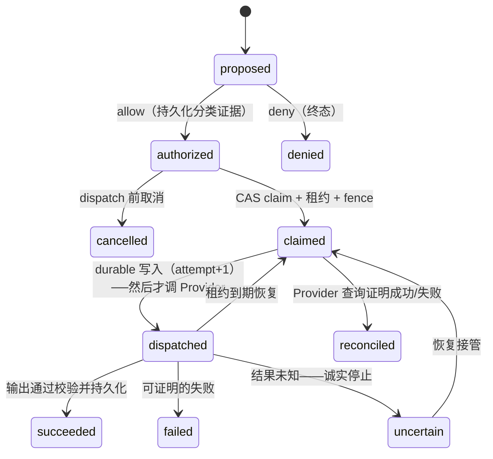

# 02 · 核心概念

## 五个对象，别混

| 对象 | 是什么 | 基数 |
|---|---|---|
| **Action** | 可版本化的副作用能力定义（`ticket.create@1`） | 一个 Action 产生多个 operation |
| **Invocation** | 宿主投递的一次工具调用 | 多次 replay 可汇合到同一 operation |
| **Operation** | Ordarium 认定的稳定业务工作（去重单位） | 一个 operation 可有多个 attempt |
| **Attempt** | 一次持久化 `dispatched` 后的 Provider 尝试 | 只有证明安全时才增加 |
| **External effect** | Provider 里真实发生的业务变化 | 目标：一个 operation 最多一项（能否证明取决于 Provider） |

## Operation 身份怎么来

默认身份 = `source + scope + callId`（宿主提供）；你的 Action 也可以用 `key(input, identity)` 声明**业务键**（完全替代默认身份）：

```ts
const reserve = defineAction({
  /* ... */
  key: (input) => `sku:${input.sku}`,   // 跨会话/跨宿主都汇合到同一 operation
  effect: effects.guarded(),
  async execute(input) { /* ... */ },
});
```

推导链：`logicalKey → SHA-256 → operationId = op_hash(name+version+keyDigest)[0:40]`。同一 `operationId` 再来时，输入摘要不一致会得到 `OPERATION_CONFLICT`——绝不静默创建第二项工作。

多 agent 语义：`rootCallId`/`lineage` 只作审计关联，**不参与去重**——同一根调用下的两个 subagent 兄弟任务是两个 operation（这是特性，不是缺陷）。

## 状态机



三条承重规则：

1. **`dispatched` 先于 Provider 落盘**——崩溃后我们能区分"肯定没发出去"和"可能发出去了"；
2. **`uncertain` 是一等状态**，不是异常：外部结果无法证明时的正确答案。重复调用不会盲重试；
3. **终态可直接复用**：succeeded 的结果从 ledger 读回，不再执行。

## 并发：claim、租约、fence

一个 operation 同时只有一个有效 owner。执行者通过 CAS 获得 claim（含**单调递增 fencing token**），执行期间以轻量心跳续租约——心跳**不产生任何语义写入**。租约丢失时执行中的 Action 会被 abort，旧 owner 无法写入终态。两个进程竞争同一工作时，只有一个能进入 dispatch。

## Secret 边界

ledger **保存**：Action 名/版本、合同指纹、identity、各种 SHA-256 摘要、分类授权证据、状态/attempt/fence、通过校验的 output 与 receipt、安全错误码。

ledger **永不保存**：原始输入、原始业务键、凭据、异常堆栈、未筛选的 Provider 响应。Provider 主体最多以摘要形式持久化（换账号恢复会被 `PRINCIPAL_CONFLICT` 拒绝）。单个 output/receipt 上限默认 1 MiB。

> 含义：写 Action 时把 output/receipt 当审计数据对待——不要往里放 token 或未脱敏响应。

## 与宿主的分工

DSH 拥有 Agent Loop、审批 UI、凭据、沙箱、会话；Ordarium 只拥有"这项已获准的工作以什么身份、由谁、在什么证据下触达外部世界"。不复制、不绕过。
