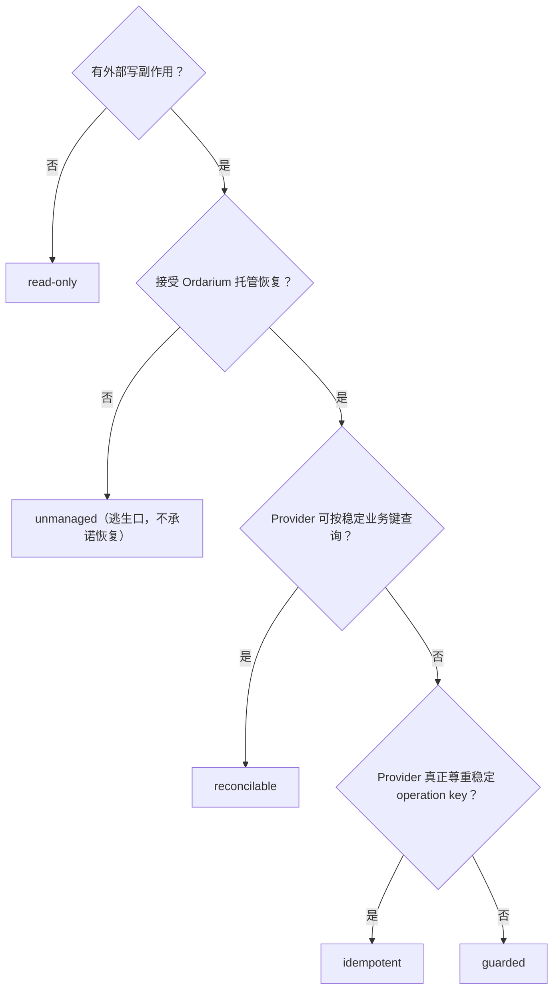

# 03 · Effect Profiles

Profile 是对 **Action 与其 Provider 事实**的能力描述，不是安全等级分数。选错的代价很具体：把没有恢复原语的 Provider 标成 `idempotent`，崩溃后你得到的保护比想象的少。

## 决策树



## 逐项说明

### `effects.readOnly()`

查询、纯计算。可重做；不需要 durable 恢复。隐式允许授权。**纯读取工具通常不需要 Ordarium**——需要统一身份/审计/结果复用时才用。

### `effects.guarded()`

有副作用但 Provider 无恢复原语。行为：准入 → dispatch → **结果不明即停在 `uncertain`，绝不盲重试**。这是"诚实下限"，不是低人一等。

### `effects.idempotent()`

Provider 对稳定 operation key 真正幂等（默认视为 durable 窗口）。有限窗口显式声明：

```ts
effect: effects.idempotent({
  window: { kind: "finite", expiresAfterMs: 3_600_000 },
}),
```

**finite window 的冻结语义**：deadline 在 operation 首次创建时计算一次并持久化（`idempotencyExpiresAt`）。重启、重试、重载都**不续期**；过期后禁止再执行，只能查询或保持 `uncertain`（`IDEMPOTENCY_EXPIRED`）。

### `effects.reconcilable(...)`

Provider 可按业务键查询。恢复时**先查询**：只有 authoritative 证据才落 `reconciled`；`absent + retrySafe` 允许正常运行时重发（运维的 reconcile-only 永远不会）。可选叠加幂等窗口与取消：

```ts
effect: effects.reconcilable({
  idempotencyWindow: { kind: "durable" },
  cancellable: true,   // 声明后才能实现 cancel() 钩子
}),
```

带 `cancellable` 的 Action 可以实现 `cancel(input, context)`——它只是 best-effort 请求，不能自行宣告取消成功；dispatch 后的最终事实仍由查询决定。

### `effects.unmanaged()`

显式退出托管恢复。仍记录 dispatch 与不确定性，但不承诺 crash/restart 恢复。迁移期的逃生口，不要写进"安全模式"的宣传。

## 配对检查（写测试时）

`@ordarium/testing` 提供交叉校验：声明与 profile 不匹配会在接线前被拒绝（例如 opaque Provider 配 `idempotent()` 直接 throw）。见 [09](09-testing.md#provider-conformance)。

## 常见错配

| 你写的 | Provider 实际 | 结果 |
|---|---|---|
| `idempotent()` | 忽略幂等键 | 崩溃后可能重复副作用——Ordarium 无法证明 |
| `reconcilable()` | 查询是最终一致的假 absent | 恢复保持 `uncertain`（不重发）——安全但要知道 |
| finite 窗口 | 键实为永久 | 过期后白白停止执行——声明 durable 即可 |
