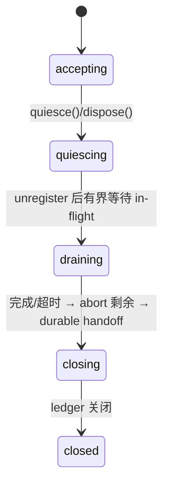

# 10 · 生命周期与恢复

## Runtime 生命周期

- `quiesce()` 之后新调用得到 `RUNTIME_QUIESCING`，ledger 零写入；
- dispose 固定序：**quiesce → unregister → 有界 drain（默认一个租约期）→ abort 剩余 → durable handoff → 吸收迟到回调 → close**；
- handoff 语义：dispatch 前的调用落 `cancelled`，可能已 dispatch 的落 `uncertain`（`runtime-dispose-handoff`）——挂死的 Action 迟到返回不会造成未处理拒绝，其终态写入被 fence 验证拒绝；
- 硬杀进程跳过 drain——靠 durable 恢复，语义等价。

## 崩溃检查点矩阵

| 崩溃位置 | 可知事实 | 恢复行为 |
|---|---|---|
| dispatch 前（claim 后） | Provider 肯定未调用 | 同身份重进即可 |
| dispatched 落盘后、请求前 | 可能调用 | 进入恢复，**不当普通失败** |
| Provider 执行中/响应丢失 | 结果未知 | 按能力查询或同键重发；否则 `uncertain` |
| Provider 成功后、终态前 | 外部可能已成功 | 同身份查询/恢复，不建新 operation |
| 终态落盘后 | 完成 | 直接复用结果 |

恢复在**同一 Action 调用再次进入时惰性发生**——Ordarium 不保存原始输入，不会后台重放。

## 恢复决策（唯一评估器）

顺序固定：有 `reconcile()` 先查询 → `absent+retrySafe` 且在 frozen deadline 内允许重发（仅 normal 模式）→ 无查询但 operation-key 幂等且未过期 → 同键重发 → 其余保持 `uncertain`。finite deadline 过期后执行被 `IDEMPOTENCY_EXPIRED` 拒绝——重启/重试不续期。

时钟异常（跳变/停顿）下的保证：租约比较使用与 ledger 一致的时钟源；无法证明唯一 owner 时 fail closed / uncertain。

## 数据版本

- 打开旧 v1 数据库自动**事务性迁移**到 v2（`LEDGER_MIGRATION_FAILED` 时库保持完整 v1，可排查后重试）；
- `user_version` 高于支持 → `LEDGER_NEWER_SCHEMA`，不自动降级。

## Action 版本纪律

`name + version` 是跨重载/重启的语义边界。输入/输出 schema、key 生成、effect profile、恢复语义有不兼容变化 → 必须升 version。同名同版本但元数据漂移 → `CONTRACT_DRIFT` 诊断失败（合同指纹只发现意外漂移，不替代你的版本责任）。
