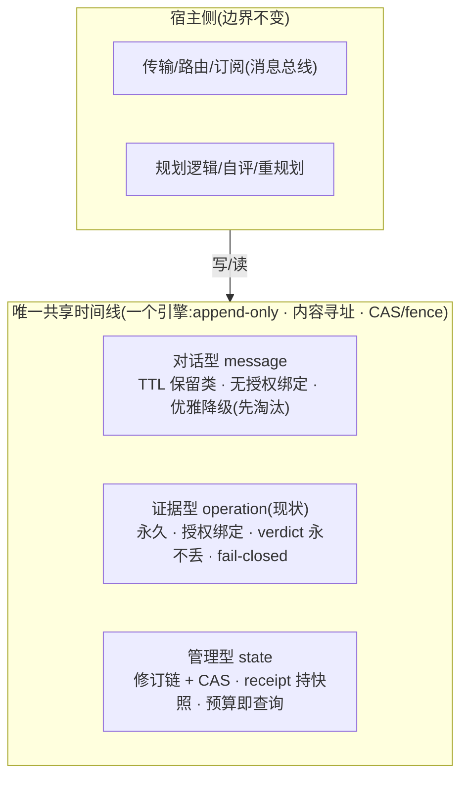

# 03 · 三种公共账本：对话型 / 证据型 / 管理型

> 核心结论先行：三类账本"特别突出"是必要的——以**三种契约**的形式；"特别分开"作为存储则是错误的——三类的价值乘积恰在共享时间线的交叉关联里。

## 1. 本体刻画（契约矩阵）

| 维度 | 对话型 message | 证据型 operation（现状） | 管理型 state |
|---|---|---|---|
| 语义 | "发生过通信" | "世界被改变"（承诺） | "当前意图/计划" |
| 频率 | 极高（每轮多条） | 低（每个真实副作用一条） | 中（每步修订） |
| 写门槛 | 任何有身份的 agent | 授权门控 + 内容寻址 | 持有 fence/lease 的写者 |
| 不可变性 | append 但**可过期** | 永久 append，撤销也只能以新事件表达 | 修订链（current + history，CAS 更新） |
| 保留 | 会话级 / TTL / 滚动 | 永久 | run 生命周期，归档 |
| 丢失代价 | 噪音、取证缺页 | **灾难**（verdict 永不丢是硬不变量） | 计划丢失 → 重规划（昂贵但可容忍） |
| 读取模式 | 尾读、线程序 | id 查询、过滤、历史 | 当前值 + 修订历史 |

关键观察：三类差异**全部集中在信任模型、保留策略和失败代价上——不在并发机制上**。这决定了后文走向。

## 2. 从调研系统反推（接缝疼痛的一手证据）

- **Danus**：最自觉的三分——global memory（gm_add，advisory 不验证）≈ 对话型；事实图 ≈ 证据型；master_guidance/todo ≈ 管理型。**但付出了分家代价**：`fact_submit` 的 `source_id` 参数手工把 global memory 的 finding 与提升后的 fact 缝起来——两套存储、两套查询路径，关联靠人工指针。
- **Magentic**：管理型（ledger）在上下文内 assistant 消息里，证据型在会话 transcript——该分开的没分开（都在易失介质），且丢失代价最高的一类最脆弱。
- **Grok Build**：run 状态 / chat 通知 / PR 产物——三套系统三个存储，"哪个消息导致了这个 run 决策"只能 grep（三引擎方案的疼痛证据）。
- **Manus**：只有管理型，副作用不留持久证据——单 agent 够用，多 agent 共账不够。
- **规律**：每家都需要全部三类；疼痛**全部发生在类间接缝**（跨类关联），没有一家疼在类内部。

## 3. 方案对抗推演

**方案 A：分家（三 Port、三存储、三 conformance）**
正方：信任模型隔离干净；保留策略自由。反方推演撞三堵墙：① 时间线关联变分布式问题（跨库 join + 时钟对齐，比单时间线难一个量级）；② 三套 CAS/lease/fence、三条迁移路径——内核膨胀成框架（谱系死枝的形状）；③ Danus 的 `source_id` 手工缝合以更丑形式重现。

**方案 B：统一时间线（一个引擎，三种 record kind）**
正方：并发机器只有一套（revision/CAS/fence 已实现）；关联是结构保证的（同一有序时间线，lineage/callId 天然成链）；Danus 的 `source_id` 退化为"就是前面那条记录"；"预算即账本查询""撤销即新事件"两个洞察本质上都是**单一时间线的派生视图**，分家后每个要按存储各实现一遍。
最强反方与回答：**这是否稀释单一职责？** 回答：职责表述精确化一次——从"operation = 副作用"升级为"record = 多智能体共享时间线上的事件，三种契约类"。内核不变量不变（append-only、内容寻址、CAS/fence、fail-closed）；单一职责的对象是"时间线"，不是"副作用"。

## 4. 结构

- **契约层分开**：kind 字段结构性区分；信任/保留/读法各自成合同；开发者文档各自独立章节（"一种时间线，三种墨水"）。
- **存储层不分家**：一套 CAS/lease/fence、一条时间线、一个迁移故事。
- **边界重述**：账本 ≠ 总线。宿主做传输/路由/推送；内核只在宿主要求时把通信事件作为 message record 落时间线（取证需求："谁在合成前对谁说了什么"）。路由语义一根手指都不伸。
- **唯一新内核语义 = 保留类（retention class）**：只有对话型可淘汰（TTL/配额，优雅降级）；证据型与管理型 append-only 且受 LEDGER_FULL fail-closed 保护。得到恰好正确的**失败不对称性**：agent 刷屏淘汰旧聊天，永不挤爆审计账本。

## 5. 落地次序与准入门槛

1. **Stage 0（现状）**：证据型已实现 = 今天的 operation ledger。
2. **Stage 1（最高杠杆）**：管理型形式化为 `state` kind——机器全现成（revision/CAS/fence）；`receipt` 持快照从惯用法升级为文档化 API；Magentic/Grok run/Danus 事实图三种复刻立刻受益。
3. **Stage 2（需求拉动）**：`message` kind + 保留类——只在第二真实宿主提出取证需求时做，不做投机预设。
4. **单一机器测试（准入门槛）**：任何新 kind 若需要 revision/CAS/fence 之外的新并发机制，说明它是另一个引擎，不进这扇门。
